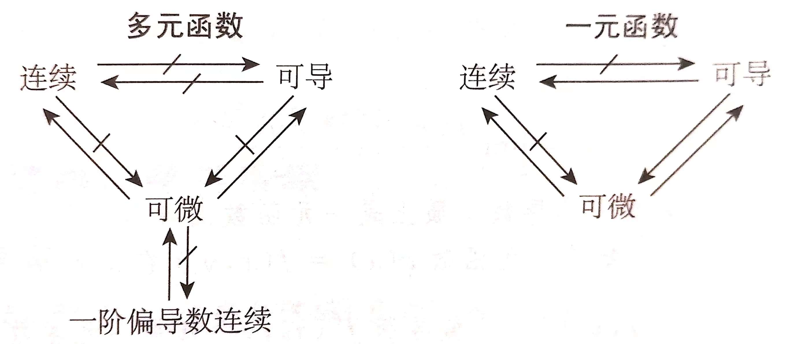
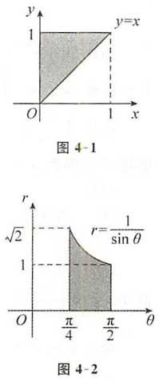
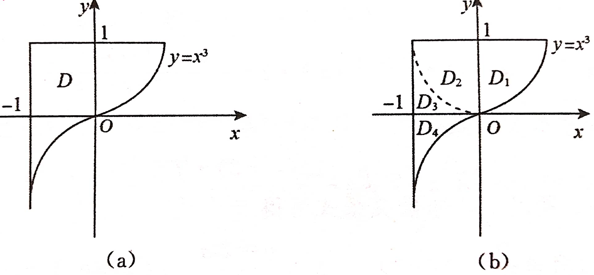
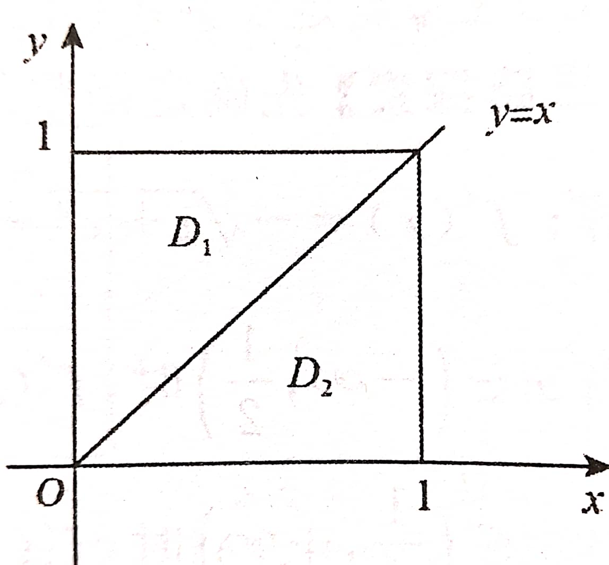

- [高等数学](#高等数学)
  - [低级错误](#低级错误)
    - [一、运算符号相关](#一运算符号相关)
    - [二、运算步骤相关](#二运算步骤相关)
    - [三、逻辑相关](#三逻辑相关)
      - [1.假设 A 成立，此时若推出的条件弱于必要条件 B 时，不能说明 A 就是错的](#1假设-a-成立此时若推出的条件弱于必要条件-b-时不能说明-a-就是错的)
  - [背景知识](#背景知识)
    - [一、常用数学思想](#一常用数学思想)
      - [1.1 证明 XXX 唯一](#11-证明-xxx-唯一)
    - [二、常用不等式](#二常用不等式)
      - [2.1 绝对值不等式](#21-绝对值不等式)
      - [2.2 根号不等式](#22-根号不等式)
      - [2.3 指数不等式](#23-指数不等式)
      - [2.4 分数不等式](#24-分数不等式)
      - [2.5 三角不等式](#25-三角不等式)
      - [2.6 对数不等式](#26-对数不等式)
  - [第一章 函数、极限、连续](#第一章-函数极限连续)
    - [1.1 函数](#11-函数)
      - [1.1.1 函数的基本概念](#111-函数的基本概念)
      - [1.1.2 函数的性质](#112-函数的性质)
    - [1.2 函数的性质的综合问题](#12-函数的性质的综合问题)
      - [1.2.1 函数运算对奇偶性的影响](#121-函数运算对奇偶性的影响)
      - [1.2.2 判断函数有界性的方法](#122-判断函数有界性的方法)
      - [1.2.3 判断函数周期性的方法](#123-判断函数周期性的方法)
      - [1.2.4 判别函数单调性的方法](#124-判别函数单调性的方法)
    - [1.3 反函数](#13-反函数)
    - [1.4 函数极限的概念](#14-函数极限的概念)
      - [1.4.1 函数极限的定义](#141-函数极限的定义)
      - [1.4.2 基础四则运算](#142-基础四则运算)
      - [1.4.3 函数极限的性质](#143-函数极限的性质)
      - [1.4.4 无穷大与无穷小](#144-无穷大与无穷小)
    - [1.5 函数极限的计算](#15-函数极限的计算)
      - [1.5.1 夹逼准则](#151-夹逼准则)
      - [1.5.2 重要极限](#152-重要极限)
      - [1.5.3 导数定义](#153-导数定义)
      - [1.5.4 等价无穷小替换](#154-等价无穷小替换)
      - [1.5.5 有理化](#155-有理化)
      - [1.5.6 利用左右极限求极限](#156-利用左右极限求极限)
      - [1.5.7 拉格朗日中值定理](#157-拉格朗日中值定理)
      - [1.5.8 洛必达法则](#158-洛必达法则)
      - [1.5.9 泰勒公式](#159-泰勒公式)
    - [1.6 函数极限的化简](#16-函数极限的化简)
      - [1.6.1 对数法则](#161-对数法则)
      - [1.6.2 指数法则](#162-指数法则)
      - [1.6.3 三角函数关系式](#163-三角函数关系式)
      - [1.6.4 提取常数因子](#164-提取常数因子)
      - [1.6.5 提取公因子](#165-提取公因子)
      - [1.6.6 有理化](#166-有理化)
      - [1.6.7 换元法](#167-换元法)
      - [1.6.8 倒代换](#168-倒代换)
      - [1.6.9 拆项](#169-拆项)
      - [1.6.10 脱帽法](#1610-脱帽法)
    - [1.7 极限路径的理解](#17-极限路径的理解)
    - [1.8 数列极限的计算](#18-数列极限的计算)
      - [1.8.1 用单调有界准则求极限](#181-用单调有界准则求极限)
      - [1.8.2 用夹逼准则求极限](#182-用夹逼准则求极限)
      - [1.8.3 根据子列极限情况推导原数列极限情况](#183-根据子列极限情况推导原数列极限情况)
      - [1.8.4 海涅定理（归结原则）](#184-海涅定理归结原则)
      - [1.8.5 使用四则运算化简极限式中的部分项](#185-使用四则运算化简极限式中的部分项)
    - [1.9 n 项和](#19-n-项和)
      - [1.9.1 倒序相加法](#191-倒序相加法)
      - [1.9.2 公式法](#192-公式法)
      - [1.9.3 裂项相消法](#193-裂项相消法)
      - [1.9.4 错位相减法](#194-错位相减法)
      - [1.9.5 迭加法](#195-迭加法)
      - [1.9.6 分组求和法](#196-分组求和法)
      - [1.9.7 构造法](#197-构造法)
      - [1.9.8 利用定积分的定义求极限](#198-利用定积分的定义求极限)
    - [1.10 n 项连乘](#110-n-项连乘)
    - [1.11 连续](#111-连续)
    - [1.12 间断点](#112-间断点)
    - [1.13 由极限定义的函数](#113-由极限定义的函数)
      - [1.13.1 先求极限再研究具体表达式](#1131-先求极限再研究具体表达式)
      - [1.13.2 先由已知极限求 f(x) 的包含无穷小量的表达式，再代入待求极限计算](#1132-先由已知极限求-fx-的包含无穷小量的表达式再代入待求极限计算)
      - [1.13.3 根据趋向某点的极限得到在该点的函数值，导数值](#1133-根据趋向某点的极限得到在该点的函数值导数值)
    - [1.14 常用结论](#114-常用结论)
      - [1.14.1 常用求和公式](#1141-常用求和公式)
      - [1.14.2 常用裂项公式](#1142-常用裂项公式)
  - [第二章 一元函数微分学](#第二章-一元函数微分学)
    - [2.1 导数与微分](#21-导数与微分)
      - [2.1.1 左右导数](#211-左右导数)
      - [2.1.2 导数定义的要求](#212-导数定义的要求)
      - [2.1.3 在某点的导数不能代表该点邻域内的单调性](#213-在某点的导数不能代表该点邻域内的单调性)
    - [2.2 连续的推论](#22-连续的推论)
      - [2.2.1 在一点连续](#221-在一点连续)
      - [2.2.2 在一点的邻域内连续](#222-在一点的邻域内连续)
      - [2.2.3 在一点的去心邻域内连续](#223-在一点的去心邻域内连续)
    - [2.3 可导的推论](#23-可导的推论)
      - [2.3.1 在一点可导](#231-在一点可导)
      - [2.3.2 在一点的邻域内可导](#232-在一点的邻域内可导)
      - [2.3.3 在一点的去心邻域内可导](#233-在一点的去心邻域内可导)
    - [2.4 连续和可导的其他推论](#24-连续和可导的其他推论)
      - [2.4.1 在区间上的推论](#241-在区间上的推论)
      - [2.4.2 可导性的常用结论](#242-可导性的常用结论)
    - [2.5 函数有界、可导及函数极限、导数极限的关系](#25-函数有界可导及函数极限导数极限的关系)
    - [2.6 导数计算](#26-导数计算)
      - [2.6.1 由参数式确定的函数的求导公式](#261-由参数式确定的函数的求导公式)
      - [2.6.2 莱布尼茨求导公式](#262-莱布尼茨求导公式)
      - [2.6.3 变限积分求导公式](#263-变限积分求导公式)
      - [2.6.4 洛比达](#264-洛比达)
      - [2.6.5 绝对值函数的导数](#265-绝对值函数的导数)
    - [2.7 导数应用](#27-导数应用)
      - [2.7.1 拐点](#271-拐点)
      - [2.7.2 渐近线的求法](#272-渐近线的求法)
      - [2.7.3 曲率与曲率半径](#273-曲率与曲率半径)
      - [2.7.4 由方程确定的隐函数求其驻点、极值点](#274-由方程确定的隐函数求其驻点极值点)
      - [2.7.5 变化率与相关变化率](#275-变化率与相关变化率)
    - [2.8 中值定理](#28-中值定理)
      - [2.8.1 罗尔定理](#281-罗尔定理)
      - [2.8.2 拉格朗日中值定理](#282-拉格朗日中值定理)
      - [2.8.3 双中值问题](#283-双中值问题)
      - [2.8.4 柯西中值定理](#284-柯西中值定理)
      - [2.8.5 泰勒公式](#285-泰勒公式)
      - [2.8.6 零点存在性](#286-零点存在性)
      - [2.8.7 实系数奇次方程](#287-实系数奇次方程)
      - [2.8.8 证明存在某 $\\xi$ 满足某不等式](#288-证明存在某-xi-满足某不等式)
    - [2.9 常用结论](#29-常用结论)
      - [2.9.1 复杂式子求值可以尝试用等价无穷小化简](#291-复杂式子求值可以尝试用等价无穷小化简)
  - [第三章 一元函数积分学](#第三章-一元函数积分学)
    - [3.1 不定积分](#31-不定积分)
      - [3.1.1 奇、偶函数，周期函数的原函数与变限积分的对比](#311-奇偶函数周期函数的原函数与变限积分的对比)
      - [3.1.2 换元法](#312-换元法)
      - [3.1.3 分部积分](#313-分部积分)
      - [3.1.4 有理积分](#314-有理积分)
      - [3.1.5 常用不定积分](#315-常用不定积分)
    - [3.2 定积分](#32-定积分)
      - [3.2.1 区间再现](#321-区间再现)
      - [3.2.2 定限积分等式](#322-定限积分等式)
      - [3.2.3 积分中值定理](#323-积分中值定理)
      - [3.2.4 二重积分的积分中值定理](#324-二重积分的积分中值定理)
      - [3.2.5 被积函数化简](#325-被积函数化简)
      - [3.2.6 积分区间化简](#326-积分区间化简)
      - [3.2.7 多个定积分比较大小](#327-多个定积分比较大小)
      - [3.2.8 定积分拆成不定积分](#328-定积分拆成不定积分)
    - [3.3 反常积分审敛法](#33-反常积分审敛法)
      - [3.3.1 比较审敛法](#331-比较审敛法)
      - [3.3.2 极限审敛法](#332-极限审敛法)
    - [3.4 反常积分的计算](#34-反常积分的计算)
      - [3.4.1 直接法](#341-直接法)
      - [3.4.2 极限审敛法不一定需要待定系数](#342-极限审敛法不一定需要待定系数)
      - [3.4.3 拆成多个反常积分后，先算简单的反常积分的定义域，再基于这个定义域考虑其他反常积分](#343-拆成多个反常积分后先算简单的反常积分的定义域再基于这个定义域考虑其他反常积分)
    - [3.5 定积分的几何应用](#35-定积分的几何应用)
      - [3.5.1 弧长](#351-弧长)
      - [3.5.2 体积](#352-体积)
      - [3.5.3 面积](#353-面积)
    - [3.6 由积分定义的函数](#36-由积分定义的函数)
    - [3.7 积分不等式的证明](#37-积分不等式的证明)
      - [3.7.1 视为变限函数](#371-视为变限函数)
      - [3.7.2 利用积分性质](#372-利用积分性质)
      - [3.7.3 零点问题](#373-零点问题)
      - [3.7.4 一重积分转化为二重积分](#374-一重积分转化为二重积分)
    - [3.8 常用结论](#38-常用结论)
      - [3.8.1 函数比值极限与积分比值之间的关系](#381-函数比值极限与积分比值之间的关系)
      - [3.8.2 奇偶性、周期性](#382-奇偶性周期性)
      - [3.8.3 华里士公式](#383-华里士公式)
      - [3.8.4 伽马公式](#384-伽马公式)
      - [3.8.5 常用积分](#385-常用积分)
  - [第四章 多元函数微积分学](#第四章-多元函数微积分学)
    - [4.1 二元函数的极限与连续、偏导数与微分](#41-二元函数的极限与连续偏导数与微分)
      - [4.1.1 连续、可导、可微](#411-连续可导可微)
      - [4.1.2 讨论二重极限](#412-讨论二重极限)
      - [4.1.3 讨论二元函数的连续性、偏导数存在性](#413-讨论二元函数的连续性偏导数存在性)
      - [4.1.4 讨论二元函数的可微性](#414-讨论二元函数的可微性)
    - [4.2 二元函数的微分法](#42-二元函数的微分法)
      - [4.2.1 全微分形式不变性](#421-全微分形式不变性)
      - [4.2.2 隐函数的偏导数与全微分](#422-隐函数的偏导数与全微分)
      - [4.2.3 求复合函数的偏导数与全微分](#423-求复合函数的偏导数与全微分)
      - [4.2.4 注意是否给出高阶偏导数在某点存在的条件，没有则用定义求](#424-注意是否给出高阶偏导数在某点存在的条件没有则用定义求)
    - [4.3 极值](#43-极值)
      - [4.3.1 驻点与极值点](#431-驻点与极值点)
      - [4.3.2 二元函数的极值转化为一元函数的极值](#432-二元函数的极值转化为一元函数的极值)
      - [4.3.3 多元函数的条件极值](#433-多元函数的条件极值)
      - [4.3.4 多元函数在有界区域上的最值](#434-多元函数在有界区域上的最值)
    - [4.4 二重积分](#44-二重积分)
      - [4.4.1 极坐标下的计算](#441-极坐标下的计算)
      - [4.4.2 转换积分区间](#442-转换积分区间)
      - [4.4.3 两个定积分的乘积转化成重积分](#443-两个定积分的乘积转化成重积分)
      - [4.4.4 极坐标的二重积分化为定积分](#444-极坐标的二重积分化为定积分)
    - [4.5 对称性](#45-对称性)
      - [4.5.1 主动拆分积分区域](#451-主动拆分积分区域)
      - [4.5.2 积分区域关于 y = x 对称](#452-积分区域关于-y--x-对称)
    - [4.6 常用结论](#46-常用结论)
  - [第五章 常微分方程](#第五章-常微分方程)
    - [5.1 一阶微分方程](#51-一阶微分方程)
      - [5.1.1 可分离变量的微分方程](#511-可分离变量的微分方程)
      - [5.1.2 齐次方程](#512-齐次方程)
      - [5.1.3 一阶线性方程](#513-一阶线性方程)
      - [5.1.4 伯努利方程](#514-伯努利方程)
    - [5.2 高阶微分方程](#52-高阶微分方程)
      - [5.2.1 可降阶的高阶微分方程](#521-可降阶的高阶微分方程)
      - [5.2.2 线性常系数齐次微分方程](#522-线性常系数齐次微分方程)
      - [5.2.3 线性常系数非齐次微分方程](#523-线性常系数非齐次微分方程)
    - [5.3 代换、变形、构造的更多方法](#53-代换变形构造的更多方法)
      - [5.3.1 自变量对换](#531-自变量对换)
      - [5.3.2 对题设条件恒等变形，利用导数定义构造可分离变量的微分方程](#532-对题设条件恒等变形利用导数定义构造可分离变量的微分方程)
      - [5.3.3 xy 代换](#533-xy-代换)
      - [5.3.4 f'(x) = -f(-x)](#534-fx---f-x)
    - [5.4 微分方程的应用](#54-微分方程的应用)
      - [5.4.1 物理相关](#541-物理相关)

# 高等数学

## 低级错误

### 一、运算符号相关

1. 明明题目写了 $r = \sqrt{x^2 + y^2}$，我愣是在算出一个 $\sqrt{x^2 + y^2}$ 之后认为这是 $r^{1/2}$……

### 二、运算步骤相关

1. 题目给了一个隐函数 $F(x,y,z) = 0$ 给了 $x_0,y_0$，让求 $dz \vert (x_0,y_0)$

   结果我就只想着把 $(x_0,y_0)$ 代入算出的 $dz$，式中的 $z$ 变量居然被我保留了，我居然没有把 $(x_0,y_0)$ 代入 $F(x,y,z) = 0$ 去算 $z_0$……

2. 算得了一个复杂的式子，可以暂时用一个符号来代替他

   原理是，在计算的时候只需要知道这个复杂的式子的某个性质，而不需要具体计算

   例：设函数 $y(x)$ 满足 $y'' + 2ay' + b^2y = 0,a>b>0$，且 $y(0)=1,y'(0) = 1$，则 $\int_0^{+\infty}{y(x)dx} =$

   这题可以计算出微分方程的两个特征根的解析式，但是只需要把解写成 $y = c_1e^{r_1x} + c_2e^{r_2x}$ 就好了

   因为只需要知道 $r_1,r_2 < 0$，算 $\int_0^{+\infty}{y(x)dx}$ 时是把题目条件代入，得 $\int_0^{+\infty}{-\dfrac{1}{b^2}(y'' + 2ay')dx}$

### 三、逻辑相关

#### 1.假设 A 成立，此时若推出的条件弱于必要条件 B 时，不能说明 A 就是错的

例：[>> 4.3.2 二元函数的极值转化为一元函数的极值](#432-二元函数的极值转化为一元函数的极值)

## 背景知识

### 一、常用数学思想

#### 1.1 证明 XXX 唯一

假设有两个 XXX1 和 XXX2 满足条件

然后再证 XXX1 和 XXX2 相等

唯一性的意义在于，只要满足这个形式，那么满足这个形式的值就一定是具有这个意义的值

好吧，这只是通俗的说法，可能会更好懂？

比如说如果凑成了满足泰勒的 $(x-x_0)^n$ 形式的系数项，那么这个系数项一定就是泰勒展开的唯一的系数项

比如如果凑成了满足 $AB = E$ 形式的 $B$，那么这个 $B$ 一定是 $A$ 的唯一的逆矩阵

### 二、常用不等式

#### 2.1 绝对值不等式

若 $a, b$ 为实数，则：

1. $\vert a\pm b\vert\leqslant\vert a\vert+\vert b\vert$

2. 推广公式一到离散区间：
   
   $\vert a_1\pm a_2\pm a_3\pm\cdots\pm a_n\vert\leqslant\vert a_1\vert+\vert a_2\vert+\cdots+\vert a_n\vert$

3. 推广公式一到连续区间且 $f(x)$ 在 $[a,b](a<b)$ 上可积：
   
   $\vert\int_a^bf(x)\textrm{d}x\vert\leqslant\int_a^b\vert f(x)\vert\textrm{d}x$

    因为符号不一定相同的面积代数和一定小于同为正的面积代数和

4. $\vert\vert a\vert-\vert b\vert\vert\leqslant\vert a-b\vert$ 
   
   后式子为两点之差，前式子可以看作 $a$、$b$ 两点与0之间的距离的差，若异号则两者必然抵消一部分，若同号则就等于后式

#### 2.2 根号不等式

$a,b,c>0$：

1. $\sqrt{ab}\leqslant\dfrac{a+b}{2}\leqslant\sqrt{\dfrac{a^2+b^2}{2}}$

   公式一非常重要，即算数平均值大几何平均值

2. $\sqrt[3]{abc}\leqslant\dfrac{a+b+c}{3}\leqslant\dfrac{a^2+b^2+c^2}{3}$

3. $\lim_{n \to \infty}\sqrt[n]{a_1^n+a_2^n+...+a_m^n} = \max_{1\leqslant i \leqslant m}{a_i} > 0$

#### 2.3 指数不等式

1. 设 $a>b>0$，则
   $\left\{
   \begin{array}{lcl}
      a^n>b^n, n>0 \\
      a^n<b^n, n<0
   \end{array}
   \right.$

2. $e^x\geqslant x+1(\forall x)$

#### 2.4 分数不等式

若 $0<a<x<b,0<c<y<d$，则 $\dfrac{c}{b}<\dfrac{y}{x}<\dfrac{d}{a}$

这只是对不等式乘法的运用

#### 2.5 三角不等式

1. $\sin x<x<\tan x(0<x<\dfrac{\pi}{2})$

2. $\sin x<x(x>0)$

3. $\arctan x\leqslant x\leqslant\arcsin x(0\leqslant x\leqslant 1)$

#### 2.6 对数不等式

1. $x-1\geqslant\ln x(x>0)$

2. $\dfrac{1}{1+x}<\ln(1+\dfrac{1}{x})<\dfrac{1}{x}(x>0)$

## 第一章 函数、极限、连续

### 1.1 函数

提要：概念 函数分类 有界性 单调性 奇偶性 周期性

#### 1.1.1 函数的基本概念

**1.定义**

定义域 D，对应法则 f

**2.复合运算**

代入法

**3.初等函数**

由常数和基本初等函数经过有限次的四则运算或者有限次的符合运算构成的，且能用一个式子表达的函数，称为初等函数

例：

1. $f(x) = \lvert x \rvert = \sqrt{x^2}$ 符合初等函数的定义

2. 分段函数一般不是初等函数

**4.常用的特殊函数**

1. 取整函数

2. 符号函数

3. 狄利克雷函数

**5.基本初等函数**

1. 幂函数

2. 指数函数

3. 对数函数

4. 三角函数

5. 反三角函数

#### 1.1.2 函数的性质

1. 奇偶性

   $y = f(x)$ 关于直线 $x = a$ 对称 <=> $f(a+x) = f(a-x)$ <=> $f(a+x),f(a-x)$ 关于 $x$ 是偶函数

   $y = f(x)$ 关于点 $(a,0)$ 对称 <=> $f(a+x) = -f(a-x)$ <=> $f(a+x),f(a-x)$ 关于 $x$ 是偶函数

2. 有界性

   常见有界函数：

   1. $\lvert \sin{x} \rvert \leqslant 1$

   2. $\lvert \cos{x} \rvert \leqslant 1$

   3. $\lvert \arcsin{x} \rvert \leqslant \dfrac{\pi}{2}$

   4. $0 \leqslant \arccos{x} \leqslant \pi$

   5. $-\dfrac{\pi}{2} < \arctan{x} < \dfrac{\pi}{2}$

   6. $0 < arccot{x} < \pi$
   
3. 周期性

   周期函数不一定存在最小正周期

   例：狄利克雷函数

4. 单调性

### 1.2 函数的性质的综合问题

#### 1.2.1 函数运算对奇偶性的影响

奇函数的定义域关于原点对称，若包括原点，则必有 $f(0) = -f(-0)$ 得 $f(0) = 0$

故当 $f(x)$ 为奇函数时，$f(x)$ 的原函数 $F(x) + C$ 一定是偶函数

而当 $f(x)$ 为偶函数时，$f(x)$ 的原函数 $F(x) + C$ 不一定是奇函数

特殊函数：

1. $f(x) + f(-x)$ 是偶函数，$f(x) - f(-x)$ 是奇函数

2. 令 $g_1(x) = \dfrac{f(x)+f(-x)}{2},g_2(x) = \dfrac{f(x)-f(-x)}{2},x \in (-a,a)$

   则 $f(x) = g_1(x) + g_2(x),x \in (-a,a)$

   即 $f(x)$ 可表示为一个偶函数与一个奇函数之和

#### 1.2.2 判断函数有界性的方法

1. $f(x)$ 在 $[a,b]$ 上连续 => $f(x)$ 在 $[a,b]$ 上有界

2. $f(x)$ 在 $(a,b)$ 内连续，且 $\lim_{x \to a^+}f(x),\lim_{x \to b^-}f(x)$ 均存在 => $f(x)$ 在 $(a,b)$ 内有界

   证：由 $\lim_{x \to a^+}f(x),\lim_{x \to b^-}f(x)$ 均存在，根据极限的局部有界性，$f(x)$ 在区间 $(a,a+\delta_1),(b-\delta_2,b),\delta_1 > 0,\delta_2 > 0,b-\delta_2 > a+\delta_1$ 内均有界

   又由 $f(x)$ 在 $(a,b)$ 内连续推出 $f(x)$ 在区间 $[a+\delta_1,b-\delta_2]$ 上连续

   从而 $f(x)$ 在 $(a,b)$ 有界

3. $f'(x)$ 在有限区间 $(a,b)$ 内有界 => $f(x)$ 在 $(a,b)$ 内有界，反之不一定成立

   例如：$f(x) = \sqrt{x}$ 在 $(0,1)$ 内有界，但 $f'(x) = \dfrac{1}{2\sqrt{x}}$ 在 $(0,1)$ 内无界

   证：$\forall x \in (a,b)$，取 $x_0 \in (a,b)$，由拉格朗日中值定理，可知

   $f(x) = f(x_0) + f'(\xi)(x - x_0),a < \xi < b$  

   故 $\lvert f(x) \rvert \leqslant \lvert f(x_0) \rvert + \lvert f'(\xi) \rvert \lvert x - x_0 \rvert$

   即 $f(x)$ 有界

   但若将 $(a,b)$ 改为无限区间，则结论不一定成立

辨析：无穷大必是无界量，但无界量不一定是无穷大

例如 $\lim_{x \to 0}\dfrac{1}{x}\sin{\dfrac{1}{x}}$ 是无界量而不是无穷大

#### 1.2.3 判断函数周期性的方法

1. 利用周期性的定义

2. 若 $f(x)$ 是可导的周期函数，则 $f'(x)$ 与 $f(x)$ 有相同的周期

   若 $f(x)$ 是以 $T$ 为周期的连续函数，则 $F(x) = \int_a^x{f(t)dt}$ 不一定是周期函数

   例如：$f(x) = \cos{x} + 1$ 是以 $2\pi$ 为周期的周期函数，但 $\int_0^x(\cos{t}+1)dt = \sin{x} + x$ 不是周期函数

#### 1.2.4 判别函数单调性的方法

若 $f'(x) \geqslant 0(\leqslant 0)$，且等号仅在有限多个点处成立，则 $f(x)$ 在区间上单调增加（减少）

### 1.3 反函数

$y \equiv f(f^{-1}(y)), x \equiv f(f^{-1}(x))$

因为式中的 $f$ 和 $f^{-1}$ 之间不能夹系数，所以要凑

相关题目的核心思想就是凑成这个原函数嵌套反函数的性质

---

例：当 $x \geqslant 0$ 时，函数 $f(x)$ 可导，有非负的反函数 $g(x)$，且恒等式 $\int_1^{f(x)}{g(t)dt} = x^2 - 1$ 成立，求函数 $f(x)$

解：

对 $\int_1^{f(x)}{g(t)dt} = x^2 - 1$ 两边求导，得 $g(f(x))f'(x) = 2x$

又由反函数的性质，$g(f(x)) = x$，得 $xf'(x) = 2x$ => $f(x) = 2x+C$

观察恒等式，取 $x = 1$ 时可以令 $x^2 - 1 = 0$，此时 $f(1) = 2+C$

有 $\int_1^{2+C}{g(t)dt} = 0$，即 $2+C = 1$ => $C = -1$

所以 $f(x) = 2x-1$

> 还利用了 $\int_a^a{f(x)dx} = 0$ 的性质

### 1.4 函数极限的概念

提要：定义 无穷大与无穷小 函数极限的性质与定理 计算方法

#### 1.4.1 函数极限的定义

1. 极限的定义是用“距离”刻画的

2. 定义中的 $\varepsilon$ 具有任意性，$\delta$ 与 $X$ 具有存在性，$\delta$ 与 $X$ 一般与 $\varepsilon$ 有关

3. 利用极限定义验证极限的存在性，关键是证明 $\delta$ 或 $X$ 的存在性

4. $\lim_{x \to x_0}f(x)$ 与 $f(x)$ 在点 $x_0$ 处是否有定义无关

---

例：设 $\lim_{x \to 0}\dfrac{f(x)}{x} = 1$，则（）

A. $f(0) = 0$

B. $f'(0) = 1$

C. $\lim_{x \to 0}f(x) = 0$

D. $\lim_{x \to 0}f'(x) = 1$

答案：C

极限式能够存在，说明 $f(x)$ 在 $x = 0$ 的去心邻域内是存在的

也说明了 $\lim_{x \to 0}f(x) = 0$

但是不知道 $f(x)$ 在 $x = 0$ 是否有定义，即使有定义，也不知道 $f(x)$ 在 $x = 0$ 是否连续

只有 $f(x)$ 在 $x = 0$ 连续才能由 $\lim_{x \to 0}f(x) = 0$ 得 $f(0) = 0$，A 错

要求某点的导数，使用导数定义式 $f'(0) = \lim_{x \to 0}\dfrac{f(x) - f(0)}{x - 0}$ 由于不知道 $f(0)$ 所以不知道导数定义式是否存在，B 错

只有知道 $f'(0) = 1$ 时再进一步知道 $f'(x)$ 在 $x = 0$ 连续才能推出 $\lim_{x \to 0}f'(x) = 1$，D 错

#### 1.4.2 基础四则运算

**1.极限四则运算的条件是充分非必要条件**

例如：$\lim_{x \to 0}\dfrac{1}{x^2} = \infty, \lim_{x \to 0}\dfrac{\cos{x}}{x^2} = \infty$ 极限均不存在

但极限 $\lim_{x \to 0}(\dfrac{1}{x^2}-\dfrac{\cos{x}}{x^2}) = \lim_{x \to 0}\dfrac{1-\cos{x}}{x^2} = \dfrac{1}{2}$ 存在

**2.使用情景**

极限非 0 的因子的极限可以先求 

$\lim \dfrac{g(x)}{f(x)} = \dfrac{1}{A}\lim{g(x)}$

但对于 

$\lim \dfrac{f_1(x)+f_2(x)}{f_3(x)+f_4(x)}$ 

其中 $f_i(x)$ 不能单独求

---

例：$\dfrac{e^{\dfrac{2}{x}ln(1+x)}-e^2[1-ln(1+x)]}{x}, x \rightarrow 0$

其中如果先令 $e^{\dfrac{2}{x}ln(1+x)} \rightarrow e^2$ 就会出错

---

例：求 $\lim_{x \to \infty}{e^{-x}(1+\dfrac{1}{x})^{x^2}}$

错误点 1：**幂的嵌套运算理解错误**，认为 $\lim_{x \to \infty}{(1+\dfrac{1}{x})^{x^2}} = \lim_{x \to \infty}{[(1+\dfrac{1}{x})^{x}]^2} = e^2$

实际上 $a^{x^2} = a^{x·x} = (a^x)^x$

所以 $\lim_{x \to \infty}{(1+\dfrac{1}{x})^{x^2}} = \lim_{x \to \infty}{[(1+\dfrac{1}{x})^{x}]^x}$

错误点 2：**忽略了双侧极限**，认为 $\lim_{x \to \infty}{e^{-x}} = 0$

很容易踩的坑！实际上 $\lim_{x \to \infty}$ 包含 $\lim_{x \to +\infty}$ 和 $\lim_{x \to -\infty}$，而 $\lim_{x \to -\infty}{e^{-x}} = \infty, \lim_{x \to +\infty}{e^{-x}} = 0$，所以 $\lim_{x \to \infty}{e^{-x}}$ 不存在（非无穷的不存在）

同理 $\lim_{x \to \infty}{(1+\dfrac{1}{x})^{x^2}}$ 也不存在

所以不能使用极限的四则运算

解：

$\lim_{x \to \infty}{e^{-x}(1+\dfrac{1}{x})^{x^2}} = \lim_{x \to \infty}{[e^{-1}(1+\dfrac{1}{x})^x]^x} \\
= \exp{[x(\ln(e^{-1}(1+\dfrac{1}{x}))]} \\
= \exp{[x(\ln{(1+\dfrac{1}{x})}-1)]}$

对 $\ln(1+x)$ 泰勒展开到两阶之后代入算得答案为 $e^{-1/2}$

> 对于复杂的式子只能用泰勒展开了
>
> 具体展开的阶数都是试探出来的
>
> 只要保证多余的项是趋向 0 不受干扰就行了

**3.复合运算法则**

函数的复合运算与极限运算交换顺序

#### 1.4.3 函数极限的性质

1. 唯一性

2. 有界性

3. 保号性

4. 保序性

#### 1.4.4 无穷大与无穷小

**1.无穷小**

1. 有界函数与无穷小之积是无穷小

2. 有限个无穷小之和是无穷小

3. 有限个无穷小之积是无穷小

**2.函数极限与无穷小的关系**

$\lim{f(x)} = A$ <=> $f(x) = A + \alpha$

**3.无穷小的比较**

**4.常用的等价无穷小**

**5.无穷大**

### 1.5 函数极限的计算

#### 1.5.1 夹逼准则

夹逼准则可以用来证明不等式也可以用来计算极限

#### 1.5.2 重要极限

#### 1.5.3 导数定义

极限转换以及连续性的时候会用到，但是使用的频率也较小

#### 1.5.4 等价无穷小替换

与基础四则运算类似替换的必然是整个求极限的乘或除的因子，一般加减法与部分的因子不能进行等价无穷小替换

如果是判断等价无穷小的阶数则可以，因为只会相差一个更高阶的无穷小，不影响整体

对于无法直接得出变换式子的，可以对对应参数进行凑，以达到目标的可替换的等价无穷小

特殊情形：

例如：$y = \sin{u},u = x\sin{\dfrac{1}{x}}$

当 $x \to 0$ 时，$\lim_{x \to 0}{x\sin{\dfrac{1}{x}}} = 0,\lim_{u \to 0}{\sin{u}} = 0$

即 $\sin{u}$ 与 $u = x\sin{\dfrac{1}{x}}$ 均是无穷小，但 $\sin{(x\sin{\dfrac{1}{x}})}$ 与 $x\sin{\dfrac{1}{x}}$ 不是等价无穷小

由于 $\dfrac{\sin{(x\sin{\dfrac{1}{x}})}}{x\sin{\dfrac{1}{x}}}$ 在 $x = 0$ 的去心邻域内有无穷多个点没有定义，如取 $x = \dfrac{1}{n\pi}$（$n$ 充分大），故不能求其极限

#### 1.5.5 有理化

#### 1.5.6 利用左右极限求极限

#### 1.5.7 拉格朗日中值定理

出现 $f(b)-f(a)$ 的形式时可以考虑使用中值定理

#### 1.5.8 洛必达法则

洛必达法则的本质是降低商形式的极限式子的幂次。对于幂次高的式子必然使用洛必达法则

式子比较复杂最好不要使用洛必达法则，最好是对求导后有规律或幂次较低的式子进行上下求导

对于数列极限，应将 $n$ （正整数）改为 $x$ （实数），因为数列是离散的，所以不能对其求导数

只有未定式才能使用洛必达，若已经能计算出为常数则不能使用洛必达

如果分子分母极限不存在且不是无穷，则洛必达法则失效，可能存在极限，换其他方法求解

洛必达法则必须使用在分子分母都趋向 0 或 $\infty$ 时，如果不是这样的趋向则不能使用

#### 1.5.9 泰勒公式

泰勒公式一般会使用趋向 0 的麦克劳林公式

泰勒展开嵌套时要保证截取的多项式的系数唯一

例：$\dfrac{e^{\dfrac{2}{x}ln(1+x)}-e^2[1-ln(1+x)]}{x}, x \rightarrow 0$

展开：

$\dfrac{2}{x}ln(1+x) = \dfrac{2}{x}(0+x-\dfrac{1}{2}x^2+\dfrac{1}{3}x^3+o(x^3)) = 2-x+\dfrac{2}{3}x^2+o(x^2)$

$\Rightarrow \dfrac{2}{x}ln(1+x) -2 = -x+\dfrac{2}{3}x^2+o(x^2)$

嵌套进

$e^x = 1+x+\dfrac{1}{2}x^2+\dfrac{1}{6}x^3+o(x^3)$

$\Rightarrow e^x - 1 = x+\dfrac{1}{2}x^2+\dfrac{1}{6}x^3+o(x^3)$

有

$e^{\dfrac{2}{x}ln(1+x) -2} - 1 = [-x+\dfrac{2}{3}x^2+o(x^2)] + \dfrac{1}{2}[-x+\dfrac{2}{3}x^2+o(x^2)]^2 + \dfrac{1}{6}[-x+\dfrac{2}{3}x^2+o(x^2)]^3+o(x^3)$

这个时候不需要把这个嵌套式子展开，而是只需要看幂为 k 的项的各个来源相加

例如要看幂为 2，在 $[-x+\dfrac{2}{3}x^2+o(x^2)]$ 中有 $\dfrac{2}{3}x^2$，但是在 $\dfrac{1}{2}[-x+\dfrac{2}{3}x^2+o(x^2)]^2$ 中还有 $\dfrac{1}{2}x^2$，而在 $\dfrac{1}{6}[-x+\dfrac{2}{3}x^2+o(x^2)]^3$ 中肯定没有幂为 2 的项，之后就不用看了

### 1.6 函数极限的化简

#### 1.6.1 对数法则

如 $\log_n(a\cdot b)=\log_n a+\log_n b$，$\log_n\dfrac{a}{b}=\log_na-\log_nb$

#### 1.6.2 指数法则

当出现 $f(x)^{g(x)}$ 的类似幂函数与指数函数类型的式子，需要使用 $u^v=e^{v\ln u}$

#### 1.6.3 三角函数关系式

#### 1.6.4 提取常数因子

#### 1.6.5 提取公因子

#### 1.6.6 有理化

1. 和差形式

   如 $\sqrt{a}\pm\sqrt{b}=\dfrac{a+b}{\sqrt{a}\mp\sqrt{b}}$

2. 乘积形式

   此时带有根号的式子只有单个没有加上或减去另一个式子，所以就需要将其转换为和差形式

   例：求极限 $\lim\limits_{n\to\infty}\sin^2(\pi\sqrt{n^2+n})$

   根据三角函数中 $x\pm n\pi$ 结果不变，原式变为 $=\lim\limits_{n\to\infty}\sin^2[\pi(\sqrt{n^2+n}-n)]$

#### 1.6.7 换元法

换元法本身没什么技巧性，主要是更方便计算。最重要的是获取到共有的最大因子进行替换

例：求极限 $\lim\limits_{x\to 1^-}\ln x\ln(1-x)$

因为 $x\to 0$，$\ln(1+x)\sim x$，所以 $x\to 1$，$\ln x\sim x-1$

#### 1.6.8 倒代换

1. 含有分式

   当极限式子中含有分式中一般都需要用其倒数，把分式换成整式方便计算

2. $\infty-\infty$ 型

3. $\infty\cdot\infty$ 型

#### 1.6.9 拆项

拆项需要根据式子形式进行，所以很难找到普遍规律

1. 积拆项

2. 和拆项

例：求$\lim\limits_{x\to 0}\dfrac{1-\cos x\sqrt{\cos 2x}\sqrt[3]{\cos 3x}}{\ln\cos x}$

解：使用 $\cos x-1\sim\dfrac{x^2}{2}, 1-\sqrt{x} \sim 1-\dfrac{1}{2}x^2, 1-\sqrt[3]{x} \sim 1-\dfrac{1}{3}x^2$

$\lim\limits_{x\to 0}\dfrac{1-\cos x\sqrt{\cos 2x}\sqrt[3]{\cos 3x}}{\ln\cos x}$

$=\lim\limits_{x\to 0}\dfrac{1-\cos x+\cos x-\cos x\sqrt{\cos 2x}\sqrt[3]{\cos 3x}}{-\dfrac{x^2}{2}}$

$=\lim\limits_{x\to 0}\dfrac{\dfrac{x^2}{2}}{-\dfrac{x^2}{2}}+\dfrac{\cos x(1-\sqrt{\cos 2x}\sqrt[3]{\cos 3x})}{-\dfrac{x^2}{2}}$

$=-1+\lim\limits_{x\to 0}\dfrac{(1-\sqrt{\cos 2x})+\sqrt{\cos 2x}-\sqrt{\cos 2x}\sqrt[3]{\cos 3x}}{-\dfrac{x^2}{2}}$

$=-1+\lim\limits_{x\to 0}\dfrac{-\dfrac{1}{2}(\cos 2x-1)+\sqrt{\cos 2x}(1-\sqrt[3]{\cos 3x})}{-\dfrac{x^2}{2}}$

$=-1+\lim\limits_{x\to 0}\dfrac{-\dfrac{1}{2}(-\dfrac{4x^2}{2})+\left(-\dfrac{1}{3}\right)\left(-\dfrac{9x^2}{2}\right)}{-\dfrac{x^2}{2}}=-6$

#### 1.6.10 脱帽法

函数中有 $f(x)$，且 $f(x)$ 无法转换出常数项。则将 $f(x)$ 利用已知的极限值转换为一个函数加上高阶无穷小的形式

例：$\lim\limits_{x\to 0}\dfrac{f(x)}{x} = 3$，则 $f(x) = 3x + o(x^2)$

### 1.7 极限路径的理解

例：$
f(x) = \left\{
\begin{array}{lcl}
   x^2\sin(1/x), & x \ne 0 \\
   0, & x = 0
\end{array}
\right.
$

应用拉格朗日中值定理得

$f(x) - f(0) = f'(\xi)(x-0), 0<\xi<x$

即 $x^2\sin(1/x) = [2\xi\sin(1/\xi) - \cos(1/\xi)]x$

即 $x\sin(1/x) = 2\xi\sin(1/\xi) - \cos(1/\xi)$

当 $x \to 0^+$ 时，$\xi \to 0^+$，由上式得

$\lim_{\xi \to 0^+}\xi\sin(1/\xi) = 0 = \lim_{\xi \to 0^+}[2\xi\sin(1/\xi) - \cos(1/\xi)]$

即 $\lim_{\xi \to 0^+}\cos(1/\xi) = 0$

是否可以得出 $\lim_{x \to 0^+}\cos(1/x) = 0$？

不可，$\xi$ 是一个特殊函数，只代表一种趋向 $0^+$ 的路径，不代表任意路径

### 1.8 数列极限的计算

提要：定义 极限的性质 证明极限存在的方法 计算方法

#### 1.8.1 用单调有界准则求极限

1.简单通项公式

**2.复杂递推公式**

许多题目只给出样子，连通项公式都不会给出，只会给出一个复杂递推公式，其中包括开根号，倒数，甚至只是举例。这种题目就必须使用单调有界准则来完成，甚至还需要其他的技巧

难点就是确认上下界

判断单调性时，根式用乘除，和式用加减

确认上下界和单调性后，设极限为 k，令递推公式中的 $x_{n+1}, x_{n}$ = k，解得 k

可以先求极限 k，然后射箭画靶，在上一步的上下界证明中照着 k 来思考

---

例：求出数列 $\sqrt{2}$，$\sqrt{2+\sqrt{2}}$，$\sqrt{2+\sqrt{2+\sqrt{2}}}\cdots$ 的极限

根据数列样式，无法通过普通的通项公式来表达，所以需要考虑使用递推式来表示：$x_{n+1}=\sqrt{2+x_n}$。

首先证明有界性：

给定一个任意的正整数 $k$，再根据递推式，假定 $x_k<2$，所以 $x_{k+1}=\sqrt{2+x_k}<\sqrt{2+2}=2$。且 $x_1=\sqrt{2}$ 满足假定，所以 $x_k<2$ 对于任意的正整数$k$都成立，所以 $x_n$ 存在上界 2。

然后证明单调性，根据其递推式：

$x_{n+1}-x_n=\sqrt{2+x_n}-x_n=\dfrac{2+x_n-x_n^2}{\sqrt{2+x_n}+x_n}=\dfrac{-(x_n-2)(x_n+1)}{\sqrt{2+x_n}+x_n}$

又 $0<x_n<2$，从而上式子大于 0，从而数列单调递增

所以根据单调有界定理，数列 $x_{n+1}=\sqrt{2+x_n}$ 一定存在极限，令其极限值 $\lim\limits_{n\to\infty}x_n=a$

将递推式两边平方并取极限：$\lim\limits_{n\to\infty}x^2_{n+1}=\lim\limits_{n\to\infty}(2+x_n)$

从而 $a^2=2+a$，得出 a = 2 （根据极限的保号性 -1 被舍去）

---

求单调性也不一定要用定义

求有界可以利用单调性

---

例：设 $x_1=\sqrt{a}$（$a>0$），$x_{n+1}=\sqrt{a+x_n}$，求极限

$x_1=\sqrt{a}$，$x_2=\sqrt{a+\sqrt{a}}$，$a_n=\sqrt{a+\cdots\sqrt{a+\sqrt{a}}}$ 所以可得单调递增（就这么直接说……）

$x_{n+1}=\sqrt{a+x_n}$，$x_{n+1}^2=a+x_n$，$x_{n+1}=\dfrac{a}{x_{n+1}}+\dfrac{x_n}{x_{n+1}}$。

由单调性 $x_{n+1}\geqslant x_n\geqslant x_1=\sqrt{a}$，$x_{n+1}\leqslant\dfrac{a}{x_{n+1}}+1\leqslant\sqrt{a}+1$，即有上界。

单调有界准则，$a_n$ 单调增且有上界，令极限为 $A$，$A=\sqrt{a+A}$，解得 $A=\dfrac{1\pm\sqrt{1+4a}}{2}$，负根舍去。

---

例：$x_1=a\geqslant0$，$y_1=b\geqslant0$，$a\leqslant b$，$x_{n+1}=\sqrt{x_ny_n}$，$y_{n+1}=\dfrac{x_n+y_n}{2}$（$n=1,2,\cdots$），证明 $\lim\limits_{n\to\infty}x_n=\lim\limits_{n\to\infty}y_n$

算数平均值大几何平均值，则 $x_{n+1} = \sqrt{x_ny_n} < \dfrac{x_n+y_n}{2} = y_{n+1}$

即 $x_n < y_n$ 恒成立，则

$x_{n+1} = \sqrt{x_ny_n} > x_{n+1} = \sqrt{x_n x_n} > x_n$，即 x 单调递增

$y_{n+1}=\dfrac{x_n+y_n}{2} < \dfrac{y_n+y_n}{2} = y_n$，即 y 单调递减

$x_{n+1}^2=x_ny_n$，$x_{n+1}=\dfrac{x_n}{x_{n+1}}y_n\leqslant y_n=b$，$\therefore x_n$ 有上界。

$y_{n+1}=\dfrac{x_n+y_n}{2}$，$x_n+y_n=2y_{n+1}$，$y_n=x_n-2y_{n+1}$，又 $y_n$ 单调递减，所以 $y_{n+1}\leqslant y_n$，$\therefore y_n\geqslant x_n-2y_n$，$3y_n\geqslant x_n$，$\therefore y_n$ 有下界。

所以根据单调有界准则，都有极限，令 $\lim\limits_{n\to\infty}x_n=A$，$\lim\limits_{n\to\infty}y_n=B$。

代入第二个式子，$B=\dfrac{A+B}{2}$，解得 $A=B$

#### 1.8.2 用夹逼准则求极限

**1.调整放缩程度**

例：$\lim_{n \to \infty}\dfrac {1!+2!+...+(n-1)!}{n!}$

首先肯定知道 > 0

然后要放大，我只能想到

$\dfrac {1!+2!+...+(n-1)!}{n!} < \dfrac {(n-1)(n-1)!}{n!} = \dfrac{n-1}{n} = 1-\dfrac{1}{n}$

这样就放到 1 了……

答案是

$\dfrac {1!+2!+...+(n-1)!}{n!} = \dfrac {1!+2!+...+(n-2)!+(n-1)!}{n!} < \dfrac {(n-2)(n-2)! + (n-1)!}{n!} < \dfrac{2(n-1)!}{n!} = \dfrac{2}{n} \rightarrow 0$

可见有的时候稍微少放大一点会得到很好的效果

#### 1.8.3 根据子列极限情况推导原数列极限情况

取两个不同子列，若子列极限不存在或存在但不相等，则原数列极限不存在

若子列极限存在且相等，则原数列极限不一定存在

特例：两个子列分别取奇数项和偶数项，若子列极限存在且相等，则原数列极限存在

因为奇数项和偶数项覆盖了所有路径

#### 1.8.4 海涅定理（归结原则）

描述了函数极限与数列极限之间的关系

$\lim_{x \to x_0}f(x) = A$ <=>

对于同时满足以下三个条件的任意数列 ${x_n}$，都有 $\lim_{n \to \infty}f(x_n) = A$

1. 对 $\forall n \in N^+, x_n \ne x_0$

2. 对 $\forall n \in N^+, f(x_n)$ 有定义

3. $\lim_{n \to \infty}x_n = x_0$

也就是

x 连续地趋向一点时，函数存在 <=>

x 沿任意路径离散地趋向一点时，函数存在

#### 1.8.5 使用四则运算化简极限式中的部分项

例：$\lim_{x \to \infty}{\sqrt{n}{a^n+b^n+...+c^n}} = \max{a,b,...,c}$

设 $X = \sqrt{n}{a^n+b^n+...+c^n}$ 两边乘 n 次幂，有 $X^n = a^n+b^n+...+c^n$

设 $M = \max{a,b,...,c}$，两边同除 $M^n$，有 $(\dfrac{X}{M})^n = (\dfrac{a}{M})^n + (\dfrac{b}{M})^n + ... + (\dfrac{c}{M})^n$

右式中一定包含一项 $(\dfrac{\max{a,b,...,c}}{M})^n = 1^n = 1$，其他项 $\to 0$

因此左式也 $\to 1$

因此 $X \to M = \max{a,b,...,c}$

### 1.9 n 项和

#### 1.9.1 倒序相加法

#### 1.9.2 公式法

#### 1.9.3 裂项相消法

将数列的一项拆成两项或多项，使得前后项相抵消，留下有限项

#### 1.9.4 错位相减法

应用于等比数列与等差数列相乘的形式

#### 1.9.5 迭加法

$a_{n+1} = a_n +f(n)$ 转化为 $a_{n+1}-a_n = f(n)$

迭加：$a_{n+1} - a_1 = \sum_{i = 1}^n{f(i)}$

#### 1.9.6 分组求和法

#### 1.9.7 构造法

#### 1.9.8 利用定积分的定义求极限

上面那些方法都是高中学过的

这个才是高数里出现的

$\int^1_0{f(x)}dx=\lim_{\lambda \to 0}\sum_{k=1}^n{f(\xi_k)\Delta x_k = \lim_{n \rightarrow \infty}\sum_{k=1}^n{f(\dfrac{k}{n})\dfrac{1}{n}} = \lim_{n \rightarrow \infty}\dfrac{1}{n}}\sum_{k=1}^n{f(\dfrac{k}{n})}$

直接找公共的 $\dfrac{1}{n}$ 和 $\dfrac{k}{n}$ 看上去挺简单

但是有的时候还需要一点反向思维，例如，把一个积分拆成求和式，来方便化简等

---

例：设 $A_n = \dfrac{n}{n^2+1} + \dfrac{n}{n^2+2^2} + ... + \dfrac{n}{n^2+n^2}$，求 $\lim_{n \to \infty}{n(\dfrac{\pi}{4}-A_n)}$

解：

令 $f(x) = \dfrac{1}{1+x^2}$，因为

$A_n = \dfrac{1}{n}\sum_{i=1}^n{\dfrac{1}{1+\dfrac{i^2}{n^2}}}$

故 $\lim_{n \to \infty}A_n = \int_0^1f(x)dx = \dfrac{\pi}{4}$

记 $x_i=\dfrac{i}{n}$，则

$A_n = \sum_{i=1}^n\int_{x_{i-1}}^{x_i}f(x_i)dx$

令 $J_n = n(\dfrac{\pi}{4}-A_n)$，故

$J_n = n\sum_{i=1}^n\int_{x_{i-1}}^{x_i}(f(x)-f(x_i))dx$

由拉格朗日中值定理，存在 $\xi_i \in (x_{i-1},x_i)$ 使得

$J_n = n\sum_{i=1}^n\int_{x_{i-1}}^{x_i}f'(\xi_i)(x-x_i)dx$

令 $m_i$ 和 $M_i$ 分别是 $f'(x)$ 在 $[x_{i-1},x_i]$ 上的最小值和最大值，则 $m_i \leqslant f'(\xi_i) \leqslant M_i$，故积分 $\int_{x_{i-1}}^{x_i}f'(\xi_i)(x-x_i)dx$ 介于 $\int_{x_{i-1}}^{x_i}m_i(x-x_i)dx$ 与 $\int_{x_{i-1}}^{x_i}M_i(x-x_i)dx$ 之间，所以存在 $\eta_i \in (x_{i-1},x_i)$ 使得 $\int_{x_{i-1}}^{x_i}f'(\xi_i)(x-x_i)dx = \int_{x_{i-1}}^{x_i}f'(\eta_i)(x-x_i)dx$，其中 $f'(\xi_i)$ 对于 dx 的积分来说是一个变量，而 $f'(\eta_i)$ 对于 dx 的积分来说是一个常量

$\int_{x_{i-1}}^{x_i}f'(\eta_i)(x-x_i)dx = f'(\eta_i)\int_{x_{i-1}}^{x_i}(x-x_i)dx = f'(\eta_i)(\dfrac{1}{2}x^2 - x_i)\vert_{x_{i-1}}^{x_i} = \dfrac{-f'(\eta_i)(x_i-x_{i-1})^2}{2}$

即

$\int_{x_{i-1}}^{x_i}f'(\xi_i)(x-x_i)dx = \dfrac{-f'(\eta_i)(x_i-x_{i-1})^2}{2}$

于是，$J_n = -\dfrac{n}{2}\sum_{i=1}^nf'(\eta_i)(x_i-x_{i-1})^2 = -\dfrac{1}{2n}\sum_{i=1}^nf'(\eta_i)$，从而

$\lim_{n \to \infty}{n(\dfrac{\pi}{4}-A_n)} = \lim_{n \to \infty}J_n = -\dfrac{1}{2}\int_0^1f'(x)dx = -\dfrac{1}{2}[f(1)-f(0)] = \dfrac{1}{4}$

> 甚至是有点时候我会以为我算不出来是因为我没有找到一个合适的放缩方法，而根本没有想到要用定积分的定义
>
> 只能说，看到 $\dfrac{1}{n}$ 和 $\dfrac{1}{n},\dfrac{2}{n},...,\dfrac{n}{n}$ 这种标志就要提高警惕……

### 1.10 n 项连乘

1. 消去分子分母中的公因子

2. 取对数化为 n 项和

3. 逐步消去

---

例：设 $a_n = \cos{\dfrac{\theta}{2}} · \cos{\dfrac{\theta}{2^2}} · ... · \cos{\dfrac{\theta}{2^n}}$，求 $\lim_{n \to \infty}a_n$

本来我是瞬间想到那个 $\sin{x}\sin{2x}\sin{4x}$，然后我都知道我要用二倍角逐步消去了

但是我顺着这个思路想到的是，一开始要乘 $\sin{\dfrac{\theta}{2}}$ 之后显然我就没办法做下去了……

实际上一开始乘 $\sin{\dfrac{\theta}{2^n}}$ 就好了

### 1.11 连续

提要：定义 连续相关定理 间断点的分类

**1.定义**

若有 $\lim_{x \to x_0}f(x) = f(x_0)$

则称 $y = f(x)$ 在 $x = x_0$ 连续

**2.性质**

1. 有界性定理

2. 最值定理

3. 介值定理

4. 零点定理

### 1.12 间断点

$f(x)$ 在 $x = x_0$ 处不存在，则 $x = x_0$ 是 $f(x)$ 的一个间断点

第一类间断点 左右极限都存在

1. 可去间断点 左右极限相等

2. 跳跃间断点 左右极限不相等

第二类间断点 左右极限至少有一个不存在

### 1.13 由极限定义的函数

#### 1.13.1 先求极限再研究具体表达式

例：设函数 $f(x) = \lim_{n \to \infty}{\dfrac{1-x^{2n}}{1+x^{2n}}x}$（n 为正整数），则 $f(x)$ 有（）

A. 两个第二类间断点

B. 一个第一类间断点，一个第二类间断点

C. 两个第一类间断点

D. 零个间断点

答案：C

$\lvert x \rvert < 1$ 时，$\lim_{n \to \infty}x^{2n} \to 0$

$\lvert x \rvert = 1$ 时，$\lim_{n \to \infty}x^{2n} = 1$

$\lvert x \rvert > 1$ 时，$\lim_{n \to \infty}x^{2n} \to +\infty$

则有 $f(x) = \lim_{n \to \infty}{\dfrac{1-x^{2n}}{1+x^{2n}}x} = \left\{
   \begin{array}{lcl}
      -x, \lvert x \rvert > 1 \\
      0, \lvert x \rvert = 1 \\
      x, \lvert x \rvert < 1
   \end{array}
   \right.$

易错点：认为 $\dfrac{1}{1+x^{2n}}$ 对任意 $x$ 有意义，所以 $f(x)$ 不可能存在间断点

实际上，因为这是包含极限的函数，所以**必须先把极限求出来，然后再研究具体表达式**

---

极限内的部分是否有定义同样也会影响这个由极限定义的函数是否有定义，例如 $f(x) = \lim_{t \to 0}(1+\dfrac{\sin{t}}{x})^{\dfrac{x^2}{t}} = e^x$，但 $x = 0$ 处没有定义

#### 1.13.2 先由已知极限求 f(x) 的包含无穷小量的表达式，再代入待求极限计算

例：已知 $\lim_{x \to 0}\dfrac{\sin{6x}-\tan{x}·f(x)}{x^3} = 0$，求 $\lim_{x \to 0}{\dfrac{6 -f(x)}{x^2}}$

答案：38

解：

已知 $\dfrac{\sin{6x}-\tan{x}·f(x)}{x^3} = 0 + \alpha(x)$，其中 $\lim_{x \to 0}\alpha(x) = 0$

故 $f(x) = \dfrac{\sin{6x} - x^3\alpha(x)}{\tan{x}}$

代入待求极限：$\lim_{x \to 0}{\dfrac{6 -f(x)}{x^2}} = \lim_{x \to 0}{\dfrac{6 -\dfrac{\sin{6x} - x^3\alpha(x)}{\tan{x}}}{x^2}} = \lim_{x \to 0}{\dfrac{6\tan{x} -\sin{6x}}{x^3}} = ...$

#### 1.13.3 根据趋向某点的极限得到在该点的函数值，导数值

例：设 $f(x)$ 是三次多项式，且有 $\lim_{x \to 2a}{\dfrac{f(x)}{x-2a}} = \lim_{x \to 4a}{\dfrac{f(x)}{x - 4a}} = 1,a \ne 0$，则 $\lim_{x \to 3a}{\dfrac{f(x)}{x - 3a}}$ = 

容易知道，$f(x)$ 是连续的，所以 $f(2a) = \lim_{x \to 2a}f(x) = 0$，同理有 $f(4a) = 0$

同时由这个极限式子还可以得到导数值，但是不是用洛比达哦，洛比达的因果关系是从未定型上下求导的结果之后反推回未定型的值的，不是先知道未定型的结果再得到未定型上下求导的结果的

所以应该使用导数的定义：$f'(2a) = \lim_{x \to 2a}\dfrac{f(x)-f(2a)}{x-2a} = \lim_{x \to 2a}{\dfrac{f(x)}{x-2a}} = 1$，同理 $f'(4a) = 1$

由于 $f(x)$ 是三次多项式，已知两个零点，所以设 $f(x) = k(x-2a)(x-4a)(x-\alpha)$

$f'(x) = k[(x-4a)(x-\alpha) + (x-2a)(x-\alpha) + (x-2a)(x-4a)]$

代入 $f'(2a) = f'(4a) = 1$

解得 $\alpha = 3a$，于是 $f(x) = k(x-2a)(x-3a)(x-4a)$

又因为 $\lim_{x \to 2a}{\dfrac{f(x)}{x-2a}} = \lim_{x \to 2a}{\dfrac{k(x-2a)(x-3a)(x-4a)}{x-2a}} = \lim_{x \to 2a}{k(x-3a)(x-4a)} = k2a^2 = 1$ => $k = \dfrac{1}{2a^2}$

即 $f(x) = \dfrac{1}{2a^2}(x-2a)(x-3a)(x-4a)$

因此 $\lim_{x \to 3a}{\dfrac{f(x)}{x - 3a}} = \lim_{x \to 3a}{\dfrac{\dfrac{1}{2a^2}(x-2a)(x-3a)(x-4a)}{x - 3a}} = \lim_{x \to 3a}\dfrac{1}{2a^2}(x-2a)(x-4a) = -\dfrac{1}{2}$

### 1.14 常用结论

#### 1.14.1 常用求和公式

$1^2 + 2^2 + ... + n^2 = \dfrac{1}{6}n(n+1)(2n+1)$

$1^3 + 2^3 + ... + n^3 = [\dfrac{n(n+1)}{2}]^2$

$\sum_{k=1}^n{k(k+1)} = \dfrac{1}{3}n(n+1)(n+2)$

#### 1.14.2 常用裂项公式

$\dfrac{1}{n(n+1)} = \dfrac{1}{n}-\dfrac{1}{n+1}$

$\dfrac{1}{n(n+1)(n+2)} = \dfrac{1}{2}[\dfrac{1}{n(n+1)}-\dfrac{1}{(n+1)(n+2)}]$

$\dfrac{1}{\sqrt{n+1}+\sqrt{n}} = \sqrt{n+1}-\sqrt{n}$

$\dfrac{(a-1)a^n}{(a^n+b)(a^{n+1}+b)} = \dfrac{1}{a^n+b} + \dfrac{1}{a^{n+1}+b}$

$\log_a{\dfrac{a_{n+1}}{a_n}} = \log_a{a_{n+1}} - \log_a{a_n}$

$(1+\tan{a_{n+1}}\tan{a_n})\tan{(a_{n+1}-a_n)} = \tan{a_{n+1}} - \tan{a_n}$

$n·n! = (n+1)! - n!$

$C_n^{m-1} = C_{n+1}^m - C_n^m$

## 第二章 一元函数微分学

### 2.1 导数与微分

提要：定义 定理 求导法则 导数公式

#### 2.1.1 左右导数

导数的定义式中的 $\Delta \to 0$ 就代表着 $\Delta \to -0$,$\Delta \to +0$，因此导数的定义式存在就等价于左右导数存在且相等

#### 2.1.2 导数定义的要求

导数的定义式 $\lim_{x \to x_0}{\dfrac{f(x) - f(x_0)}{x - x_0}}$ 中，必须要有 $f(x_0)$，并且其中的 $f(x)$ 是 $x_0$ 附近 $x$ 处的函数值

例：设函数 $f(x)$ 在 $x=a$ 的某个邻域内有定义，则 $f(x)$ 在 $x=a$ 处可导的一个充分条件是（）

A. $\lim_{h \to 0}{\dfrac{f(a+2h) - f(a+h)}{h}}$ 存在

B. $\lim_{h \to 0}{\dfrac{f(a+h) - f(a-h)}{2h}}$ 存在

C. $\lim_{h \to 0}{\dfrac{f(a) - f(a-h)}{h}}$ 存在

D. $\lim_{h \to +\infty}{h(f(a+1/h) - f(a))}$ 存在

A, B 都不能保证 $f(a)$ 存在，所以排除

反例为 $f(x) = \lvert x \rvert $，在 $a=0$ 对于 A, B 都成立，但是函数在该点导数不存在

C 代表着左右导数存在且相等

D 只有单侧导数存在，错误

#### 2.1.3 在某点的导数不能代表该点邻域内的单调性

例：设 $f(x)$ 是连续函数，且 $f'(0)>0$，则存在 $\delta > 0$，使得（）

A. $f(x)$ 在 $(0,\delta)$ 内单调增加

B. $f(x)$ 在 $(-\delta,0)$ 内单调减少

C. 对任意 $x \in (0,\delta)$，有 $f(x) > f(0)$

D. 对任意 $x \in (-\delta，0)$，有 $f(x) > f(0)$

答案：C

$f'(0) = f_+'(0) = \lim_{x \to 0^+}{\dfrac{f(x)-f(0)}{x-0}}>0$

根据极限的保号性可知 C 对

对于 A、B，在某点的导数不能代表该点邻域内的单调性

例如：$f(x) = \left\{
   \begin{array}{lcl}
      x^3\sin{\dfrac{1}{x^2}}+x, x \ne 0 \\
      0, x = 0
   \end{array}
   \right.$

求导得 $f'(x) = \left\{
   \begin{array}{lcl}
      3x^2\sin{\dfrac{1}{x^2}}-2\cos{\dfrac{1}{x^2}} + 1, x \ne 0 \\
      1, x = 0
   \end{array}
   \right.$

$f'(0) = 1 > 0$，但 $f'(x)$ 在 $x = 0$ 的任意去心邻域内并不保持确定的符号，故 $f(x)$ 在 $x = 0$ 的任意去心邻域内并不是单调函数

### 2.2 连续的推论

除了：

可导一定连续，连续不一定可导

连续则极限存在，极限存在不一定连续

连续一定可积，可积不一定连续

连续一定有界，可积一定有界，可导可微等价

之外，对于连续和可导的推论还可以更详细地阐述：

#### 2.2.1 在一点连续

$f(x)$ 在 $x_0$ 连续，则

1. $f(x)$ 在 $x_0$ 邻域 $U(x_0)$ 内有定义

   有定义是基础条件

   在邻域有定义才能从邻域趋向 $x_0$

2. $\lim_{x \to x_0}f(x) = f(x_0)$

   定义

3. $f(x)$ 在 $x_0$ 邻域 $U(x_0)$ 内不一定连续

   例：已知狄利克雷函数 $
   D(x) = \left\{
   \begin{array}{lcl}
      1, & x\,is\,rational \\
      0, & x\,is\,not\,rational
   \end{array}
   \right.
   $

   设 $f(x) = xD(x)$

   $\lim_{x \to 0}f(x) = \lim_{x \to 0}{xD(x)}$ = 0*有界值 = 0

   $f(0) = 0*1 = 0$

   则 $f(x)$ 在 $x = 0$ 连续
   
   又由狄利克雷函数处处不连续的性质可知，$f(x)$ 在 $x \ne 0$ 不连续

4. $f(x)$ 在 $x_0$ 不一定可导

   连续不一定可导

   例：$f(1)=\lvert x \rvert$，由狄利克雷函数构造的函数

#### 2.2.2 在一点的邻域内连续

$f(x)$ 在 $x_0$ 邻域 $U(x_0)$ 内连续，则

1. $f(x)$ 在 $x_0$ 邻域 $U(x_0)$ 内有定义

   有定义是基础条件

2. $f(x)$ 在 $x_0$ 邻域 $U(x_0)$ 内不一定可导

   连续不一定可导

   例：$f(2)=\lvert x \rvert$
   
#### 2.2.3 在一点的去心邻域内连续

$f(x)$ 在 $x_0$ 去心邻域 $\mathring{U}(x_0)$ 内连续，则

1. $f(x)$ 在 $x_0$ 去心邻域 $\mathring{U}(x_0)$ 内有定义

   有定义是基础条件

2. $f'(x)$ 在 $x_0$ 不一定存在

   由函数在某点连续的性质推广而得

3. $\lim_{x \to x_0}f(x)$ 不一定存在

   $x = x_0$ 可能是间断点

### 2.3 可导的推论

#### 2.3.1 在一点可导

$f(x)$ 在 $x_0$ 可导，则

1. $f'(x)$ 在 $x_0$ 有定义

   有定义是基础条件

2. $f'_{-}(x) = f'_{+}(x)$

   左右导数存在且相等

3. $f(x)$ 在 $x_0$ 连续

   可导一定连续

   因为导数定义式说明了 $f(x) - f(x_0)$ 与 $x - x_0$ 是同阶无穷小，即说明了原函数是符合连续的形式的

4. $f(x)$ 在 $x_0$ 邻域 $U(x_0)$ 内不一定连续

   因为导数定义式只说明了 $f(x) - f(x_0)$ 与 $x - x_0$ 是同阶无穷小，而没有说明 $x_0$ 的邻域内其他点的情况

   例：狄利克雷函数 $
   D(x) = \left\{
   \begin{array}{lcl}
      1, & x\,is\,rational \\
      0, & x\,is\,not\,rational
   \end{array}
   \right.
   $

   设 $f(x) = x^2D(x)$

   $f'(0) = \lim_{x \to 0}\dfrac{f(x)-f(0)}{x-0} = \lim_{x \to 0}\dfrac{f(x)}{x} = \lim_{x \to 0}xD(x)$ = 0*有界值 = 0

   故 $f(x)$ 在 $x = 0$ 可导

   又由狄利克雷函数处处不连续的性质可知，$f(x)$ 在 $x \ne 0$ 不连续

5. $f(x)$ 在 $x_0$ 邻域 $U(x_0)$ 内不一定可导

   理由同上

6. $f'(x)$ 在 $x_0$ 不一定连续

   因为导数定义式只说明了 $f(x) - f(x_0)$ 与 $x - x_0$ 是同阶无穷小，即只说明了原函数是符合连续的形式的，而没有说明导函数是否符合连续的形式，即没有说明 $f'(x) - f'(x_0)$

   例：$
   f(x) = \left\{
   \begin{array}{lcl}
      x^2\sin(1/x), & x \ne 0 \\
      0, & x = 0
   \end{array}
   \right.
   $

   $\lim_{x \to 0}f(x)$ = 0 * 有界值 = 0 = $f(0)$，则 $f(x)$ 在 $x = 0$ 连续

   $\lim_{x \to 0}\dfrac{f(x)-f(0)}{x - 0} = \lim_{x \to 0}\dfrac{f(x)}{x} = \lim_{x \to 0}x\sin(1/x)$ = 0 * 有界值 = 0，则 $f'(x)$ 在 $x = 0$ 存在

   但 $f'(x) = 2x\sin(1/x) - \cos(1/x)$, $\lim_{x \to 0}f'(x)$ 不存在，即则 $f'(x)$ 在 $x = 0$ 不连续

#### 2.3.2 在一点的邻域内可导

$f(x)$ 在 $x_0$ 邻域 $U(x_0)$ 内可导，则

1. $f(x)$ 在 $x_0$ 邻域 $U(x_0)$ 内有定义

   有定义是基础条件

2. $f(x)$ 在 $x_0$ 邻域 $U(x_0)$ 内连续

   可导一定连续

3. $f(x)$ 在 $x_0$ 邻域 $U(x_0)$ 内极限存在

   连续一定极限存在

4. $f'(x)$ 在 $x_0$ 邻域 $U(x_0)$ 内有定义

   可导就是导函数有定义

5. $f'(x)$ 在 $x_0$ 邻域 $U(x_0)$ 内不一定连续

   存在不一定连续

6. $f'(x)$ 在 $x_0$ 邻域 $U(x_0)$ 内不一定极限存在

   例：$
   f(x) = \left\{
   \begin{array}{lcl}
      x^2\sin(1/x), & x \ne 0 \\
      0, & x = 0
   \end{array}
   \right.
   $

   $f(x)$ 在 R 上处处可导

   $\lim_{x \to 0}f'(x)$ 不存在，即 $f'(x)$ 在 $x = 0$ 不连续

#### 2.3.3 在一点的去心邻域内可导

$f(x)$ 在 $x_0$ 去心邻域 $\mathring{U}(x_0)$ 内可导，则

1. $f(x)$ 在 $x_0$ 去心邻域 $\mathring{U}(x_0)$ 内有定义

   有定义是基础条件

2. $f(x)$ 在 $x_0$ 去心邻域 $\mathring{U}(x_0)$ 内连续

   可导一定连续

3. $f(x)$ 在 $x_0$ 去心邻域 $\mathring{U}(x_0)$ 内极限存在

   连续一定极限存在

4. $f'(x)$ 在 $x_0$ 去心邻域 $\mathring{U}(x_0)$ 内有定义

   可导就是导函数有定义

5. $f(x)$ 在 $x_0$ 不一定有定义

6. $f(x)$ 在 $x_0$ 不一定连续

7. $f(x)$ 在 $x_0$ 不一定极限存在

8. $f'(x)$ 在 $x_0$ 不一定有定义

---

例：设 $f(x)$ 在 $x = x_0$ 的某邻域内有定义，在 $x = x_0$ 的某去心邻域内可导，下述论断正确的是（）

A. 若 $\lim_{x \to 0}f'(x) = A$，则 $f'(x_0)$ 存在也等于 A

B. 若 $f'(x_0)$ 存在且等于 A，则 $\lim_{x \to 0}f'(x) = A$

C. 若 $\lim_{x \to 0}f'(x) = \infty$，则 $f'(x_0)$ 不存在

D. 若 $f'(x_0)$ 不存在，则 $\lim_{x \to 0}f'(x) = \infty$

答案：C

感性上来讲，因为 $f'(x)$ 在 $x = x_0$ 不连续，所以 $\lim_{x \to 0}f'(x)$ 与 $f'(x_0)$ 没有直接联系

但是终究是要严谨证明，所以只能找反例

A, D 的反例：

$
f(x) = \left\{
\begin{array}{lcl}
   1, & x \ne x_0 \\
   0, & x = x_0
\end{array}
\right.
$，$
f'(x) = \left\{
\begin{array}{lcl}
   0, & x \ne x_0 \\
   not\,exist, & x = x_0
\end{array}
\right.
$

B 的反例：

$
f(x) = \left\{
\begin{array}{lcl}
   x^2\sin(1/x), & x \ne 0 \\
   0, & x = 0
\end{array}
\right.
$，$
f'(x) = \left\{
\begin{array}{lcl}
   2x\sin{\dfrac{1}{x}}-\cos{\dfrac{1}{x}}, & x \ne 0 \\
   0, & x = 0
\end{array}
\right.
$

在上面已经分析过

C：

洛比达：$f'(x_0) = \lim_{x \to 0}\dfrac{f(x)-f(x_0)}{x-x_0} = \lim_{x \to 0}\dfrac{f'(x)}{x} = \lim_{x \to 0}f'(x) = \infty$

故 C 正确

### 2.4 连续和可导的其他推论

我是希望尽量整理推论，理清思路……但是太多了

#### 2.4.1 在区间上的推论

$f(x)$ 在 $[a,b]$ 上可导

可以推出 $f(x)$ 在 $[a,b]$ 上连续

可以推出 $f'(x)$ 在 $[a,b]$ 上存在

不能推出 $f'(x)$ 在 $[a,b]$ 上连续

#### 2.4.2 可导性的常用结论

1. 设 $y=f(x)$ 在 $x_0$ 处可导，$y = g(x)$ 在 $x_0$ 处连续但不可导，则函数 $F(x) = f(x)g(x)$ 在 $x_0$ 处可导的充要条件是 $f(x_0) = 0$

   证明：$F'(x) = \lim_{x \to x_0}\dfrac{F(x)-F(x_0)}{x-x_0} \\
   = \lim_{x \to x_0}\dfrac{f(x)g(x)-f(x_0)g(x_0)}{x-x_0} \\
   = \lim_{x \to x_0}\dfrac{f(x)-f(x_0)}{x-x_0}g(x) \\
   = \lim_{x \to x_0}\dfrac{f(x)-f(x_0)}{x-x_0}\dots\lim_{x \to x_0}g(x)$

   若 $F'(x_0)$ 存在，要证明 $f(x_0) = 0$，用反证法

   若 $f(x_0) \ne 0$，则 $g(x)=\dfrac{F(x)}{f(x)}$ 在 $x_0$ 处可导，这与 $g(x)$ 在 $x_0$ 处不可导矛盾，因此 $f(x_0) = 0$

2. 设 $f(x)$ 在 $x_0$ 处可导，则

   1. 当 $f(x_0) \ne 0$ 时，$y = \lvert f(x) \rvert$ 在 $x_0$ 处可导

   2. 当 $f(x_0) = 0$ 且 $f'(x_0) \ne 0$ 时，$y = \lvert f(x) \rvert$ 在 $x_0$ 处不可导

   3. 当 $f(x_0) = 0$ 且 $f'(x_0) = 0$ 时，$y = \lvert f(x) \rvert$ 在 $x_0$ 处可导，且 $y'\vert_{x_0} = 0$

   证明：对于 1，当 $f(x_0) \ne 0$ 时，不妨设 $f(x_0) > 0$，又由于 $f'(x_0)$ 存在，所以 $f(x)$ 在 $x_0$ 的邻域内有 $f(x) > 0$，故

   $\lim_{x \to x_0}\dfrac{\lvert f(x) \rvert - \lvert f(x_0) \rvert}{x - x_0} \\
   = \lim_{x \to x_0}\dfrac{f(x) - f(x_0)}{x - x_0} = f'(x_0)$

   即 $y = \lvert f(x) \rvert$ 在 $x_0$ 可导
   
3. 设 $f(x) = (x-x_0)^k\lvert x - x_0 \rvert$，则

   1. 当 $k = 0$ 时，$f(x) = \lvert x - x_0 \rvert$ 在 $x_0$ 处不可导

   2. 当 $k = 1$ 时，$f(x) = (x - x_0)\lvert x - x_0 \rvert$ 在 $x_0$ 处一阶可导，但二阶不可导

   3. 一般地，若 $k$ 为正整数，$f(x)$ 在 $x_0$ 处 $k$ 阶可导，但 $k+1$ 阶不可导

   证明：用导数的定义

4. 设 $f(x)$ 在 $x_0$ 处连续，且 $f(x_0) \ne 0$，则 $\lvert f(x) \rvert$ 在 $x_0$ 处可导 <=> $f(x)$ 在 $x_0$ 处可导

   证明：由 $f(x)$ 在 $x_0$ 处连续，且 $f(x_0) \ne 0$，又由保号性，存在 $\delta > 0$，当 $\lvert x - x_0 \rvert < \delta$ 时，有：

   $f(x)\left\{
   \begin{array}{lcl}
      >0, & f(x_0) > 0 \\
      <0, & f(x_0) < 0
   \end{array}
   \right.$

   于是 $\lvert f(x_0) \rvert' = \dfrac{\lvert f(x) \rvert - \lvert f(x_0) \rvert}{x - x_0} \left\{
   \begin{array}{lcl}
      \dfrac{f(x) - f(x_0)}{x - x_0} = f'(x_0), & f(x_0) > 0 \\
      -\dfrac{f(x) - f(x_0)}{x - x_0} = -f'(x_0), & f(x_0) < 0
   \end{array}
   \right.$

### 2.5 函数有界、可导及函数极限、导数极限的关系

例：设函数 $y = f(x)$ 在 $(0,+\infty)$ 内有界且可导，则（）

A. 当 $\lim_{x \to +\infty}f(x) = 0$ 时，必有 $\lim_{x \to +\infty}f'(x) = 0$

B. 当 $\lim_{x \to +\infty}f'(x)$ 存在时，必有 $\lim_{x \to +\infty}f'(x) = 0$

C. 当 $\lim_{x \to 0^+}f(x) = 0$ 时，必有 $\lim_{x \to 0^+}f'(x) = 0$

D. 当 $\lim_{x \to 0^+}f'(x)$ 存在时，必有 $\lim_{x \to 0^+}f'(x) = 0$

答案：B

首先，题目里面的有界一般说的是同时有上界和下界

法 1：排除法

C D 一看就是错的，刚开始斜率不为 0，之后斜率逐渐趋于 0 就好了，起点在哪里不重要

A 也一看就是错的，可以震荡地趋向 0，由于震荡所以导数不存在

法 2：解析证明

设 $f(x) = \dfrac{\sin{x^2}}{x}$，则 $\lim_{x \to 0^+}f(x) = 0,\lim_{x \to +\infty}f(x) = 0$，所以 $f(x)$ 在 $(0,+\infty)$ 内有界

由于 $f'(x) = \dfrac{2x^2\cos{x^2}-\sin{x^2}}{x^2} = 2\cos{x^2} - \dfrac{\sin{x^2}}{x^2}$

可见 $f(x)$ 在 $(0,+\infty)$ 内可导，但是 $\lim_{x \to +\infty}f'(x)$ 不存在，$\lim_{x \to 0^+}f'(x) = \lim_{x \to 0^+}\cos{x} = 1 \ne 0$，排除 A D

又设 $y =\sin{x}$ 排除 C

对于 B 是需要证明，这个证明值得学习：

对任意的 $a \in (0,+\infty)$，对 $y = f(x)$ 在区间 $[a,x]$ 上使用拉格朗日中值定理，得

$f'(\xi) = \dfrac{f(x)-f(a)}{x-a},a < \xi < x$

因为 $f(x)$ 在 $[a,x] \subset (0,+\infty)$ 上有界，所以 $f(x) - f(a)$ 有界

有 $\lim_{x \to +\infty}{f'(x)} = \lim_{\xi \to +\infty}{f'(\xi)} = \lim_{x \to +\infty}\dfrac{1}{x-a}[f(x)-f(a)] = 0$

故 B 正确

> 这个从 $x \to +\infty$ 转到 $\xi \to +\infty$ 的思路就很神奇
>
> 因为我个人的想法是，$\xi$ 属于一个趋向无穷的区间不代表它自己要趋向无穷啊……

> 还有对一个大区间做中值定理的思路也很新颖吧（对我来说
>
> 毕竟很多时候都是在固定两点之间，甚至是从一点趋向另一点，形成了一个固定的思维……

---

例：设 $f(x)$ 在 $[a,+\infty)$ 上二阶可导，$f(a) > 0,f'(a) < 0,f''(x) < 0$，证明：方程 $f(x) = 0$ 在 $[a,+\infty)$ 上有且仅有一个实根

在这个例子中居然由 $f(x)$ 单调递减直接得到了 $\lim_{x \to +\infty}f(x) \to -\infty$

我是不太理解为什么

或许是因为 $f(x)$ 在 $[a,+\infty)$ 上二阶可导，所以泰勒展开最多可以展到两阶 $f(x) = f(a) + f'(a)(x-a) + \dfrac{1}{2}f''(\xi)(x-a)^2$

因为 $f'(a),f''(\xi)$ 是一个定值，所以它们乘无穷不是未定型，所以 $f'(a)(x-a) \to -\infty,\dfrac{1}{2}f''(\xi)(x-a)^2 \to -\infty$

### 2.6 导数计算

#### 2.6.1 由参数式确定的函数的求导公式

$\dfrac{dy}{dx} = \dfrac{{dy}/{dt}}{{dx}/{dt}}$

$\dfrac{d^2y}{dx^2} = \dfrac{d(dy/dx)}{dx} = \dfrac{d(dy/dx)/dt}{dx/dt}$

#### 2.6.2 莱布尼茨求导公式

$(uv)^{(n)} = \sum_{k = 0}^{n}{C_n^k u^{(n-k)}v^{(k)}}$

---

例：设 $f(x) = \arctan{x}$，则 $f^{(n)}(0)$ =

解：$f'(x) = \dfrac{1}{1+x^2}$

之后如果继续求导会很复杂

但是如果将式子写为 $(1+x^2)f'(x) = 1$，然后对两边同求 n-1 阶导，使用莱布尼茨求导公式，就很方便

因为 $(1+x^2)$ 最多求两次导，再高就为 0，$(1+x^2)' = 2x, (1+x^2)'' = 2, (1+x^2)''' = 0$

所以有 $f^n(x)(1+x^2) + (n-1)f^{(n-1)}2x + \dfrac{(n-1)(n-2)}{2} f^{(n-2)}2 = 0$

代入 $x = 0$，得递推关系式 $f^n(0) = - (n-1)(n-2)f^{(n-2)}$

因为 $f(0) = 0,f'(0) = 1$，所以由此递推关系式可得：

$f^{(n)}(0) = \left\{
\begin{array}{lcl}
   0, & n = 2m \\
   (-1)^m·(2m)!, & n = 2m+1
\end{array}
\right.(m = 0,1,2,...)$

> 求函数的 n 阶导数常用的方法：
>
> 1. 将函数变形，然后利用已知的 n 阶导数公式
>
> 2. 用莱布尼茨求导公式
>
>     当**一个次数不高的幂函数与一个指数函数或三角函数相乘**时，常用此法
>
> 3. 建立导数方程，得到导数的递推公式，求解这个递推公式

#### 2.6.3 变限积分求导公式

设 $F(x) = \int^{\varphi_2(x)}_{\varphi_1(x)}f(x, t)dt$，对 x 求导：

$F'(x) = (\int^{\varphi_2(x)}_{\varphi_1(x)}f(x, t)dt)' = \int^{\varphi_2(x)}_{\varphi_1(x)}f_x(x, t)dt + f(x, \varphi_2(x))\varphi_2'(x) - f(x, \varphi_1(x))\varphi_1'(x)$

1. 若可以化简为 $F(x) = \int^{\varphi_2(x)}_{\varphi_1(x)}f(x)f(t)dt$

   则被积部分的 $f(x)$ 与积分无关，可以提出来。该不定积分对 x 求导时，不要忘了提出来的 $f(x)$

2. 若还能进一步化简为 $F(x) = \int^{\varphi_2(x)}_{\varphi_1(x)}f(t)dt$，求导公式变为

   $F'(x) = (\int^{\varphi_2(x)}_{\varphi_1(x)}f(t)dt)' = f(\varphi_2(x))\varphi_2'(x) - f(\varphi_1(x))\varphi_1'(x)$

> 一般看到被积部分为 f(x, t) 时，都要想办法换元换成 f(t)，然后使用简单的求导公式；
>
> 而不是直接上 $F'(x) = (\int^{\varphi_2(x)}_{\varphi_1(x)}f(x, t)dt)'$ 这会很复杂

#### 2.6.4 洛比达

$\lim_{x \to x_0}\dfrac{f(x)}{g(x)} = \lim_{x \to x_0}\dfrac{f'(x)}{g'(x)}$

要求：

1. 对于 $\dfrac{0}{0}$ 型，要求 $\lim_{x \to x_0}f(x) = \lim_{x \to x_0}g(x) = 0$

   对于 $\dfrac{\infty}{\infty}$ 型，要求 $\lim_{x \to x_0}f(x) = \lim_{x \to x_0}g(x) = \infty$

2. $f(x)$ 和 $g(x)$ 在 $x_0$ 的某去心领域 $\mathring{U}(x_0)$ 内可导，且 $g'(x) \ne 0$

3. $\lim_{x \to x_0}\dfrac{f'(x)}{g'(x)}$ 存在（或为 $\infty$）

注意：

**1.每使用一次洛比达，都要考虑将式子整理化简，甚至要用变量替换**

**2.尽量使用等价无穷小替换简化运算**

**3.是一个后验逻辑**

也就是说先按 $\lim_{x \to x_0}\dfrac{f'(x)}{g'(x)}$ 算，得到的结果如果存在（或为 $\infty$）说明本条件成立，所以洛比达成立

得到的结果如果不存在（不包括 $\infty$ 的不存在）说明本条件不成立，所以洛比达不成立

**4.因果关系**
   
洛比达因果关系是由 $\lim_{x \to x_0}\dfrac{f'(x)}{g'(x)} = A$（或 $\infty$）推出 $\lim_{x \to x_0}\dfrac{f(x)}{g(x)} = A$（或 $\infty$），而不是相反

也不是由 $\lim_{x \to x_0}\dfrac{f'(x)}{g'(x)}$ 不存在（不包括 $\infty$ 的不存在）推出 $\lim_{x \to x_0}\dfrac{f(x)}{g(x)}$ 不存在（不包括 $\infty$ 的不存在）

**5.$f(x)$ 在 $x_0$ 可导，则 $f(x)$ 在 $x_0$ 邻域 $U(x_0)$ 内不一定可导**

$f(x)$ 在 $x_0$ 可导不是洛比达的条件，在 $x_0$ 去心领域 $\mathring{U}(x_0)$ 内可导才是

所以注意，如果题目给出 $f'(x_0), g'(x_0)$ 存在，但没有给出 $f(x), g(x)$ 在 $x_0$ 去心领域 $\mathring{U}(x_0)$ 内可导，那么不能使用洛比达，而应该使用凑成导数的形式

**6.不一定需要 $f'(x), g'(x)$ 在 $x_0$ 连续**

$f'(x), g'(x)$ 在 $x_0$ 连续可以推出 $f'(x), g'(x)$ 在 $x_0$ 邻域 $U(x_0)$ 内存在，即 $f(x), g(x)$ 在 $x_0$ 去心领域 $\mathring{U}(x_0)$ 内可导，即满足洛比达条件

但是 $f'(x), g'(x)$ 在 $x_0$ 不连续，也可能有 $f'(x), g'(x)$ 在 $x_0$ 邻域 $U(x_0)$ 内存在，即 $f(x), g(x)$ 在 $x_0$ 去心领域 $\mathring{U}(x_0)$ 内可导，即满足洛比达条件

也就是说 $f'(x), g'(x)$ 在 $x_0$ 连续只是一个更强的条件而已

也就是说，不能认为 $f'(x), g'(x)$ 在 $x_0$ 不连续就不能用洛比达

所谓：

n 阶可导只能洛到 n - 1 阶

n 阶连续可以洛到 n 阶

这个规律没错，但它很容易导致“$f'(x), g'(x)$ 在 $x_0$ 不连续就不能用洛比达”的错误认识

它的“n 阶可导只能洛到 n - 1 阶”的意思有两个

1. 提醒注意：**已知 $f(x)$ 在 $x_0$ 可导，则 $f(x)$ 在 $x_0$ 去心领域 $\mathring{U}(x_0)$ 内不一定可导** 

   而不是：$f'(x), g'(x)$ 在 $x_0$ 不连续就不能用洛比达

   而“n 阶连续可以洛到 n 阶”是因为“$f'(x), g'(x)$ 在 $x_0$ 连续是一个更强的条件”，所以自然可以洛比达。这同样也不能说明“$f'(x), g'(x)$ 在 $x_0$ 不连续就不能用洛比达”

2. 提醒注意：已知 $f(x)$ 在 $x_0$ 可导，若 $f(x)$ 在 $x_0$ 去心领域 $\mathring{U}(x_0)$ 内可导，那么确实可以使用洛比达 $\lim_{x \to x_0}\dfrac{f(x)}{g(x)} = \lim_{x \to x_0}\dfrac{f'(x)}{g'(x)}$，**但 $f'(x)$ 在 $x_0$ 不一定连续，因此不一定有 $\lim_{x \to x_0}{f'(x)} = f'(x_0)$，也就是极限是否存在还是未知的，洛成 $\lim_{x \to x_0}\dfrac{f'(x)}{g'(x)}$ 不一定能用极限的四则运算计算 $\dfrac{\lim_{x \to x_0}f'(x)}{\lim_{x \to x_0}g'(x)}$**

---

有个文章举了一个例子：设 $f(x), g(x)$ 在 $x_0$ 邻域 $U(x_0)$ 内连续，$f(x), g(x)$ 在 $x_0$ 去心领域 $\mathring{U}(x_0)$ 内可导，$\lim_{x \to 0}\dfrac{f(x)}{x} = -1, \lim_{x \to 0}\dfrac{g(x)}{f^2(x)} = 1$

由 $\lim_{x \to 0}\dfrac{f(x)}{x} = -1$ 可见 $\lim_{x \to 0}f(x)$ 与 $\lim_{x \to 0}x = o(x)$ 是同阶无穷小，所以 $\lim_{x \to 0}f(x) = 0$

又因为 $f(x)$ 在 $x_0$ 连续，所以 $f(0) = 0$

由导数的定义式，$f'(0) = \lim_{x \to 0}\dfrac{f(x)-f(0)}{x-0} = \lim_{x \to 0}\dfrac{f(x)}{x} = -1$

洛比达，$\lim_{x \to 0}\dfrac{f(x)}{x} = \lim_{x \to 0}\dfrac{f'(x)}{1} = -1$

他说这样就推出来了 $\lim_{x \to 0}f(x) = -1 = f'(0)$ 所以推出来了 $f'(x)$ 在 $x = 0$ 连续，比题目中给的“$f(x)$ 在 $x_0$ 去心领域 $\mathring{U}(x_0)$ 内可导”条件更强了，所以他肯定哪里写错了

然后他就说只能是他洛比达写错了，恩，我认同

然后他说他洛比达哪里错了呢，他说是因为 $f'(x)$ 没有在 $x = 0$ 连续导致的

但我觉得，这明显是因果关系上的错误吧，洛比达因果关系是由 $\lim_{x \to x_0}\dfrac{f'(x)}{g'(x)} = A$（或 $\infty$）推出 $\lim_{x \to x_0}\dfrac{f(x)}{g(x)} = A$（或 $\infty$），而不是相反

现在他拿 $\lim_{x \to 0}\dfrac{f(x)}{x} = -1$ 说洛比达之后的 $\lim_{x \to 0}\dfrac{f'(x)}{x'} = -1$，这不就是因果颠倒了吗，跟连续不连续没关系吧

---

例：设函数 $f(x)$ 在 $x = a$ 处可导，且 $f(a) > 0$，求 $\lim_{x \to \infty}[\dfrac{f(a+\dfrac{1}{x})}{f(a)}]^x$

错误解法：$\lim_{x \to \infty}[\dfrac{f(a+\dfrac{1}{x})}{f(a)}]^x = \lim_{x \to \infty}\exp{(x\ln\dfrac{f(a+\dfrac{1}{x})}{f(a)})} = \lim_{x \to \infty}\exp{(\dfrac{\ln f(a+\dfrac{1}{x}) - \ln f(a)}{\dfrac{1}{x}})} = \lim_{t \to 0}\exp{(\dfrac{\ln f(a+t) - \ln f(a)}{t})}$

错误点 1：根据导数定义：$\lim_{t \to 0}\exp{(\dfrac{\ln f(a+t) - \ln f(a)}{t})} = \exp{[(\ln{f(x)})']\vert_{x = a}} = \exp(\dfrac{f'(a)}{f(a)})$

错误在于只知道 $f(x)$ 在 $x = a$ 处可导，而不知道 $\ln f(x)$ 在 $x = a$ 处是否可导

错误点 2：企图绕过导数定义，想要使用洛比达：$\lim_{t \to 0}\exp{(\dfrac{\ln f(a+t) - \ln f(a)}{t})} = \lim_{t \to 0}\exp{(\dfrac{[\ln f(a+t)]'}{t'})} = \lim_{t \to 0}\exp(\dfrac{f'(a+t)}{f(a+t)}) = \exp(\dfrac{f'(a)}{f(a)})$

错误在于：

第一，如果能够使用洛比达的话，那么本身就需要 $\ln f(x)$ 在 $x = a$ 处可导，那本身就可以直接使用导数定义式了；

第二，就算已知 $\ln f(x)$ 在 $x = a$ 处可导的同时又不用导数定义式，那么 $\lim_{t \to 0}\exp(\dfrac{f'(a+t)}{f(a+t)}) = \exp(\dfrac{f'(a)}{f(a)})$ 这一步又进一步要求更强的条件：$f'(x)$ 在 $x = a$ 连续，这也是未知的
 
正确解法：

使用重要极限：

$\lim_{x \to \infty}[\dfrac{f(a+\dfrac{1}{x})}{f(a)}]^x = \lim_{x \to \infty}[1 + \dfrac{f(a+\dfrac{1}{x})}{f(a)}- 1]^x \\
= \lim_{x \to \infty}[1 + (\dfrac{f(a+\dfrac{1}{x})}{f(a)}- 1)]^{1/(\frac{f(a+\frac{1}{x})}{f(a)}- 1)·(\frac{f(a+\frac{1}{x})}{f(a)}- 1)·x} \\
= \lim_{x \to \infty}{\exp((\dfrac{f(a+\dfrac{1}{x})}{f(a)}- 1)x)} \\
= \lim_{x \to \infty}{\exp(\dfrac{1}{f(a)}\dfrac{f(a+\dfrac{1}{x})-f(a)}{\dfrac{1}{x}})} \\
= \lim_{t \to 0}{\exp(\dfrac{1}{f(a)}\dfrac{f(a+t)-f(a)}{t})}$

根据导数定义：

$= \exp(\dfrac{f'(a)}{f(a)})$

#### 2.6.5 绝对值函数的导数

1. 去绝对值常用方法：极限的保号性

2. 左右导数存在且相等，引起符号 $\lim_{x \to {x_0^+}}(x-x_0)=0^+, \lim_{x \to {x_0^-}}(x-x_0)=0^-$ 的符号问题，配合绝对值引起的符号问题
   
例：设 $f(x)$ 在 $x = a$ 处可导，证明：若 $f(a) = 0$，则 $\lvert f(x) \rvert$ 在 $x=a$ 处可导的充要条件是 $f'(a) = 0$

证：

$(\lvert f(x) \rvert)'_{a^+} = \lim_{x \to a^+}{\dfrac{\lvert f(x) \rvert}{x-a}} = \lim_{x \to a^+}\lvert {\dfrac{f(x)}{x-a}} \rvert = \lvert f'(a) \rvert$

$(\lvert f(x) \rvert)'_{a^-} = \lim_{x \to a^-}{\dfrac{\lvert f(x) \rvert}{x-a}} = -\lim_{x \to a^-}\lvert {\dfrac{f(x)}{x-a}} \rvert = -\lvert f'(a) \rvert$

$(\lvert f(x) \rvert)'_a$ 存在 <=> $(\lvert f(x) \rvert)'_{a^+} = (\lvert f(x) \rvert)'_{a^-}$

即 $\lvert f'(a) \rvert = -\lvert f'(a) \rvert \Rightarrow f'(a) = 0$

> $f(x)$ 在 $x = a$ 处可导 <=> $f'(a) = \lim_{x \to a}{\dfrac{f(x)-f(a)}{x-a}} = \lim_{x \to a}{\dfrac{f(x)}{x-a}}$ 存在
>
> $\lvert f(x) \rvert$ 在 $x=a$ 处可导 <=> $(\lvert f(x) \rvert)'_a = \lim_{x \to a}{\dfrac{\lvert f(x) \rvert - \lvert f(a)\rvert}{x-a}} = \lim_{x \to a}{\dfrac{\lvert f(x) \rvert}{x-a}}$ 存在
>
> 我一开始以为如果 $\lim_{x \to a}{\dfrac{f(x)}{x-a}}$ 存在就必然有 $\lim_{x \to a}{\dfrac{\lvert f(x) \rvert}{x-a}}$ 存在，毕竟只是差了一个绝对值嘛
>
> 但是实际上不能这么想，应该看的是 $f'(a), \lvert f'(a) \rvert, (\lvert f(x) \rvert)'_a$ 这些整体之间的联系

---

例 2：若 $f(x)$ 在 $x_0$ 处可导，且 $f(x_0) = a,f'(x_0) = b$，而 $\lvert f(x) \rvert$ 在 $x_0$ 处不可导，则（）

A. a = 0, b = 0

B. a = 0, b $\ne$ 0

C. a $\ne$ 0, b = 0

D. a $\ne$ 0, b $\ne$ 0

答案：B

如果 $f(x)$ 在 $x_0$ 处可导且 $f(x_0) \ne 0$，根据复合函数求导法则：

$(\lvert f(x) \rvert)'\vert_{x = x_0} = (\sqrt{f^2(x)})'\vert_{x = x_0} = \dfrac{2f(x)f'(x)}{2\sqrt{f^2(x)}}\vert_{x = x_0} = \dfrac{f(x_0)f'(x_0)}{\lvert f(x_0)\rvert}$

因此，$f(x)$ 在 $x_0$ 处可导，而 $\lvert f(x) \rvert$ 在 $x_0$ 处不可导时，应有 $f(x_0) = 0$

同时，见上题，使用左右极限也可以得出，$\lvert f(x) \rvert$ 在 $x_0$ 处不可导时，有充要条件 $f'(x_0) \ne 0$

> 注意这个 $\lvert x \rvert = \sqrt{x^2}$ 的变形，用来去掉绝对值符号……完全没想到

### 2.7 导数应用

提要：单调性 极值与最值 凹凸性与拐点 渐近线 曲率与曲率半径

#### 2.7.1 拐点

拐点是 $y''(x) = 0$ 的根及 **$y''(x)$ 不存在但是函数有意义的点**

#### 2.7.2 渐近线的求法

1. 水平渐近线

   若 $\lim_{x \to +\infty}f(x) = b$，则 $y=b$ 是一条水平渐近线

2. 铅直渐近线

   若 $\lim_{x \to {x_0}^-}f(x) = \infty$ 或 $\lim_{x \to {x_0}^+}f(x) = \infty$，则 $x = x_0$ 是一条铅直渐近线

   一般由观察法得，如分母为 0 处，对数的真数为 0 处

3. 斜渐近线

   若 $\lim_{x \to +\infty}\dfrac{f(x)}{x} = a, \lim_{x \to +\infty}(f(x) - ax) = b$，则 $y = ax+b$ 是一条斜渐近线

   $\lim_{x \to -\infty}$ 同理

#### 2.7.3 曲率与曲率半径

设 $f(x)$ 存在二阶导数，曲线 $y=f(x)$ 在其上点 $(x, f(x))$ 处的曲率计算公式为

$k = \dfrac{\lvert f(x) \rvert}{(1+{y'}^2)^{3/2}}$

曲率半径 $R = 1/k$

> 一般题目给个曲率再给个切线斜率就可以了
>
> 同时可以根据圆心和切点的相对位置得出曲线的凹凸性，确定参数范围
>
> 比如抛物线的切线圆在抛物线的内部，根据相对位置可以看出 a 的正负，切点在对称轴的左边还是右边

当曲线以极坐标形式给出时，为求曲线的某条切线的斜率，一般利用直角坐标与极坐标之间的关系，将曲线的极坐标方程转化为参数方程，再求切线的斜率

特别注意：$r'(\theta_0)$ 不是曲线 $r = r(\theta)$ 在 $\theta = \theta_0$ 对应点处的切线斜率

#### 2.7.4 由方程确定的隐函数求其驻点、极值点

1. 按照隐函数的求导法则，求出导数 $y'$ 的用 $x$ 和 $y$ 表达的关系式

2. 将 $y' = 0$ 与原方程联立，求出 $x$ 和 $y$ 的值

   将求得的 $x$ 和 $y$ 的值代入 $y'$ 的表达式的分母（如果有的话），验算分母不为 0，则求得的 $x$ 和 $y$ 的值即为驻点

3. 求出 $y''$ 的表达式，代入驻点处的 $x, y, y'$，根据求得的 $y''$ 的符号判断驻点是极大值还是极小值，还是不能确定

#### 2.7.5 变化率与相关变化率

在某一变化过程中，涉及多个变量，如 $x,y$ 等，如果这几个变量之间存在某种相互依赖关系，而它们又都是另一个变量 t 的可导函数

则这几个变量以及 t 之间存在等式关系，这种关系称为相关变化率

解决相关变化率问题时，应先建立这几个变量之间的等式关系，再用复合函数的链式法则对 t 求导

### 2.8 中值定理

提要：费马定理 罗尔定理 拉格朗日中值定理 柯西中值定理 泰勒定理

各定理的定义：

|定理|条件|内容|用途|
|:---:|:---:|:---:|:---:|
|费马定理 极值必要条件|$f(x)$ 在 $x_0$ 邻域 $U(x_0)$ 内有定义|若 $f(x_0)$ 是 $f(x)$ 的极值，且 $f'(x_0)$ 存在，则 $f'(x_0) = 0$||
|罗尔定理|$f(x)$ 在 $[a,b]$ 上连续，在 $(a,b)$ 内可导|若 $f(a) = f(b)$，则至少存在一点 $\xi \in (a,b)$ 使 $f'(\xi) = 0$||
|拉格朗日中值定理 形式 1|$f(x)$ 在 $[a,b]$ 上连续，在 $(a,b)$ 内可导|至少存在一点 $\xi \in (a,b)$ 使 $f(b) - f(a) = f'(\xi)(b-a)$||
|形式 2|同上|设 $x, x_0$ 是 $[a,b]$ 上两点，则至少存在一点 $\xi \in (a,b)$ 使 $f(x) = f(x_0)+f'(\xi)(x-x_0)$||
|形式 3|同上|令 $\theta = \dfrac{\xi - x_0}{x-x_0}, 0<\theta<1$，形式 2 可写为 $f(x) = f(x_0)+f'(x_0 + \theta(x-x_0))(x-x_0)$||
|柯西中值定理|$f(x), g(x)$ 在 $[a,b]$ 上连续，在 $(a,b)$ 内可导，且 $g'(x) \ne 0, x \in (a,b)$|至少存在一点 $\xi \in (a,b)$ 使 $\dfrac{f(b)-f(a)}{g(b)-g(a)}=\dfrac{f'(\xi)}{g'(\xi)}$||
|泰勒定理|根据余项的不同而不同|设 $x, x_0$ 是 $[a,b]$ 上两点，则至少存在一点 $\xi \in (a,b)$ 使 $f(x) = f(x_0) + \dfrac{f'(x_0)}{1!}(x-x_0) + \dfrac{f''(x_0)}{2!}(x-x_0)^2 + ... + \dfrac{f^{(n)}(x_0)}{n!}(x-x_0)^n + R_n(x)$||
|拉格朗日余项|$f(x)$ 在 $[a,b]$ 上有 n 阶连续的导数，在 $(a,b)$ 上有 n+1 阶导数|$R_n(x) = \dfrac{f^{(n+1)}(\xi)}{(n+1)!}(x-x_0)^{n+1}$|可用于区间 $[a,b]$ 上，例如证明不等式或等式|
|佩亚诺余项|$f(x)$ 在 $[a,b]$ 上有 n 阶连续的导数，在 $(a,b)$ 上有 n 阶导数|$R_n(x) = o((x-x_0)^n)$|仅能用于 $x_0$ 邻域，例如讨论极值及求 $x \rightarrow x_0$ 时的极限|

#### 2.8.1 罗尔定理

**1.几何意义**

$f(x)$ 在 $(a,b)$ 内有水平切线

**2.证明题解题思路**

**3.罗尔原话**

假设以下提到的导数存在，有结论：

如果 $f'(x)$ 至多有 k 个零点，则 $f(x)$ 至多有 k + 1 个零点（k = 0, 1, 2...）

类似地，如果 $f''(x)$ 至多有 k 个零点，则 $f'(x)$ 至多有 k + 1 个零点，$f(x)$ 至多有 k + 2 个零点（k = 0, 1, 2...）

以此类推

当 $x \in (a,b)$ 时，若 $f^{(k)}(x) \ne 0$ 恒成立（$f^{(k)}(x)$ 至多有 0 个零点），则在区间 $(a,b)$ 内 $f(x)$ 至多有 k 个零点

---

例：设 $f(x)=xe^{2x}-2x-\cos{x}$，讨论它在区间 $(-\infty,+\infty)$ 上零点的个数

先划分区间，由连续函数介值定理讨论 $f(x)$ **至少**有几个零点

再根据罗尔原话确定**至多**有几个零点

最终夹逼得到零点个数

$f(-1) = -e^{-2}+2-cos1>0,f(0)=-1<0,f(1)=e^2-2-cos1>0$

所以在区间 $(-1,0)$ 和 $(0,1)$ 上分别至少有 1 个零点

$f'(x) = (1+2x)e^{2x}-2+\sin{x}$

易知在区间 $(-\infty,-1)$ 上 $f'(x)<0$，因此 $f(x)$ 单调递减，但 $f(-1)>0$，所以 $f(x)$ 在区间 $(-\infty,-1)$ 上没有零点

对区间 $(1,+\infty)$ 同理没有零点

$f''(x) = (4x+4)e^{2x}+\cos{x}$

易知在区间 $(-1,1)$ 上 $f''(x)>0$，即 $f(x)$ 在区间 $(-1,1)$ 内至多有两个零点

综上，$f(x)$ 有两个零点

**4.辅助函数**

1. $(uv)' = u'v+uv'$ 两项加法考虑乘

2. $(\dfrac{u}{v})' = \dfrac{uv'-v'u}{v^2} \Rightarrow f(x) = 0$ 两项减法考虑除

3. $[x^nf(x)]' = nx^{n-1}f(x)+x^nf'(x) = 0 \Rightarrow nf(x)+xf'(x) = 0$

4. $[e^{\pm \lambda x}f(x)]' = \pm \lambda e^{\pm \lambda x} f(x) + e^{\pm \lambda x}f'(x) = 0 \Rightarrow \pm \lambda f(x) + f'(x) = 0$

5. 乘以 $x^n$ 或 $e^{\pm \lambda x}$

6. 作差构造辅助函数，例如 $F(x) = f(x) - y_{\overline{AB}}(x)$ 表示函数与区间端点连线的所在直线的函数之间的差值

7. 在需证明的等式两端同时加、减某一函数

8. 因为题目一般给出的关系式是包括了 $f$ 和 $f'$，所以可以考虑能否华为分离变量的微分方程或者解微分方程

9. 使用对数函数特性

   例：设常数 $a>0$，讨论 $a$ 的值，确定曲线 $y=e^{ax}$ 与曲线 $y=x^2$ 在第一象限中公共点的个数

   对 $e^{ax} = x^2$ 两边去对数后得到 $ax = 2\ln{x}$ 方便讨论

10. 令某一参数为变量

   例：要证 $f(a,b) < g(a,b)$，可以构造 $\varphi(x) = f(a,x) - g(a,x)$

但是有些构造就真的很天马行空了……积分也积不出

例：设函数 $f(x)$ 在 $[0,1]$ 上二阶可导，且 $f(0) = 0,f(1) = 1$，求证：存在 $\xi \in (0,1)$，使得 $\xi f''(\xi)+(1+\xi)f'(\xi) = 1+\xi$

构造：$F(x) = e^xx(f'(x)-1)$

求导得 $F'(x) = e^x[x(f'(x)-1)]+e^x(f'(x)-1)+e^xxf''(x) \\
= e^x[xf''(x)+(1+x)f'(x)-(1+x)]$

#### 2.8.2 拉格朗日中值定理

**1.几何意义**

$f(x)$ 在 $(a,b)$ 内存在与端点连线平行的切线

**2.证明题解题思路**

1. “增量”

   $f(b)-f(a) = f'(\xi)(b-a),\xi in (a,b)$

2. “表达”

   $f(x) = f(x_0) + f'(\xi)(x - x_0)$，$\xi in (x_0,x)$ 或 $\xi in (x,x_0)$

3. 不同函数在同一区间上用拉格朗日中值定理

4. 同一函数在不同区间上用拉格朗日中值定理

5. 利用 $f(b)-f(a) = f'[a+\theta(b-a)](b-a)$，求 $\lim_{x \to 0}\theta(x)$ 等

例题：凑成“增量”形式 $f(b) - f(a)$

例：

$\lim_{x \to \infty}{x(\dfrac{\pi}{4}-\arctan{\dfrac{x}{1+x}})}$

实际上是 $\arctan1$ 和 $\arctan{\dfrac{x}{1+x}}$

即 $b=1,a=\dfrac{x}{1+x}\rightarrow 1$，这样夹逼 $\xi \rightarrow 1$

#### 2.8.3 双中值问题

证明思路 1：

1. 不同函数在同一区间上用拉格朗日中值定理

2. 同一函数在不同区间上用拉格朗日中值定理（划分区间）

3. 综合应用柯西中值定理与拉格朗日中值定理或泰勒公式

证明思路 2：

即有两个值 $\xi$ 和 $\eta$，分离 $\xi$ 和 $\eta$，两边都使用一次中值定理

不要求 $\xi\neq\eta$，对 $a,b$ 使用两次中值定理，要么两次拉格朗日中值定理，要么一次拉格朗日中值定理一次柯西中值定理

要求 $\xi\neq\eta$，找点 $c$，在 $(a,c)$、$c,b$ 区间上分别使用两次拉格朗日中值定理或一次拉格朗日中值定理一次柯西中值定理

对于 $c$ 的取值，要么是第一问给出，要么逆推假设 $c$ 已知根据要证的结论推出 $c$（基本上不会考到）

> 感觉看上去都很厉害……当然还是要做题才能理解

---

例：设 $f(x)$ 在闭区间 $[0,c]$ 上连续，其导数 $f'(x)$ 在开区间 $(0,c)$ 内存在且单调减少，又 $f(0)=0$，证明 $f(a+b)\leqslant f(a)+f(b)$，$0\leqslant a\leqslant b\leqslant a+b\leqslant c$

解：不存在两端点相等的条件，所以使用拉格朗日中值定理

因为所要证明的式子中含有 $a$、$b$、$a+b$，$f(0)=0$，所以对这几个区间进行拉格朗日中值定理。

证明式子中没有减的形式只有和的形式，所以需要对其转换

第一次转换：要证 $f(a+b) - f(b)\leqslant f(a)$

这时可以对 $f(a+b) - f(b)$ 做一次拉格朗日中值定理 $f(a+b)-f(b)=f'(\xi_1)(a+b-b) = f'(\xi_1)a$，$b < \xi_1 < a+b$

即证 $f'(\xi_1)a \leqslant f(a)$

第二次转换：要证 $f'(\xi_1) \leqslant \dfrac{f(a)-0}{a-0} = \dfrac{f(a)-f(0)}{a-0}$

这时可以对 $f(a)-f(0)$ 做一次拉格朗日中值定理 $f(a)-f(0)=f'(\xi_2)(a-0)$

即证 $f'(\xi_1) \leqslant f'(\xi_2)$，$0<\xi_2<a<b<\xi_1<a+b$

又 $f'(x)$ 单调减少，所以自然有 $f'(\xi_1)<f'(\xi_2)$ 即原命题得证

---

证明存在两个不同的点在同一个区间满足一个不等式

如果两个点彼此存在一定关系，如上面式子转换的例子 $a+b$，$a$，$b$，那么我们可以使用转换

如果两个完全独立的变量，则这种方式没用

我们可以考虑划分区间，假定这两个点在不同的区间，中间以一个区间变量分隔

由于拉格朗日中值定理中两个变量只会出现一次，而间隔变量会出现多次

所以对其分别拉格朗日中值定理，就可以把两个变量换成以间隔变量表示的形式，将两个无关变量的式子变成一个变量的式子

---

例：设函数 $f(x)$ 在 $[0,1]$ 上连续，在 $(0,1)$ 内可导，且 $f(0)=0$，$f(1)=1$，证明存在不同的 $\xi_1$、$\xi_2$，使得 $\dfrac{1}{f'(\xi_1)}+\dfrac{1}{f'(\xi_2)}=2$

证明：使用 $\xi$ 将 $[0,1]$ 划分为 $[0,\xi]$ 和 $[\xi,1]$ 两个区间，假定 $\xi_1$、$\xi_2$ 分别在这两个区间上

分别对其进行拉格朗日：

$f(\xi)-f(0)=f'(\xi_1)(\xi-0)$，即 $\dfrac{1}{f'(\xi_1)}=\dfrac{\xi}{f(\xi)}$

$f(1)-f(\xi)=f'(\xi_2)(1-\xi)$，即 $\dfrac{1}{f'(\xi_2)}=\dfrac{1-\xi}{1-f(\xi)}$

即 $\dfrac{1}{f'(\xi_1)}+\dfrac{1}{f'(\xi_2)}=\dfrac{\xi}{f(\xi)}+\dfrac{1-\xi}{1-f(\xi)}$，任取$f(\xi)=\dfrac{1}{2}$，原式等于2，得证

---

例：设函数 $f(x)$ 在闭区间 $[0,1]$ 上连续，且 $I = \int_0^1f(x)dx \ne 0$，证明：在 $(0,1)$ 内存在不同的两点 $\xi_1,\xi_2$，使得 $\dfrac{1}{f(\xi_1)}+\dfrac{1}{f(\xi_2)} = \dfrac{2}{I}$

证明：使用 $\xi$ 将 $[0,1]$ 划分为 $[0,\xi]$ 和 $[\xi,1]$ 两个区间，假定 $\xi_1$、$\xi_2$ 分别在这两个区间上

设 $F(x) = \dfrac{1}{I}\int_0^xf(t)dt$，则 $F(0) = 0, F(1) = 1$

$F(\xi)-F(0)=F'(\xi_1)(\xi-0)=\dfrac{1}{I}f(\xi_1)\xi$，即 $F(\xi)=\dfrac{1}{I}f(\xi_1)\xi$

$F(1)-F(\xi)=F'(\xi_2)(1-\xi)=\dfrac{1}{I}f(\xi_2)(1-\xi)$，即 $1-F(\xi)=\dfrac{1}{I}f(\xi_2)(1-\xi)$

任取 $\xi$ 使得 $F(\xi) = \dfrac{1}{2}$，有

$\dfrac{1}{2}=\dfrac{1}{I}f(\xi_1)\xi \Rightarrow \dfrac{1}{f(\xi_1)} = \dfrac{2}{I}\xi$

$\dfrac{1}{2}=\dfrac{1}{I}f(\xi_2)(1-\xi) \Rightarrow \dfrac{1}{f(\xi_2)} = \dfrac{2}{I}(1-\xi)$

即 $\dfrac{1}{f(\xi_1)}+\dfrac{1}{f(\xi_2)} = \dfrac{2}{I}\xi + \dfrac{2}{I}(1-\xi) = \dfrac{2}{I}$
      
#### 2.8.4 柯西中值定理

**1.几何意义**

由参数方程表示的曲线在 $(a,b)$ 内存在切线与端点的连线是平行的

**2.证明题解题思路**

凑成形式

#### 2.8.5 泰勒公式

常用拉格朗日余项的泰勒公式证明不等式

1. 展开的阶数

   $n$ 阶可导则只展开到 $n-1$ 阶，第 $n$ 阶留给余项

   只要给出二阶或二阶以上可导，可以先泰勒展开看看

2. 展开点

   把 $f(x)$ 在给定信息最多的点上泰勒展开

   若两点信息一样多，则优先在有导数信息的一点展开

   若两点都是导数信息或函数信息，则对两点分别展开

3. 消去式中某阶导数的方法

   1. 取极值点消去一阶导，取驻点消去二阶导

   2. 将一些已知数据代入，利用加减将这项消除

---

例：设 $f(x)$ 在区间 $(a,b)$ 内存在二阶导数，且 $f''(x) < 0$，试证明：对于 $(a,b)$ 内的任意两个不同的 $x_1$ 和 $x_2$，以及满足 $s+t=1,0<s<1$ 的两个数 $s$ 和 $t$，均有 $f(sx_1+tx_2)>sf(x_1)+tf(x_2)$

题目给出 $f''(x)$ 存在且 $f''(x)$ 具有一定的符号，要证 $f(x)$ 满足某不等式，一般想到将 $f(x)$ 在某点 $x = x_0$ 处按拉格朗日余项的泰勒公式展开至 $n = 1$

$f(x) = f(x_0) + f'(x_0)(x-x_0)+\dfrac{1}{2!}f''(\xi)(x-x_0)^2$

其中，自然利用已知 $f''(x)$ 的符号，将 $f''(\xi)$ 抹去成为一个不等式

将该式与题目对照，式中不能含有 $f'(x_0)$，如何消除？通过加减

当然，看到二阶导数也可以想到使用两次中值定理，但是这或许有点需要技巧……

法 1：

泰勒展开

$f(x) = f(x_0) + f'(x_0)(x-x_0)+\dfrac{1}{2!}f''(\xi)(x-x_0)^2$

分别代入 $x = x_1, x = x_2$，得

$f(x_1) = f(x_0) + f'(x_0)(x_1-x_0)+\dfrac{1}{2!}f''(\xi)(x_1-x_0)^2$

$f(x_2) = f(x_0) + f'(x_0)(x_2-x_0)+\dfrac{1}{2!}f''(\xi)(x_2-x_0)^2$

第一式乘 s，第二式乘 t，相加：

$sf(x_1)+tf(x_2) = f(x_0) + f'(x_0)(sx_1+tx_2-x_0)+\dfrac{s}{2!}f''(\xi)(x_1-x_0)^2+\dfrac{t}{2!}f''(\xi)(x_2-x_0)^2$

由于 $f(x)$ 在区间 $(a,b)$ 内有 $f''(x) < 0$，所以 $f''(\xi) < 0$，所以

$sf(x_1)+tf(x_2) < f(x_0) + f'(x_0)(sx_1+tx_2-x_0)$

令 $x_0 = sx_1+tx_2$，得

$sf(x_1)+tf(x_2) < f(sx_1+tx_2)$

法 2：

$
f(sx_1+tx_2)-sf(x_1)-tf(x_2) = (s+t)f(sx_1+tx_2)-sf(x_1)-tf(x_2) \\
= s[f(sx_1+tx_2)-f(x_1)]+t[f(sx_1+tx_2)-f(x_2)] \\
= sf'(\xi_1)[(s-1)x_1+tx_2]+tf'(\xi_2)[sx_1+(t-1)x_2] \\
= stf'(\xi_1)(x_2-x_1)-stf'(\xi_2)(x_2-x_1) \\
= stf''(\xi_3)(\xi_1-\xi_2)(x_2-x_1)
$

由于 $f''(\xi_3) < 0, \xi_1-\xi_2 < 0, x_2 - x_1 > 0$，所以 $stf''(\xi_3)(\xi_1-\xi_2)(x_2-x_1) > 0$

所以 $f(sx_1+tx_2)-sf(x_1)-tf(x_2) > 0

#### 2.8.6 零点存在性

1. 连续函数介值定理

2. 罗尔定理

3. 其他

---

例：设 $f(x)$ 在 $[a,b]$ 上可导，且 $f'(a)f'(b)<0$，证明至少存在一点 $\xi \in (a,b)$ 使得 $f'(\xi) = 0$

这里的条件是“$f(x)$ 在 $[a,b]$ 上可导”而不是“$f‘(x)$ 在 $[a,b]$ 上连续”，所以不能用介值定理

不妨认为 $f'(a)<0,f'(b)>0$，从而有

$\lim_{x \to a^+}\dfrac{f(x)-f(a)}{x-a} = f'(a) < 0$

$\lim_{x \to b^-}\dfrac{f(x)-f(b)}{x-b} = f'(b) > 0$

由保号性知，存在 $\delta_1 > 0$，当 $0<x-a<\delta_1$ 时，$f(x)-f(a)<0$

同理，存在 $\delta_2 > 0$，当 $-\delta_2<x-b<0$ 时，$f(x)-f(b)<0$

从而知 $f(a),f(b)$ 都不是 $f(x)$ 在 $[a,b]$ 上的最小值

故 $f(x)$ 的最小值点必在 $(a,b)$ 的内部，它必然是 $f(x)$ 的极小值点

#### 2.8.7 实系数奇次方程

实系数奇次方程至少有一个实根。即 $x^{2n+1}+a_1x^{2n}+\cdots+a_{2n}x+a_{2n+1}=0$ 至少有一个实根

这个判断法则往往要和罗尔原话一起使用确定是否有且仅有常数个实根

#### 2.8.8 证明存在某 $\xi$ 满足某不等式

证明不等式：证明不等式在某区间成立

满足不等式：证明不等式在某区间的某一点上成立

零点问题：证明等式在某区间的某一点上成立

例：设 $f(x)$ 在 $[a,b]$ 上连续，在 $(a,b)$ 内可导，并且不是一次式，证明至少存在一点 $\xi$ 使 $\lvert f'(\xi) \rvert > \lvert \dfrac{f(b)-f(a)}{b-a} \rvert$

**描述函数不是一次式的方法：**

设点 A $(a,f(a))$，点 B $(b,f(b))$，考虑曲线 $y=f(x)$ 的弧 $\overset{\frown}{AB}$ 的纵坐标与弦 $\overline{AB}$ 的纵坐标的差

$\varphi(x) = f(x) - [f(a) + \dfrac{f(b)-f(a)}{b-a}(x-a)] \not\equiv 0$

又因为 $\varphi(a) = \varphi(b) = 0$，所以至少存在一点 $x_1 \in (a,b)$ 使得 $\varphi(x_1)>0$ 或 $\varphi(x_1)<0$

之后移项用一次拉格朗日中值定理就好了

### 2.9 常用结论 

#### 2.9.1 复杂式子求值可以尝试用等价无穷小化简

学到等价无穷小的时候，我不知道别人是否跟我一样，觉得这东西完全可以用泰勒公式取代

当然是这样的，当然可以用泰勒取代

但是重要的是思想，就是说，当你看到一个复杂的式子的时候，你有两个选择，一个选择是把这个解析式展开，另一个选择是化简

如果你对是否化简不能确定，或者说你不知道怎么化简的时候，你就会想，是不是需要展开？但是展开又太难

之后就会陷入自我怀疑的深渊……

实际上泰勒展开肯定是没错！但是展开会写得很长！

所以说，需要确立一个使用等价无穷小化简的思路，在看到题目的时候立即这样想，之后再尝试用泰勒之类的，也就会自然而然地用出来

例：设函数 $y = f(x)$ 有二阶导数，且 $f''(x) > 0, f(x) = 0, f'(x) = 0$，求 $\lim_{x \to 0}\dfrac{x^3f(u)}{f(x)\sin^3{u}}$，其中 $u$ 是曲线 $y = f(x)$ 上点 $p(x,f(x))$ 处的切线在 x 轴上的截距

易得：$u = x - \dfrac{f(x)}{f'(x)}$

如果这个时候要把 u 代入式子，然后研究这个式子的性质，就会觉得很难

所以这个时候要相信可以化简，怎么化简？都趋于 0 了，用等价无穷小咯

由泰勒：

$f(x) = 0 + 0 + \dfrac{1}{2}f''(0)x^2 + o(x^2)$

$f(u) = 0 + 0 + \dfrac{1}{2}f''(0)u^2 + o(u^2)$

由等价无穷小：$\sin^3{u} \sim u^3$

则 $\lim_{x \to 0}\dfrac{x^3f(u)}{f(x)\sin^3{u}} = \lim_{x \to 0}\dfrac{x^3}{u^3}\dfrac{\dfrac{1}{2}f''(0)u^2 + o(u^2)}{\dfrac{1}{2}f''(0)x^2 + o(x^2)} = \lim_{x \to 0}\dfrac{x}{u} = \lim_{x \to 0}\dfrac{x}{x - \dfrac{f(x)}{f'(x)}} = \lim_{x \to 0}\dfrac{1}{1 - \dfrac{f(x)}{xf'(x)}}$

其中 $\lim_{x \to 0}1 - \dfrac{f(x)}{xf'(x)} = 1-\lim_{x \to 0}{\dfrac{f(x)}{xf'(x)}} = 1-\lim_{x \to 0}{\dfrac{\dfrac{1}{2}f''(0)x^2 + o(x^2)}{xf'(x)}} = 1-\lim_{x \to 0}{\dfrac{\dfrac{1}{2}f''(0) + o(1)}{\dfrac{f'(x)}{x}}}$

又因为 $f'(x) = 0$ 有 $1-\lim_{x \to 0}{\dfrac{\dfrac{1}{2}f''(0) + o(1)}{\dfrac{f'(x)}{x}}} = 1-\lim_{x \to 0}{\dfrac{\dfrac{1}{2}f''(0) + o(1)}{\dfrac{f'(x) - f'(0)}{x-0}}} = 1-\lim_{x \to 0}{\dfrac{\dfrac{1}{2}f''(0) + o(1)}{f''(0)}} = 1-\dfrac{1}{2} = \dfrac{1}{2}$

所以 $\lim_{x \to 0}\dfrac{x^3f(u)}{f(x)\sin^3{u}} = 2$

## 第三章 一元函数积分学

### 3.1 不定积分

提要：定义 性质 计算方法

#### 3.1.1 奇、偶函数，周期函数的原函数与变限积分的对比

由原函数 $F(x)$ 的奇偶性、周期性推断 $f(x)$ 的相应性质，用到微分学的知识

由 $f(x)$ 的奇偶性、周期性推断原函数 $F(x)$ 的相应性质，自然用到积分学

但是不是不定积分，不定积分只能用来作为运算，不能用来讨论性质

应该用变上限函数 $\int_a^x{f(t)dt}$ 来表示 $f(x)$ 的某一个原函数，用它来讨论原函数的性质

即：

|||
|:---:|:---:|
|从 $f(x)$ 到 $F(x)$|令 $f(x) = F'(x), f(-x) = F'(-x)$|
|从 $F(x)$ 到 $f(x)$|令 $F(x) + C = \int_0^x{f(u)du}, F(-x) + C = \int_0^{-x}{f(u)du}$|

#### 3.1.2 换元法

**1.第一类换元**

1. 凑微分法

2. 积化和差 和差化积

3. 三角等式

4. 反三角换元

5. 指对换元

6. 倒数换元

7. 有理换元

8. 万能公式

**2.第二类换元**

1. $\int{R(x,\sqrt{a^2-x^2})dx},\int{R(x,\sqrt{x^2 \pm a^2})dx}$

   三角换元

   当被积函数含有根式 $\sqrt{ax^2+bx+c}$ 时，需要对其配方变成 $\sqrt{\varphi^2(x)+k^2}$、$\sqrt{\varphi^2(x)-k^2}$、$\sqrt{k^2-\varphi^2(x)}$ 三种形式再进行三角换元

2. $\int{R(x,\sqrt[n]{ax+b},\sqrt[m]{ax+b})dx}$，$a \ne 0$

   令 $t = \sqrt[nm]{ax+b}$

3. $\int{R(x,\sqrt{\dfrac{ax+b}{cx+d}})dx}$

   令 $t = \sqrt{\dfrac{ax+b}{cx+d}}$

4. $\int{R(\sin{x},\cos{x})dx}$

   万能公式 $t = \tan{\dfrac{x}{2}}$ 萬不得已再用

**3.辅助换元**

在使用换元法的时候有可能单个式子不能求出积分，而使用其他辅助式子加减在一起积分可以得到结果，从而能得到原式和辅助式子的积分结果。对于这类题目需要观察什么样的式子能让积分简单

例：求 $\displaystyle{\int\dfrac{\textrm{d}x}{x+\sqrt{1-x^2}}}$

解：令 $x=\sin t$，所以 $\sqrt{1-x^2}=\cos t$，$\textrm{d}x=\cos t\,\textrm{d}t$。

$\because x+\sqrt{1-x^2}$ 可能为正可能为负，正负时单调性不同，所以令 $ x+\sqrt{1-x^2}=0$，即 $\sin t=-\dfrac{\sqrt{2}}{2}$，从而 $t\in(-\dfrac{\pi}{2},-\dfrac{\pi}{4})\cup(-\dfrac{\pi}{4},\dfrac{\pi}{2})$

$\therefore=\displaystyle{\int\dfrac{\cos t}{\sin t+\cos t}\textrm{d}t}$（$t\in(-\dfrac{\pi}{4},\dfrac{\pi}{2})$）

这时你会发现使用积化和差、万能公式、倍角公式都无法解出这个积分，所以这时候就需要另外一个辅助积分式子加上或减去这个式子，从而让和以及差更容易解出积分。这里根据式子特点让辅助式子分子为 $\sin t$：

令 $I_1=\displaystyle{\int\dfrac{\cos t}{\sin t+\cos t}\textrm{d}t}$，$I_2=\displaystyle{\int\dfrac{\sin t}{\sin t+\cos t}\textrm{d}t}$

$I_1+I_2=\displaystyle{\int\dfrac{\sin t+\cos t}{\sin t+\cos t}\textrm{d}t=\int\textrm{d}t=t}$

$I_1-I_2=\displaystyle{\int\dfrac{\cos t-\sin t}{\sin t+\cos t}\textrm{d}t=\int\dfrac{\textrm{d}(\sin t+\cos t)}{\sin t+\cos t}}=\ln\vert\sin t+\cos t\vert +C$

所以 $I_1=\dfrac{1}{2}(\arcsin x+\ln\vert x+\sqrt{1-x^2}\vert)+C$

同理 $t\in(-\dfrac{\pi}{2},-\dfrac{\pi}{4})$也得到同样结果

#### 3.1.3 分部积分

**1.非幂函数优先**

当幂函数与一些微分后能降低幂函数幂次的函数在一起时，先对非幂函数优先分部积分，结果与幂函数相乘可以消去幂次，以达到降低幂次的作用

如 $\int x^n\ln x\,\textrm{d}x$，$\int x^n\arctan x\,\textrm{d}x$，$\int x^n\arcsin x\,\textrm{d}x$

**2.幂函数优先**

当幂函数与三角函数在一起微分时，因为三角函数无论如何积分都不会被消去，所以应该优先消去幂函数部分，从而降低幂次

如 $\int{x^n \sin{x}dx}, \int{x^n \cos{x}dx}$

**3.多次分部**

对于一部分通过微分形式不会发生变化的函数，所以需要多次积分，然后利用等式求出目标值。即三角函数和指数函数，这两种积分形式不变，指数函数一次积分保持不变，而三角函数两次积分保持不变。

也称为积分再现、循环积分法

如：$\int e^x\sin x\,\textrm{d}x$，$\int e^x\cos x\,\textrm{d}x$

> 常常**交替使用换元法和分部积分**

#### 3.1.4 有理积分

**1.高阶多项式分配**

当不定积分式子形如 $\displaystyle{\int\dfrac{f(x)}{g(x)}\,\textrm{d}x}$，且 $f(x)$、$g(x)$ 都为与 $x$ 相关的多项式，$f(x)$ 阶数高于或等于 $g(x)$

则 $f(x)$ 可以按照 $g(x)$ 的形式分配，约去式子，得到最简单的表达

**2.低阶多项式分解**（留数拆分）

当不定积分式子形如 $\displaystyle{\int\dfrac{f(x)}{g(x)}\,\textrm{d}x}$，且 $f(x)$、$g(x)$ 都为与 $x$ 相关的多项式，$f(x)$ 阶数低于 $g(x)$

且 $g(x)$ 可以因式分解为 $g(x)=g_1(x)g_2(x)\cdots$ 时，先因式分解再进行运算

一次单项式 $ax+b$ 产生一项 $\dfrac{A}{ax+b}$
   
$k$ 重一次因式 $(ax+b)^k$ 产生 $k$ 项：$\dfrac{A_1}{ax+b}+\dfrac{A_2}{(ax+b)^2}+\cdots+\dfrac{A_n}{(ax+b)^n}$
   
二次因式 $px^2+qx+r$ 产生一项：$\dfrac{Ax+B}{px^2+qx+r}$
   
$k$ 重二次因式 $(px^2+qx+r)^k$ 产生 $k$ 项：$\dfrac{A_1x+B_1}{px^2+qx+r}+\cdots+\dfrac{A_nx+B_n}{(px^2+qx+r)^k}$

**3.低阶多项式分配**

当不定积分式子形如 $\displaystyle{\int\dfrac{f(x)}{g(x)}\,\textrm{d}x}$，且$f(x)$、$g(x)$ 都为与 $x$ 相关的多项式，$f(x)$ 阶数低于 $g(x)$

且 $g(x)$ 不能因式分解为 $g(x)=g_1(x)g_2(x)\cdots$ 时，则可以分配式子：$\displaystyle{\int\dfrac{f(x)}{g(x)}\,\textrm{d}x=a_1\int\dfrac{\textrm{d}(f_1(x))}{g_1(x)}+a_2\int\dfrac{\textrm{d}(f_2(x))}{g_2(x)}}+\cdots$，将积分式子组合成积分结果为分式的函数，如 $\ln x$、$\arcsin x$、$\arctan x$等

---

例：求 $\displaystyle{\int\dfrac{x-1}{x^2+2x+3}\textrm{d}x}$

解：因为$x^2+2x+3$不能因式分解，所以考虑将分子按照分母形式进行分配。优先对高阶的$x$进行分配。

首先因为分子最高阶为 $x$ 只比分母最高 $x^2$ 低一阶，所以考虑将 $x-1$ 分配到微分号内。

$\because\textrm{d}(x^2+2x+3)=2x+2$，而现在是 $x-1$，所以：

$=\displaystyle{\dfrac{1}{2}\int\dfrac{2x+2}{x^2+2x+3}\textrm{d}x-2\int\dfrac{1}{x^2+2x+3}\textrm{d}x}=\displaystyle{\dfrac{1}{2}\int\dfrac{\textrm{d}(x^2+2x+3)}{x^2+2x+3}}$

---

类似的有三角函数的分配：

$\dfrac{C\sin{x}+D\cos{x}}{A\sin{x}+B\cos{x}} = \dfrac{h(A\cos{x}-B\sin{x})}{A\sin{x}+B\cos{x}} + \dfrac{k(A\sin{x}+B\cos{x})}{A\sin{x}+B\cos{x}}$

由 $
\left\{
\begin{array}{lcl}
   -Bh+Ak = C \\
   Ah+Bk = D
\end{array}
\right.
$ 解出 h 与 k

#### 3.1.5 常用不定积分

$\int{\dfrac{1}{\sqrt{1+x^2}}dx} = \ln(x+\sqrt{1+x^2})+C$

证：

变量代换 $x = \tan{\theta}$ 得 $\int{\dfrac{1}{\sqrt{1+x^2}}dx} = \int{\dfrac{1}{\cos{\theta}}d\theta}$

由于分母中的三角函数是奇数次幂，容易想到变形为 $\int{\dfrac{1}{\cos{\theta}}d\theta} = \int{\dfrac{\cos{\theta}}{\cos^2{\theta}}d\theta} = \int{\dfrac{\cos{\theta}}{1-\sin^2{\theta}}d\theta}$

变量代换 $t = \sin{\theta}$ 得 $\int{\dfrac{\cos{\theta}}{1-\sin^2{\theta}}d\theta} = \int{\dfrac{1}{1-t^2}dt} = \int{\dfrac{1}{1+t}+\dfrac{1}{1-t}dt} = \dfrac{1}{2}\ln \lvert \dfrac{1+t}{1-t} \rvert +C = \dfrac{1}{2}\ln \lvert \dfrac{1+\sin{\theta}}{1-\sin{\theta}} \rvert +C$

要研究 $x = \tan{\theta}$ 与 $\sin{\theta}$ 之间的关系，可以设一个边长为 $1,x,\sqrt{1+x^2}$ 的直角三角形，其中 $\theta$ 的对边长为 $x$，那么 $\sin{\theta}$ 与 $x$ 之间就可以建立联系，即 $\sin{\theta} = \dfrac{x}{\sqrt{1+x^2}}$

代入得：$\dfrac{1}{2}\ln \lvert\dfrac{1+\sin{\theta}}{1-\sin{\theta}}\rvert +C = \dfrac{1}{2}\ln \lvert\dfrac{1+\dfrac{x}{\sqrt{1+x^2}}}{1-\dfrac{x}{\sqrt{1+x^2}}}\rvert +C = \dfrac{1}{2}\ln \lvert\dfrac{\sqrt{1+x^2}+x}{\sqrt{1+x^2}-x}\rvert +C = \dfrac{1}{2}\ln \lvert(\sqrt{1+x^2}+x)^2\rvert +C = \ln(x+\sqrt{1+x^2})+C$

### 3.2 定积分

提要：定义 性质 定理 计算方法

#### 3.2.1 区间再现

若函数 $f(x)$ 为连续函数，则 $\int_a^bf(x)\,\textrm{d}x=\int_a^bf(a+b-x)\,\textrm{d}x$

区间再现本质是一种换元法，但是实际上是显式地根据函数周期移动 $x$ 的范围，求出另一种形式，再结合一起解出。这种方法类似多次分部积分求出两边同一个形式的不定积分然后相减的方法

基本上三角函数相关的式子，如果直接求不出来就可以考虑区间再现。一般积分区间为 $[0,a]$，令 $x=a-t$

同时，区间再现的区间也要考虑到式子的实际意义

比如要考察 $\int_{0}^{\pi/2}{\dfrac{\cos{x}-\sin{x}}{1+x^2}}$ 的正负时，一般直接想到对这个式子作 $t = \dfrac{\pi}{2} - x$ 的区间再现，但做完之后就不知道怎么办了

考虑到式子的实际意义，由于 $\cos{x}-\sin{x}$ 的正负不是以 $[0,\dfrac{\pi}{2}]$ 为划分，而是以 $[0,\dfrac{\pi}{4}],[\dfrac{\pi}{4},\dfrac{\pi}{2}]$ 为划分

所以原式要拆成 $\int_{0}^{\pi/4}{\dfrac{\cos{x}-\sin{x}}{1+x^2}} + \int_{\pi/4}^{\pi/2}{\dfrac{\cos{x}-\sin{x}}{1+x^2}}$ 然后对第二项作 $t = \dfrac{\pi}{2} - x$ 的区间再现

之后再合并，就可以发现式子的正负

#### 3.2.2 定限积分等式

1.函数

求函数时表达式中含有积分式子，这时可以令其为常数项，然后反代计算定积分

**2.积分值**

基本上是给出一个一个已知表达式的积分并给出积分值，然后求另一个表达式的积分值。可以令这个积分表达式为$t$代入原积分表达式，也可以将积分式子初等运算

例：$f(3)$ 为连续函数，$\int_0^\frac{\pi}{2}f(x\cos x)\cos x\,\textrm{d}x=A$，求$\int_0^\frac{\pi}{2}f(x\cos x)x\sin x\,\textrm{d}x$

解：$\int_0^\frac{\pi}{2}f(x\cos x)\cos x\,\textrm{d}x-\int_0^\frac{\pi}{2}f(x\cos x)x\sin x\,\textrm{d}x=\int_0^\frac{\pi}{2}f(x\cos x)(\cos x\,\textrm{d}x+x\,\textrm{d}\cos x)=\int_0^\frac{\pi}{2}f(x\cos x)\textrm{d}(x\cos x)=F(x\cos x)\vert_0^\frac{\pi}{2}=F(0)-F(0)=0$

$\therefore\int_0^\frac{\pi}{2}f(x\cos x)\cos x\,\textrm{d}x=\int_0^\frac{\pi}{2}f(x\cos x)x\sin x\,\textrm{d}x=A$

#### 3.2.3 积分中值定理

中值定理一般是在微分中使用，积分中也可能考到，但是重点是将定限积分化为两个常数的差的形式，所以基本上使用拉格朗日中值定理。

积分中值定理：

若 $f(x)$ 在$[a,b]$ 上连续，则存在 $\xi\in[a,b]$，使得 $\int_a^bf(x)\,\textrm{d}x=f(\xi)(b-a)$

若 $f(x)$、$g(x)$ 在 $[a,b]$ 上连续，$g(x)$ 不变号，则存在 $\xi\in[a,b]$，使得 $\int_a^bf(x)g(x)\,\\\textrm{d}x=f(\xi)\int_a^bg(x)\,\textrm{d}x$

---

例：设 n 是正整数，p 是大于零的常数，求 $\lim_{n \to \infty}\dfrac{\sin{x}}{x}dx$ 

$\lim_{n \to \infty}\dfrac{\sin{x}}{x}dx = \dfrac{\sin{\xi}}{\xi}(n+p-n) = p\dfrac{\sin{\xi}}{\xi} = p\dfrac{1}{\xi}\sin{\xi}$ = p·0·有界量 = 0

#### 3.2.4 二重积分的积分中值定理

若 $f(x,y)$ 连续，则必存在点 $(x_0,y_0) \in D$，使得

$\iint_D{f(x,y)dxdy} = f(x_0,y_0)\lvert D \rvert$，其中 $\lvert D \rvert$ 表示 D 的面积

#### 3.2.5 被积函数化简

被积函数可能看上去很复杂，或者由于被积函数中某一部分的存在，导致正常思路被堵死

这个时候可以尝试化简掉那个导致复杂的部分

1. $\arcsin{x} + \arccos{x} = \dfrac{\pi}{2}, -1 \leqslant x \leqslant 1$

   $\arctan{x} + \arctan{\dfrac{1}{x}} = \dfrac{\pi}{2}, x > 0$

   例：定积分 $I = \int_{-\pi}^{\pi}{\dfrac{x\sin{x}\arctan{e^x}}{1+\cos^2{x}}}dx$

   有 x 有三角，一眼区间再现

   但是有一个 arctanx 难搞，所以要消掉它  

   $
   I = \int_{-\pi}^{0}{\dfrac{x\sin{x}\arctan{e^x}}{1+\cos^2{x}}}dx + \int_{0}^{\pi}{\dfrac{x\sin{x}\arctan{e^x}}{1+\cos^2{x}}}dx \\
   = \int_{0}^{\pi}{\dfrac{x\sin{x}\arctan{e^{-x}}}{1+\cos^2{x}}}dx + \int_{0}^{\pi}{\dfrac{x\sin{x}\arctan{e^x}}{1+\cos^2{x}}}dx \\
   = \dfrac{\pi}{2}\int_{0}^{\pi}{\dfrac{x\sin{x}}{1+\cos^2{x}}}dx \\
   $

   之后用区间再现

#### 3.2.6 积分区间化简

**1.利用周期性**

例：$\int_0^{2n\pi}{\lvert \sin{t} \rvert dt} = 2n\int_0^{\pi}{\lvert \sin{t} \rvert dt}$

**2.根据题目所给条件的意义缩小积分区间**

例：求曲线 $y = (x+1)(e^{nx}-1),n>1$ 与 x 轴所围面积

如果上来就求从负无穷到正无穷，那就没法求了

实际上，要求与 x 轴所围面积，首先要知道与 x 轴交点

一求，零点只有两个 $x = -1$ 和 $x = 0$，这样就把积分区间缩小到了 $(-1,0)$

之后就好做了

**3.根据题目所给条件的意义划分积分区间**

比如积分区间是 $[a,b]$，被积函数在 $[a,c]$ 上大于 0，在 $[c,b]$ 上小于 0，那么自然而然地就想到要划分成这两个区间

例：[>> 3.2.8 定积分拆成不定积分](#328-定积分拆成不定积分)

#### 3.2.7 多个定积分比较大小

**1.两个定积分相减**

**2.使用定积分计算技巧，如区间再现等**

**3.使用某个定积分作为中介**

例：设 $I_1 = \int_0^{\pi /2}{\cos{(\sin{t})}dt}, I_2 = \int_0^{\pi /2}{\sin{(\cos{t})}dt}, I_3 = \int_0^{\pi /2}{\sin{(\sin{t})}dt}$，则（）

A. $I_1 > I_2 = I_3$

B. $I_1 = I_2 > I_3$

C. $I_1 < I_2 = I_3$

D. $I_2 > I_1 = I_3$

答案：A

对 $I_3$ 区间再现，即令 $t = \dfrac{\pi}{2} - x$，得 $I_3 = I_2$

再比较 $I_1$ 与 $I_3$ 的大小

当 $t \in [0,\dfrac{\pi}{2}]$ 时，$\sin{t}$ 单调增加，$\cos{t}$ 单调减小，所以

$\cos{(\sin{t})} > \cos{t}$

$\sin{(\sin{t})} < \sin{t}$

由被积函数的大小关系推出积分的大小关系：

$I_1 > \int_0^{\pi /2}{\cos{t}dt} = \sin{t}\vert_0^{\pi /2} = 1$

$I_3 < \int_0^{\pi /2}{\sin{t}dt} = -\cos{t}\vert_0^{\pi /2} = 1$

因此 $I_1 > 1 > I_3$

#### 3.2.8 定积分拆成不定积分

例：设 $f(x)$ 在 $[0,1]$ 上可导，且 $f'(x)>0$，$F(x) = \int_0^1{\lvert f(x)-f(t) \rvert dt}$，则在 $[0,1]$ 上有（）

A. $F(x) \geqslant F(\dfrac{1}{2})$

B. $F(x) \leqslant F(\dfrac{1}{2})$

C. $F(\dfrac{1}{2}) \geqslant F(0)$

D. $F(1) \leqslant F(\dfrac{1}{2})$

答案：A

这种选择题是可以设特例进行排除法的，比如设 $y = x$

当然对于正经解法是，$F(x) = \int_0^1{\lvert f(x)-f(t) \rvert dt} = \int_0^x[f(x)-f(t)]dt + \int_x^1[f(t) - f(x)]dt$

之后自然而然地求导，就做出来了

### 3.3 反常积分审敛法

提要：无穷区间上的反常积分：定义 性质 常用结论 判敛法
无界函数的反常积分：定义 性质 常用结论 判敛法

#### 3.3.1 比较审敛法

对于每个瑕点或无限区间都要对区域进行划分

对于无限反常积分 $\int_a^{+\infty}f(x)\,\textrm{d}x$，$\int_a^{+\infty}g(x)\,\textrm{d}x$，$f(x),g(x)$ 在 $[a,+\infty)$ 上连续非负

当 $0 \leqslant f(x) \leqslant g(x), a \leqslant x < +\infty$ 时，

如果 $\int_a^{+\infty}g(x)\,\textrm{d}x$ 收敛，那么 $\int_a^{+\infty}f(x)\,\textrm{d}x$ 也收敛

如果 $\int_a^{+\infty}f(x)\,\textrm{d}x$ 发散，那么 $\int_a^{+\infty}g(x)\,\textrm{d}x$ 也发散

对于瑕积分类似

推论：

对于无限反常积分 $\int_a^{+\infty}f(x)\,\textrm{d}x$，$f(x)$ 在 $[a,+\infty)$ 上连续非负

如果存在常数 $M>0$ 及 $p>1$，使得 $f(x) \leqslant \dfrac{M}{x^p}, a \leqslant x < +\infty$，那么 $\int_a^{+\infty}f(x)\,\textrm{d}x$ 收敛 

如果存在常数 $N>0$，使得 $f(x) \geqslant \dfrac{N}{x}, a \leqslant x < +\infty$，那么 $\int_a^{+\infty}f(x)\,\textrm{d}x$ 发散 

对于瑕积分 $\int_a^b f(x)\,\textrm{d}x$，其中 $x = a$ 为瑕点，$f(x)$ 在 $(a,b]$ 上连续非负 

如果存在常数 $M>0$ 及 $p>1$，使得 $f(x) \leqslant \dfrac{M}{(x-a)^p}, a < x \leqslant b$，那么 $\int_a^b f(x)\,\textrm{d}x$ 收敛 

如果存在常数 $N>0$，使得 $f(x) \geqslant \dfrac{N}{x-a}, a < x \leqslant b$，那么 $\int_a^b f(x)\,\textrm{d}x$ 发散 

比较审敛法的极限形式：

对于无限反常积分 $\int_a^{+\infty}f(x)\,\textrm{d}x$，$\int_a^{+\infty}g(x)\,\textrm{d}x$，$f(x),g(x)$ 在 $[a,+\infty)$ 上连续非负，$\lim_{x \to +\infty}\dfrac{f(x)}{g(x)} \to \lambda$

1. $0 < \lambda < +\infty$ 时，$\int_a^{+\infty}f(x)\,\textrm{d}x$，$\int_a^{+\infty}g(x)\,\textrm{d}x$ 具有相同的敛散性

2. $\lambda = 0$ 时，若 $\int_a^{+\infty}g(x)\,\textrm{d}x$ 收敛，则 $\int_a^{+\infty}f(x)\,\textrm{d}x$ 也收敛

3. $\lambda = +\infty$ 时，若 $\int_a^{+\infty}g(x)\,\textrm{d}x$ 发散，则 $\int_a^{+\infty}f(x)\,\textrm{d}x$ 也发散

对于瑕积分类似

#### 3.3.2 极限审敛法

对于每个瑕点或无限区间都要对区域进行划分

对于无限反常积分 $\int_a^{+\infty}f(x)\,\textrm{d}x$，$f(x)$ 在 $[a,+\infty)$ 上连续非负

若存在常数 $\rho>1$，使得 $\lim\limits_{x\to+\infty}x^\rho f(x)=c<+\infty$，则积分收敛

若存在常数 $\rho=1$，使得 $\lim\limits_{x\to+\infty}xf(x)=c>0$ 或为$+\infty$，则积分发散

对于瑕积分 $\int_a^bf(x)\,\textrm{d}x$，其中 $a$ 为瑕点，$f(x)$ 在 $[a,b]$ 上连续非负

若存在常数 $0<\rho<1$，使得 $\lim\limits_{x\to a^+}(x-a)^\rho f(x)=c$ 存在，则积分收敛

若存在常数 $\rho=1$，使得 $\lim\limits_{x\to a^+}(x-a)f(x)=c>0$ 或为 $+\infty$，则积分发散

### 3.4 反常积分的计算

#### 3.4.1 直接法

直接用牛顿莱布尼茨公式算，对于反常的那个点求极限

---

需要注意的是，对于反常的那个点求极限时，可能需要让趋于极限的自变量保持一致

具体看题吧，我这个描述也不太准确

例：$I = \int_1^2{[\dfrac{1}{x\ln^2{x}}-\dfrac{1}{(x-1)^2}]dx}$

解：

$I = \int_1^2{[\dfrac{1}{x\ln^2{x}}-\dfrac{1}{(x-1)^2}]dx} \\
= \int_0^{\ln{2}}{\dfrac{1}{t^2}dt} - \int_1^2{\dfrac{1}{(x-1)^2}]dx} \\
= -\dfrac{1}{t}\vert_0^{\ln{2}} + \dfrac{1}{x-1}\vert_1^2 \\
= -\dfrac{1}{\ln{2}} + \dfrac{1}{t}\vert_{t = 0} + 1 - \dfrac{1}{x-1}\vert_{x = 1}$

这个时候如果认为 $\dfrac{1}{t}\vert_{t = 0}$ 能够把自变量的符号变成 $x$，等价于 $\dfrac{1}{x}\vert_{x = 0}$

同时 $- \dfrac{1}{x-1}\vert_{x = 1}$ 自变量代换成 $- \dfrac{1}{x}\vert_{x = 0}$

那么可能就会认为 $\dfrac{1}{t}\vert_{t = 0} - \dfrac{1}{x-1}\vert_{x = 1} = 0$

实际上这是不对的，在这里，两个函数趋于极限，单个函数的自变量不能随便改写，他是有意义的

或者说成是趋于某点的路径不同？总之就是不一样的

实际上，$\dfrac{1}{t}\vert_{t = 0}$ 应代入 $t = \ln{x}$ 写成 $\dfrac{1}{\ln{x}}\vert_{x = 1}$，有

$\dfrac{1}{t}\vert_{t = 0} - \dfrac{1}{x-1}\vert_{x = 1} = \dfrac{1}{\ln{x}}\vert_{x = 1} - \dfrac{1}{x-1}\vert_{x = 1} \\
= \lim_{x \to 1}(\dfrac{1}{\ln{x}} - \dfrac{1}{x-1}) \\
= \lim_{x \to 1}\dfrac{x-1-\ln{x}}{(x-1)\ln{x}} \\
= \dfrac{1}{2}$

#### 3.4.2 极限审敛法不一定需要待定系数

虽然我们都知道要对无限反常积分乘一个 $x^\rho$、对瑕积分乘一个 $(x-a)^\rho$ 来判别

但是实际上怎么乘是有讲究的

有的时候不需要你对这个 $\rho$ 待定系数

（或者是说我其实没有真正理解我要接下来要讲的这题，我以为不用待定系数，实际上待定系数也能做hhh）

（反正从我个人来说，这题从答案来说很简单，题型也很常见，所以还是值得学习的）

例：已知积分 $\int_0^{+\infty}{\dfrac{x^m \arctan{x}}{2+x^n}dx},n \geqslant 0$ 收敛，则（）

A. m > -2 且 n - m > 1

B. m > 0 且 n - m > 1

C. m > 0 且 n - m < 1

D. m > -2 且 n - m < 1

答案：A

注意这里的 m 可能是负数，因此 $x = 0$ 处有瑕积分，容易被忽略

$\int_0^{+\infty}{\dfrac{x^m \arctan{x}}{2+x^n}dx} = \int_0^{1}{\dfrac{x^m \arctan{x}}{2+x^n}dx} + \int_1^{+\infty}{\dfrac{x^m \arctan{x}}{2+x^n}dx} = I_1 + I_2$

对于 $I_1$，因为 $\lim_{x \to 0+} x^(-m-1)\dfrac{x^m \arctan{x}}{2+x^n} = \lim_{x \to 0+} \dfrac{1}{2}\dfrac{\arctan{x}}{x} = \dfrac{1}{2}$

根据比较审敛法，$I_1$ 收敛要求 $0 < -m-1 < 1$ 即 $-2 < m < -1$

对于 $I_2$，因为 $\lim_{x \to +\infty} x^(n-m)\dfrac{x^m \arctan{x}}{2+x^n} = \lim_{x \to +\infty} \dfrac{x^n\arctan{x}}{2+x^n} = \lim_{x \to +\infty} \dfrac{\arctan{x}}{2} = \dfrac{\pi}{2}$

根据比较审敛法，$I_2$ 收敛要求 $n-m > 1$

#### 3.4.3 拆成多个反常积分后，先算简单的反常积分的定义域，再基于这个定义域考虑其他反常积分

毕竟某个反常积分的收敛域是每个反常积分部分的收敛域的交集

例：设积分 $I = \int_1^{+\infty}\dfrac{dx}{x^p\ln^q{x}},p>0,q>0$

易知 $x = 1$ 为瑕点，于是有 $I = \int_1^c \dfrac{dx}{x^p\ln^q{x}} + \int_c^{+\infty}\dfrac{dx}{x^p\ln^q{x}}  = I_1 + I_2, 1<c<+\infty$

对于 $I_1$，观察 $\lim_{x \to 1}\dfrac{1}{x^p\ln^q{x}}$

易知 $x^p = 1$ 可以化简掉，那么只需要观察 $\lim_{x \to 1}\dfrac{1}{\ln^q{x}}$

泰勒展开 $\ln{x} = 0 + x-1 + o(x-1)$，所以只需要乘上一个 $(x-1)^q$ 就可以得到 $\lim_{x \to 1}\dfrac{(x-1)^q}{\ln^q{x}} = 1$

根据极限审敛法，$0<q<1$ 时 $I_1$ 收敛

那么之后研究 $I_2$ 时以 $0<q<1$ 为前提

当 $0<q<1,p=1$ 时，$\int_c^{+\infty}\dfrac{dx}{x^p\ln^q{x}} = \int_c^{+\infty}\dfrac{dx}{x\ln^q{x}} = \int_{\ln{c}}^{+\infty}\dfrac{dt}{t^q},t = \ln{x} = \dfrac{1}{1-q}t^{1-q}\vert_{\ln{c}}^{+\infty} = +\infty$，$I_2$ 发散

当 $0<q<1,p<1$ 时，$\dfrac{dx}{x^p\ln^q{x}} \geqslant \dfrac{dx}{x\ln^q{x}}$

由于 $\int_c^{+\infty}\dfrac{dx}{x\ln^q{x}}$ 发散，根据比较审敛法，$I_2$ 发散

当 $0<q<1,p>1$ 时，$\dfrac{dx}{x^p\ln^q{x}} \leqslant \dfrac{dx}{x^p}$

由于 $\int_c^{+\infty}\dfrac{dx}{x^p}$ 收敛，根据比较审敛法，$I_2$ 收敛

综上，当 $0<q<1,p>1$ 时，原积分收敛

### 3.5 定积分的几何应用

提要：平面图形的计算 旋转体的计算 其他应用

#### 3.5.1 弧长

$s = \int_{\alpha}^{\beta}{\sqrt{{x'}^2(t)+{y'}^2(t)}dt}$

$s = \int_{a}^{b}{\sqrt{1+{y'}^2(x)}dx}$

$s = \int_{\alpha}^{\beta}{\sqrt{{r}^2(\theta)+{r'}^2(\theta)}d\theta}$

---

特别得，对于极坐标，如果 $x,y$ 可以表达成 $r$ 或者 $\theta$ 的函数，那么也可以把 $r$ 或者 $\theta$ 视为参数，有

$s = \int_{\alpha}^{\beta}{\sqrt{{x'}^2(r)+{y'}^2(r)}dr}$

#### 3.5.2 体积

1. 曲线 $y = y(x)$ 与 $x = a, x = b$，$x$ 轴围成的曲边梯形绕 x 轴旋转一周所成的旋转体体积

   $V = \pi\int_a^b{y^2(x)dx},a<b$

2. 曲线 $y = y_2(x), y = y_1(x), x = a, x = b(y_2(x) \geqslant y_1(x) \geqslant 0)$ 围成的图形绕 x 轴旋转一周所成的旋转体体积

   $V = \pi\int_a^b{[y_2^2(x)-y_1^2(x)]dx},a<b$

3. 曲线 $y = y_2(x), y = y_1(x), x = a, x = b(b \geqslant a \geqslant 0,y_2(x) \geqslant y_1(x) \geqslant 0)$ 围成的图形绕 y 轴旋转一周所成的旋转体体积

   $V = 2\pi\int_a^b{x(y_2(x)-y_1(x))dx}$

#### 3.5.3 面积

在区间 $[a,b]$ 上的曲线 $y=f(x)$ 的弧段绕 x 轴旋转一周所成的旋转曲面的面积

$S = 2\pi\int_a^b \lvert y \rvert ds$

### 3.6 由积分定义的函数

例：设 $f$ 在 $[a,b]$ 上非负连续，严格单增，且存在 $x_n \in [a,b]$ 使得 $[f(x_n)]^n = \dfrac{1}{b-a}\int_a^b{[f(x)]^n}dx$，求 $\lim_{n \to \infty}{x_n}$

由于 $f$ 在 $[a,b]$ 上非负连续，严格单增

所以 $\dfrac{1}{b-a}\int_a^b{[f(x)]^n}dx < \dfrac{1}{b-a}\int_a^b{[f(b)]^n}dx = f^n(b)$

放缩：$\dfrac{1}{b-a}\int_{b-\frac{1}{n}}^b{[f(x)]^n}dx < \dfrac{1}{b-a}\int_a^b{[f(x)]^n}dx$

由积分中值定理，$\dfrac{1}{b-a}\int_{b-\frac{1}{n}}^b{[f(x)]^n}dx = \dfrac{1}{b-a}\dfrac{1}{n}f^n(\xi_n),b-\dfrac{1}{n}<\xi_n<b$

所以 $\dfrac{1}{b-a}\dfrac{1}{n}f^n(\xi_n) < \dfrac{1}{b-a}\int_a^b{[f(x)]^n}dx < f^n(b)$

即 $\dfrac{1}{b-a}\dfrac{1}{n}f^n(\xi_n) < [f(x_n)]^n < f^n(b)$

即 $\dfrac{1}{\sqrt[n]{n(b-a)}}f(\xi_n) < f(x_n) < f(b)$

由极限的保号性得：$\lim_{n \to \infty}\dfrac{1}{\sqrt[n]{n(b-a)}}f(\xi_n) < \lim_{n \to \infty}f(x_n) < f(b)$

因为 $b-\dfrac{1}{n}<\xi_n<b$，所以 $\lim_{n \to \infty}\dfrac{1}{\sqrt[n]{n(b-a)}} = 1, \lim_{n \to \infty}f(\xi_n) = f(b)$

即 $f(b) < \lim_{n \to \infty}f(x_n) < f(b)$ 夹逼得 $\lim_{n \to \infty}x_n = b$

### 3.7 积分不等式的证明

提要：变限积分函数 积分不等式 零点问题

#### 3.7.1 视为变限函数

设要证某式 $> 0$（或 $\geqslant 0$）的形式，可将一边看成变限函数，用微分学的办法证明

如单调性，最值，拉格朗日中值定理，拉格朗日余项的泰勒公式等

#### 3.7.2 利用积分性质

设要证 $\int_a^bf(x)dx \geqslant \int_a^bg(x)dx, a < x < b$

先证在区间 $[a,b]$ 上 $f(x) \geqslant g(x)$，则根据积分的性质自然有 $\int_a^bf(x)dx \geqslant \int_a^bg(x)dx, a < x < b$

设要证 $\int_a^bf(x)dx > \int_a^bg(x)dx, a < x < b$

先证在区间 $[a,b]$ 上 $f(x), g(x)$ 连续，且 $f(x) \geqslant g(x)$，并且至少存在一点 $x_1 \in [a,b]$ 使 $f(x_1) > g(x_1)$，则由积分的性质有 $\int_a^bf(x)dx > \int_a^bg(x)dx, a < x < b$

此外，还有：

1. 积分中值定理，积分变量代换，分部积分等

2. 如果一个式子有积分号，一个没有积分号，要比较它们的大小，可以统一化为没有积分号或者统一有积分号

3. 如果区间不一致，化为区间一致

#### 3.7.3 零点问题

1. 化成变限积分

2. 利用积分中值定理

例：设 $f(x)$ 在 $[a,b]$ 上存在二阶导数，试证明：存在 $\xi, \eta \in (a,b)$，使

(1) $\int_a^bf(t)dt = f(\dfrac{a+b}{2})(b-a)+\dfrac{1}{24}f''(\xi)(b-a)^3$

(2) $\int_a^bf(t)dt = \dfrac{1}{2}(f(a)+f(b))(b-a)-\dfrac{1}{12}f''(\eta)(b-a)^3$

证明：

法 1

(1) 化成变限积分：令 $\varphi(x) = \int_{x_0}^xf(t)dt$，将 $\varphi(x)$ 在 $x =x_0$ 处展开成泰勒公式至 $n=2$，有

$\varphi(x) = \varphi(x_0)+\varphi'(x_0)(x-x_0)+\dfrac{1}{2}\varphi''(x_0)(x-x_0)^2+\dfrac{1}{3!}\varphi'''(\xi)(x-x_0)^3$

由 $\varphi(x_0) = 0, \varphi'(x_0) = f(x_0), \varphi''(x_0) = f'(x_0), \varphi'''(\xi) = f''(\xi)$，其中 $\xi \in (x_0,x)$ 或 $\xi \in (x,x_0)$

以 $\varphi(x) = \int_{x_0}^xf(t)dt$ 代入得

$\int_{x_0}^xf(t)dt = f(x_0)(x-x_0)+\dfrac{1}{2}f'(x_0)(x-x_0)^2+\dfrac{1}{6}f''(\xi)(x-x_0)^3$

若两点都是导数信息或函数信息，则对两点分别展开：对照欲证的式子，令 $x_0 = \dfrac{a+b}{2}$，再分别以 $x = a, x = b$ 代入，得：

$\int_{\frac{a+b}{2}}^af(t)dt = f(\dfrac{a+b}{2})(\dfrac{a-b}{2})+\dfrac{1}{2}f'(\dfrac{a+b}{2})(\dfrac{a-b}{2})^2+\dfrac{1}{6}f''(\xi_1)(\dfrac{a-b}{2})^3$

$\int_{\frac{a+b}{2}}^bf(t)dt = f(\dfrac{a+b}{2})(\dfrac{b-a}{2})+\dfrac{1}{2}f'(\dfrac{a+b}{2})(\dfrac{b-a}{2})^2+\dfrac{1}{6}f''(\xi_2)(\dfrac{b-a}{2})^3$

第二个式子 - 第一个式子，得：

$\int_{a}^bf(t)dt = f(\dfrac{a+b}{2})(b-a)+\dfrac{1}{48}[f''(\xi_1)+f''(\xi_2)](b-a)^3$

显然，接下来要证明存在 $\xi_3 = \dfrac{1}{2}[f''(\xi_1)+f''(\xi_2)]$

其中 $\xi_1,\xi_2,\xi_3 \in (a,b)$

题目没给二阶导连续，但是我不知道除了连续函数的介值定理之外还能怎么证

(2) 因为待证式中出现的 $f(a), f(b)$ 很明显是需要令 $x_0 = a, b$，那么为了化简，剩下的 $x$ 只能是 $x = \dfrac{a+b}{2}$，所以先尝试用老方法：

$\int_{a}^{\frac{a+b}{2}}f(t)dt = f(a)(\dfrac{b-a}{2})+\dfrac{1}{2}f'(a)(\dfrac{b-a}{2})^2+\dfrac{1}{6}f''(\xi_1)(\dfrac{b-a}{2})^3$

$\int_{b}^{\frac{a+b}{2}}f(t)dt = f(b)(\dfrac{a-b}{2})+\dfrac{1}{2}f'(b)(\dfrac{a-b}{2})^2+\dfrac{1}{6}f''(\xi_2)(\dfrac{a-b}{2})^3$

第一个式子 - 第二个式子，得：

$\int_a^b{f(t)dt} = [f(a) + f(b)](\dfrac{b-a}{2})+\dfrac{1}{2}[f'(a)-f'(b)](\dfrac{b-a}{2})^2+\dfrac{1}{48}[f''(\xi_1)+f''(\xi_2)](b-a)^3$

对比题目，要证 $\dfrac{1}{8}[f'(a)-f'(b)](b-a)^2+\dfrac{1}{48}[f''(\xi_1)+f''(\xi_2)](b-a)^3 = -\dfrac{1}{12}f''(\eta)(b-a)^3$

为了凑二阶导，对 $\dfrac{1}{8}[f'(a)-f'(b)](b-a)^2$ 使用中值定理，得

$\dfrac{1}{8}[f'(a)-f'(b)](b-a)^2 = -\dfrac{1}{8}f''(\xi_3)(b-a)^3$

即证 $\{-\dfrac{1}{8}f''(\xi_3)+\dfrac{1}{48}[f''(\xi_1)+f''(\xi_2)]\} = -\dfrac{1}{12}f''(\eta)$

即证 $\{-\dfrac{1}{2}f''(\xi_3)+\dfrac{1}{12}[f''(\xi_1)+f''(\xi_2)]\} = -\dfrac{1}{3}f''(\eta)$

设存在 $\xi_4 = \dfrac{1}{2}[f''(\xi_1)+f''(\xi_2)]$

即证 $-\dfrac{1}{2}f''(\xi_3)+\dfrac{1}{6}f''(\xi_4) = -\dfrac{1}{3}f''(\eta)$

其中 $\xi_1,\xi_2,\xi_3,\xi_4,\eta \in (a,b)$

接下来如果用连续函数介值定理的话自然很好证……但是这仍然是不行的……

---

法 2：

书本上的第二小问的答案：

(2) 用常数 k 值法

令 $\dfrac{\int_a^bf(t)dt-\dfrac{1}{2}(f(a)+f(b))(b-a)}{(b-a)^3} = K$

作函数 $F(x) = \int_a^x{f(t)dt}-\dfrac{1}{2}(f(x)+f(a))(x-a)-K(x-a)^3$

有 $F(a) = F(b) = 0$，所以存在 $\eta_1 \in (a,b)$ 使 $F'(\eta_1) = 0$，即

$f(\eta_1)-\dfrac{1}{2}f'(\eta_1)(\eta_1-a)-\dfrac{1}{2}(f(\eta_1)+f(a))-3K(\eta_1-a)^2 = 0$

化简为

$f(\eta_1)-f(a)-f'(\eta_1)(\eta_1-a)-6K(\eta_1-a)^2 = 0$

又由泰勒公式有

$f(a) = f(\eta_1) + f'(\eta_1)(a-\eta_1) + \dfrac{1}{2}f''(\eta)(a-\eta_1)^2$

联立上述二式，得 $-6K = \dfrac{1}{2}f''(\eta)$

即 $f''(\eta) = -12K$

即 $f''(\eta) = -12\dfrac{\int_a^bf(t)dt-\dfrac{1}{2}(f(a)+f(b))(b-a)}{(b-a)^3}$

原式得证

这个书本的第二小问的答案倒是很靠谱

或许可以参考这个答案做第一小问

(1) 用常数 k 值法

令 $\dfrac{\int_a^bf(t)dt-\dfrac{1}{2}(f(\dfrac{a+b}{2}))(b-a)}{(b-a)^3} = K$

作函数 $F(x) = \int_a^x{f(t)dt}-\dfrac{1}{2}f(\dfrac{x+a}{2})(x-a)-K(x-a)^3$

有 $F(a) = F(b) = 0$，所以存在 $\xi_1 \in (a,b)$ 使 $F'(\xi_1) = 0$，即

$f(\xi_1) - \dfrac{1}{4}f'(\dfrac{\xi_1+a}{2})(\xi_1 - a) - \dfrac{1}{2}f(\dfrac{\xi_1+a}{2})  - 3K(\xi_1-a)^2 = 0$

又由泰勒公式有

$f(\xi_1) = f(\dfrac{\xi_1+a}{2}) + f'(\dfrac{\xi_1+a}{2})(\dfrac{\xi_1-a}{2}) + \dfrac{1}{2}f''(\xi_2)(\dfrac{\xi_1-a}{2})^2$

联立上述二式，得

$f(\dfrac{\xi_1+a}{2}) + f'(\dfrac{\xi_1+a}{2})(\dfrac{\xi_1-a}{2}) + \dfrac{1}{2}f''(\xi_2)(\dfrac{\xi_1-a}{2})^2 - \dfrac{1}{4}f'(\dfrac{\xi_1+a}{2})(\xi_1 - a) - \dfrac{1}{2}f(\dfrac{\xi_1+a}{2})  - 3K(\xi_1-a)^2 = 0$

化简得：

$\dfrac{1}{2}f(\dfrac{\xi_1+a}{2}) - \dfrac{1}{4}f'(\dfrac{\xi_1+a}{2})(\xi_1 - a) + (\dfrac{1}{16}f''(\xi_2)-3K)(\xi_1-a)^2 = 0$

之后感觉做不下去，可能是我哪错了

---

法 3：

(1)

泰勒展开

$f(x) = f(x_0)+f'(x_0)(x-x_0)+\dfrac{1}{2}f''(\xi)(x-x_0)^2$

只令 $x_0 = \dfrac{a+b}{2}$

$f(x) = f(\dfrac{a+b}{2})+f'(\dfrac{a+b}{2})(x-\dfrac{a+b}{2})+\dfrac{1}{2}f''(\xi)(x-\dfrac{a+b}{2})^2$

两边在 $[a,b]$ 上积分

$\int_a^bf(x)dx = \int_a^bf(\dfrac{a+b}{2})dx+\int_a^bf'(\dfrac{a+b}{2})(x-\dfrac{a+b}{2})dx+\int_a^b\dfrac{1}{2}f''(\xi)(x-\dfrac{a+b}{2})^2dx \\
= f(\dfrac{a+b}{2})(b-a)+f'(\dfrac{a+b}{2})[\dfrac{1}{2}(x-\dfrac{a+b}{2})^2]\vert_a^b+\dfrac{1}{2}f''(\xi)[\dfrac{1}{3}(x-\dfrac{a+b}{2})^3]\vert_a^b \\
= f(\dfrac{a+b}{2})(b-a)+f'(\dfrac{a+b}{2})\dfrac{1}{2}[(\dfrac{b-a}{2})^2-(\dfrac{a-b}{2})^2] + \dfrac{1}{2}f''(\xi)\dfrac{1}{3}[(\dfrac{b-a}{2})^3-(\dfrac{a-b}{2})^3] \\
= f(\dfrac{a+b}{2})(b-a) + 0 + \dfrac{1}{24}f''(\xi)(b-a)^3$

$x_0$ 在 $[a,b]$ 的中心上才有这样的效果

#### 3.7.4 一重积分转化为二重积分

一般是多个对 x 积分的一重积分的乘积

可以设为对 x 积分和对 y 积分的一重积分的乘积，进而化为对 x 和 y 的二重积分

注意这个二重积分的计算可能需要 x 和 y 的对换

---

例：设 $f(x)$ 为 $[0,1]$ 上的单调增加的连续函数，证明：$\dfrac{\int_0^1{xf^3(x)dx}}{\int_0^1{xf^2(x)dx}} \geqslant \dfrac{\int_0^1{f^3(x)dx}}{\int_0^1{f^2(x)dx}}$

变形：$\int_0^1{xf^3(x)dx}\int_0^1{f^2(x)dx} \geqslant \int_0^1{f^3(x)dx}\int_0^1{xf^2(x)dx}$

为了转化为二重积分，区分自变量：$\int_0^1{xf^3(x)dx}\int_0^1{f^2(y)dy} \geqslant \int_0^1{f^3(x)dx}\int_0^1{yf^2(y)dy}$

转化为二重积分：$\iint_D{xf^3(x)f^2(y)dxdy} \geqslant \iint_D{f^3(x)yf^2(y)dxdy}$

即证：$\iint_D{(x-y)f^3(x)f^2(y)dxdy} \geqslant 0$

取 $I = \iint_D{(x-y)f^3(x)f^2(y)dxdy}$

同理，在区分自变量时将 x 和 y 对换，相当于对于 I 的 x 和 y 对换，I 不变：

$I = \iint_D{(y-x)f^3(y)f^2(x)dxdy}$

两式相加，则 $2I = \iint_D{f^2(x)f^2(y)[(x-y)f(x)+(y-x)f(y)]dxdy} = \iint_D{f^2(x)f^2(y)(y-x)[f(y) - f(x)]dxdy}$

又因为单调性，有 $(y-x)[f(y) - f(x) \geqslant 0$ 对任意 $x,y \in [0,1]$ 成立

所以 $2I \geqslant 0$ 即 $I \geqslant 0$ 得证，即原不等式得证

### 3.8 常用结论

#### 3.8.1 函数比值极限与积分比值之间的关系

设 $f(x)$ 和 $g(x)$ 在 x = 0 的某邻域内连续，且 $\lim_{x \to 0} \dfrac{f(x)}{g(x)} = 1$，则

$\int^x_0{f(t)}dt \sim \int^x_0{g(t)}dt$

#### 3.8.2 奇偶性、周期性

被积函数关于积分区间偶对称，区间减半，积分乘 2

被积函数关于积分区间奇对称，积分 = 0

被积函数为周期函数，积分区间可以根据周期化简

#### 3.8.3 华里士公式

1. 华里士公式（根据区间再现公式可知 $\int_0^\frac{\pi}{2}\sin^nx\,\textrm{d}x=\int_0^\frac{\pi}{2}\cos^nx\,\textrm{d}x$）：

   $\int_0^\frac{\pi}{2}\sin^nx\,\textrm{d}x=\int_0^\frac{\pi}{2}\cos^nx\,\textrm{d}x=\left\{\begin{array}{ll}
      \dfrac{n-1}{n}\cdot\dfrac{n-3}{n-2}\cdot\cdots\cdot\dfrac{2}{3}\cdot1, & n = 2k+1, k = 1,2... \\ 
      \dfrac{n-1}{n}\cdot\dfrac{n-3}{n-2}\cdot\cdots\cdot\dfrac{1}{2}\cdot\dfrac{\pi}{2}, & n = 2k, k = 1,2...
   \end{array}\right.$

2. $\int_0^\pi\sin^nx\,\textrm{d}x=2\int_0^\frac{\pi}{2}\sin^nx\,\textrm{d}x$

3. $\int_0^\pi\cos^nx\,\textrm{d}x=\left\{\begin{array}{lcl}
   0, & & n = 2k+1, k = 0,1,2... \\
   2\int_0^\frac{\pi}{2}\cos^nx\,\textrm{d}x, & & n = 2k, k = 1,2...
\end{array}\right.$

4. $\int_0^{2\pi}\sin^nx\,\textrm{d}x=\int_0^{2\pi}\cos^nx\,\textrm{d}x=\left\{\begin{array}{lcl}
   0, & & n = 2k+1, k = 0,1,2... \\
   4\int_0^\frac{\pi}{2}\sin^nx\,\textrm{d}x, & & n = 2k, k = 1,2...
\end{array}\right.$

#### 3.8.4 伽马公式

将阶乘化为积分

1. $\int_0^{+\infty}x^ne^{-x}\,\textrm{d}x=n!=\Gamma(n+1)$。（$n\in N^*$）

2. $\int_{-\infty}^{+\infty}e^{-x^2}x^{2n}\,\textrm{d}x=\Gamma\left(\dfrac{2n+1}{2}\right)$

3. $\Gamma(x+1)=x\Gamma(x)$

4. $\Gamma(p)\Gamma(1-p)=\dfrac{\pi}{\sin p\pi}$

5. $n\to\infty$时，$\Gamma(n+1)=\sqrt{2\pi n}\left(\dfrac{n}{e}\right)^n$

6. $\Gamma\left(\dfrac{1}{2}\right)=\sqrt{\pi}$

#### 3.8.5 常用积分

$\int_0^{+\infty}{e^{-x^2}dx} = \dfrac{\sqrt{\pi}}{2}$

$\int_0^{+\infty}\dfrac{\sin{x}}{x}dx = \dfrac{\pi}{2}$

## 第四章 多元函数微积分学

### 4.1 二元函数的极限与连续、偏导数与微分

提要：极限与连续 偏导数 可微性与全微分

#### 4.1.1 连续、可导、可微

多元函数的连续、可微都是用重极限定义的，动点 $(x,y)$ 沿任意路径趋向 $(x_0,y_0)$

多元函数的可导是指一阶偏导数存在，是用一元函数极限定义的，动点 $(x,y)$ 沿坐标轴趋向 $(x_0,y_0)$

---

例：考虑二元函数 $f(x,y)$ 的下面 4 条性质：

① $f(x,y)$ 在点 $(x_0,y_0)$ 处连续

② $f(x,y)$ 在点 $(x_0,y_0)$ 处的两个偏导数连续

③ $f(x,y)$ 在点 $(x_0,y_0)$ 处可微

④ $f(x,y)$ 在点 $(x_0,y_0)$ 处的两个偏导数存在

若用“P => Q”表示可由性质 P 推出性质 Q，则有（）

A. ② => ③ => ①

B. ③ => ② => ①

C. ③ => ④ => ①

D. ③ => ① => ④

答案：A

#### 4.1.2 讨论二重极限

1. 证明二重极限 $\lim_{x \to x_0, y \to y_0}f(x,y)$ 不存在

   取两种不同的路径，极限 $\lim_{x \to x_0, y \to y_0}f(x,y)$ 不相等
   
   或取某一路径极限 $\lim_{x \to x_0, y \to y_0}f(x,y)$ 不存在

2. 求二重极限 $\lim_{x \to x_0, y \to y_0}f(x,y)$

   1. 利用极限的性质（如四则运算法则，夹逼准则）

   2. 消去分母中极限为零的因子（通常采用有理化，等价无穷小代换等）

   3. 转化为一元函数极限

   4. 无穷小*有界量 = 无穷小

#### 4.1.3 讨论二元函数的连续性、偏导数存在性

#### 4.1.4 讨论二元函数的可微性

1. 利用可微的定义

2. 利用可微的必要条件：可微必可导

   即不可导的函数一定不可微

3. 利用可微的充分条件：有连续一阶偏导数的函数一定可微

最常用的方法：利用可微的定义。步骤分为：

1. 考查 $f'_x(x_0,y_0),f'_y(x_0,y_0)$ 是否都存在

   至少有一个不存在时，不可微

   都存在时，下一步

2. 考查 $\lim_{\Delta x \to 0, \Delta y \to 0}\dfrac{[f(x_0+\Delta x,y_0+\Delta y)-f(x_0,y_0)]-[f'_x(x_0,y_0)\Delta x + f'_y(x_0,y_0)\Delta y]}{\rho} = 0,\rho = \sqrt{(\Delta x)^2+(\Delta y)^2}$ 是否成立

   不成立则不可微

   成立则可微

---

例：设 $f'_x(x_0,y_0)$ 存在，$f'_y(x,y)$ 在点 $(x_0, y_0)$ 处连续，证明：$f(x,y)$ 在点 $(x_0,y_0)$ 处可微

本题条件比可微的充分条件要弱，所以只能用可微的定义

第一步，易知 $f'_x(x_0,y_0),f'_y(x_0,y_0)$ 是否都存在

第二步，要考查 $\lim_{\Delta x \to 0, \Delta y \to 0}\dfrac{[f(x_0+\Delta x,y_0+\Delta y)-f(x_0,y_0)]-[f'_x(x_0,y_0)\Delta x + f'_y(x_0,y_0)\Delta y]}{\rho} = 0,\rho = \sqrt{(\Delta x)^2+(\Delta y)^2}$ 是否成立

对于 $\Delta z = f(x_0+\Delta x,y_0+\Delta y)-f(x_0,y_0)$

加一减一 $\Delta z = [f(x_0+\Delta x,y_0+\Delta y)-f(x_0+\Delta x,y_0)]+[f(x_0+\Delta x,y_0)-f(x_0,y_0)]$

其中，由于 $f'_y(x,y)$ 在点 $(x_0, y_0)$ 处连续，所以 $\lim_{\Delta x \to 0, \Delta y \to 0}\dfrac{f(x_0+\Delta x,y_0+\Delta y)-f(x_0+\Delta x,y_0)}{\Delta y} = \lim_{\Delta x \to 0, \Delta y \to 0}f'_y(x_0+\Delta x,y_0) = f'_y(x_0,y_0)$

由于 $f'_x(x_0,y_0)$ 存在，所以 $\lim_{\Delta x \to 0, \Delta y \to 0}\dfrac{f(x_0+\Delta x,y_0)-f(x_0,y_0)}{\Delta x} = f'_x(x_0,y_0)$

为了方便计算 $\Delta z - [f'_x(x_0,y_0)\Delta x + f'_y(x_0,y_0)\Delta y]$，以上二式化为

$\dfrac{f(x_0+\Delta x,y_0+\Delta y)-f(x_0+\Delta x,y_0)}{\Delta y} = f'_y(x_0,y_0) + \varepsilon_1, \varepsilon_1 = o(\Delta x, \Delta y)$

$\dfrac{f(x_0+\Delta x,y_0)-f(x_0,y_0)}{\Delta x} = f'_x(x_0,y_0) + \varepsilon_2, \varepsilon_2 = o(\Delta x, \Delta y)$

代入 $\Delta z$ 得 $\Delta z = (f'_y(x_0,y_0) + \varepsilon_1)\Delta y + (f'_x(x_0,y_0) + \varepsilon_2)\Delta x$

待验证式子化为：

$\lim_{\Delta x \to 0, \Delta y \to 0}\dfrac{[f(x_0+\Delta x,y_0+\Delta y)-f(x_0,y_0)]-[f'_x(x_0,y_0)\Delta x + f'_y(x_0,y_0)\Delta y]}{\rho} = \lim_{\Delta x \to 0, \Delta y \to 0}\dfrac{\varepsilon_1 \Delta y + \varepsilon_2 \Delta x}{\rho}$

为了方便放缩，对待验证式子取绝对值，保证各项为正数：

$0 \leqslant \dfrac{\lvert \varepsilon_1 \Delta y + \varepsilon_2 \Delta x\rvert}{\rho} \leqslant \dfrac{\lvert \varepsilon_1 \Delta y \rvert + \lvert \varepsilon_2 \Delta x\rvert}{\rho} = \dfrac{\lvert \varepsilon_1 \rvert \lvert \Delta y \rvert + \lvert \varepsilon_2 \rvert \lvert \Delta x\rvert}{\rho} \leqslant \lvert \varepsilon_1 \rvert + \lvert \varepsilon_2 \rvert \to 0$

所以 $\lim_{\Delta x \to 0, \Delta y \to 0}\dfrac{\varepsilon_1 \Delta y + \varepsilon_2 \Delta x}{\rho} = 0$

所以 $f(x,y)$ 在点 $(x_0,y_0)$ 处可微

### 4.2 二元函数的微分法

提要：复合函数的微分法 隐函数的微分法

#### 4.2.1 全微分形式不变性

设函数 $z = f(u,v)$ 和 $u = \varphi(x,y), v = \psi(x,y)$ 都具有连续一阶偏导数，则复合导数 $z = f[\varphi(x,y),\psi(x,y)]$ 可微，且

$dz = \dfrac{\partial z}{\partial x}dx+\dfrac{\partial z}{\partial y}dy = \dfrac{\partial z}{\partial u}du+\dfrac{\partial z}{\partial v}dv$

#### 4.2.2 隐函数的偏导数与全微分

1. 由一个方程式确定的隐函数（一元函数）求导法

   设 $F(x,y)$ 有连续一阶偏导数，且 $F'_x \ne 0$，则由方程 $F(x,y)=0$ 确定的函数 $y=y(x)$ 可导，且

   $\dfrac{dy}{dx}=-\dfrac{F'_x}{F'_y}$

2. 由一个方程式确定的隐函数（二元函数）求导法

   设 $F(x,y,z)$ 有连续一阶偏导数，且 $F'_z \ne 0$，$z = z(x,y)$ 由方程 $F(x,y,z) = 0$ 所确定，则

   $\dfrac{\partial z}{\partial x} = -\dfrac{F'_x}{F'_z},\dfrac{\partial z}{\partial y} = -\dfrac{F'_y}{F'_z}$

#### 4.2.3 求复合函数的偏导数与全微分

1. 求 $f'_x(x_0,y_0)$，可以先令 $f(x,y)$ 中 $y = y_0$ 再对 $x$ 求导，再令 $x = x_0$

2. 当原偏导很难求积分，就再次偏导

   若函数连续，则利用偏导不变性$\dfrac{\partial f}{\partial x\partial y}=\dfrac{\partial f}{\partial y\partial x}$

   可以求出参数

#### 4.2.4 注意是否给出高阶偏导数在某点存在的条件，没有则用定义求

例：设 $z = f[\cos{(x^2+y^2)-1},\ln{(1+x^2+y^2)}]$，其中 $f$ 有一阶连续偏导数，则 $(\dfrac{\partial^2{z}}{\partial{x^2}}-\dfrac{\partial^2{z}}{\partial{x}\partial{y}}+\dfrac{\partial^2{z}}{\partial{y^2}})\vert_{(0,0)} = $

答案：$4f_z'(0,0)$

首先由 $f$ 有一阶连续偏导数可得

$\dfrac{\partial{z}}{\partial{x}} = -2x\sin{(x^2+y^2)}f_1' + \dfrac{2x}{1+x^2+y^2}f_2'$

$\dfrac{\partial{z}}{\partial{y}} = -2y\sin{(x^2+y^2)}f_1' + \dfrac{2y}{1+x^2+y^2}f_2'$

由于 $f(u,v)$ 没有二阶偏导数存在的条件，故用定义求

$\dfrac{\partial^2{z}}{\partial{x^2}} \vert_{(0,0)} = \lim_{x \to 0}\dfrac{z_x'(x,0)-z_x'(0,0)}{x} \\
= \lim_{x \to 0}\dfrac{-2x\sin{(x^2)}f_1' + \dfrac{2x}{1+x^2}f_2'}{x} \\
= 2f_2'(0,0)$

由对称性知 $\dfrac{\partial^2{z}}{\partial{y^2}} \vert_{(0,0)} = 2f_2'(0,0)$

$\dfrac{\partial^2{z}}{\partial{x}\partial{y}} \vert_{(0,0)} = \lim_{y \to 0}\dfrac{z_x'(0,y)-z_x'(0,0)}{y} = 0$

则 $(\dfrac{\partial^2{z}}{\partial{x^2}}-\dfrac{\partial^2{z}}{\partial{x}\partial{y}}+\dfrac{\partial^2{z}}{\partial{y^2}})\vert_{(0,0)} = 4f_2'(0,0)$

### 4.3 极值

提要：无条件极值 条件极值 最值

#### 4.3.1 驻点与极值点

1. 驻点

   满足 $f'_x(x,y) = f'_y(x,y) = 0$ 的点

2. 极值点

   二元函数取极值的必要条件：设 $z=f(x,y)$ 在点 $(x_0,y_0)$ 一阶偏导数存在且取极值，则 $f_x'(x_0,y_0)=0$，$f_y'(x_0,y_0)=0$。三元及以上可以类推

   二元函数取极值的充分条件：若对函数求二阶偏导 $\left\{\begin{array}{l}
      f_{xx}''(x_0,y_0)=A \\
      f_{xy}''(x_0,y_0)=B \\
      f_{yy}''(x_0,y_0)=C
   \end{array}\right.$
   
   则 $\Delta = B^2-AC = \left\{\begin{array}{l}
      <0\Rightarrow\text{极值}\left\{\begin{array}{l}
         A<0\Rightarrow\text{极大值} \\
         A>0\Rightarrow\text{极小值}
      \end{array}\right.
      \\>0\Rightarrow\text{非极值} \\
      =0\Rightarrow\text{方法失效，使用定义法}
   \end{array}\right.$。只适用于二元函数极值

#### 4.3.2 二元函数的极值转化为一元函数的极值

例：设 $f(x,y)$ 在点 $P_0(x_0,y_0)$ 处有二阶连续偏导数,且 $f(x,y)$ 在 $P_0$ 取得极大值，则（）

A. $f_{xx}''(P_0) \geqslant 0,f_{yy}''(P_0) \geqslant 0$

B. $f_{xx}''(P_0) < 0,f_{yy}''(P_0) < 0$

C. $f_{xx}''(P_0) \leqslant 0,f_{yy}''(P_0) \leqslant 0$

D. $f_{xx}''(P_0) \leqslant 0,f_{yy}''(P_0) \geqslant 0$

答案：C

令 $F(x) = f(x,y_0)$，由已知得，$x = x_0$ 是 $F(x)$ 的极大值点

反证法：若 $F''(x_0) > 0$，则 $x = x_0$ 是 $F(x)$ 的极小值点，与已知矛盾，故

$F''(x_0) = \dfrac{d^2}{dx^2}f(x,y_0)\vert_{x = x_0} = \dfrac{\partial^2{f(P_0)}}{\partial{x^2}} \leqslant 0$

同理，令 $G(y) = f(x_0,y)$，则 $y = y_0$ 是 $G(y)$ 的极大值点，故

$G''(x_0) = \dfrac{d^2}{dy^2}f(x_0,y)\vert_{y = y_0} = \dfrac{\partial^2{f(P_0)}}{\partial{y^2}} \leqslant 0$

> 我一开始犯了一个很典型的错误
> 
> 假设 A 成立，此时若 A 的必要条件 B 不成立，则发生矛盾，可证 A 是错误的
>
> 假设 A 成立，此时若推出的条件弱于必要条件 B 时，不能说明 A 就是错的

> 比如我一开始想，如果 A, C 可以为 0 的话，那么 B^2 - AC 可能 = B^2 >= 0
> 
> 此时如果还在 $(x_0,y_0)$ 有极值的话，就需要 B = 0，保证判别式 = 0
>
> 这样的话就比这道题中所给的选项强了，或者说这道题中的选项所给的条件就不完善了
>
> 那么答案是不是就错了呢？不是的
>
> 这道题本身正确的解法就是二元函数的极值转化为两个一元函数的极值，然后用反证法
>
> 反证法的假设，例如：“令 $F(x) = f(x,y_0)$，若 $F''(x_0) > 0$，则 $x = x_0$ 是 $F(x)$ 的极小值点”也是没有错的，如果设 $F''(x_0) \geqslant 0$ 那么是不能推出“$x = x_0$ 是 $F(x)$ 的极小值点”的
>
> 反证法本身没有错，反证法的结果也没有错，反证法的结果弱于必要条件，其实也是合理的；
> 
> 如果 A, C 可以为 0，就需要 B = 0，也是没错的。实际上，这是从一个较弱条件变到较强条件的过程，其实……嗯……算是一个推论，但是不能说明原来我的弱条件不对啊

#### 4.3.3 多元函数的条件极值

步骤：

1. 构造拉格朗日函数

2. 求该拉格朗日函数的驻点

   解方程组求驻点的方法不统一，需要具体题目具体分析

---

例：设三角形三边的长分别为 a, b, c，此三角形的面积设为 S，求此三角形内的点到三边距离乘积的最大值，并求出这三个相应的距离

解：设 P 为三角形内的任意一点，该点到边长分别为 a, b, c 的边的距离分别为 x, y, z，由三角形的面积公式，有

$S = \dfrac{1}{2}ax + \dfrac{1}{2}by + \dfrac{1}{2}cz$

求 $f = xyz$ 在约束 $ax + by + cz = 2S$ 下的最大值，构造拉格朗日函数：

$w = xyz + \lambda(ax + by + cz - 2S)$

求驻点：

$\left\{\begin{array}{l}
      \dfrac{\partial w}{\partial x} = yz + a\lambda = 0 \\
      \dfrac{\partial w}{\partial y} = xz + b\lambda = 0 \\
      \dfrac{\partial w}{\partial z} = xy + c\lambda = 0 \\
      \dfrac{\partial w}{\partial \lambda} = ax + by + cz - 2S = 0 \\
   \end{array}\right.$

由前三个式子算得 $\dfrac{yz}{a} = \dfrac{xz}{b} = \dfrac{xy}{c}$

向第四个式子的方向靠拢：$\dfrac{xyz}{ax} = \dfrac{xyz}{by} = \dfrac{xyz}{cz}$

即 $ax:by:cz = 1:1:1$

代入 $ax + by + cz - 2S = 0$ 有 $3ax = 2S$ => $x = \dfrac{2S}{3a}$

同理，解得：$x = \dfrac{2S}{3a}, y = \dfrac{2S}{3b}, z = \dfrac{2S}{3c}$

点 P 位于三角形边界上时，$f = 0$ 为最小值

点 P 位于三角形内部时，$f = \dfrac{8S^3}{27c}$ 为最大值

#### 4.3.4 多元函数在有界区域上的最值

多元函数在有界区域上的最值，或在区域内达到，或在边界上达到

在区域内达到时，该店一定是极值点

在边界上达到时，属于条件极值问题

其中最大（小）者就是最大（小）值

### 4.4 二重积分

提要：定义 性质 累次积分 交换积分次序 计算方法

#### 4.4.1 极坐标下的计算

从直角坐标到极坐标的雅可比行列式 J = r

#### 4.4.2 转换积分区间

先根据转换前的边界，画出坐标系中的积分区间

然后再根据这个画出来的图，看**转换后的边界**是什么式子

更不容易错

例：$I = \int_{\pi /4}^{\pi /2}{d\theta}\int_{0}^{1/\sin{\theta}}{f(r)rdr} = $

对于极坐标下的区间，很方便地分解为两个区域 $\int_{0}^{1}{dr}\int_{\pi /4}^{\pi /2}{f(r)r d \theta} + \int_{1}^{\sqrt{2}}{dr}\int_{\pi /4}^{\arcsin{1/r}}{f(r)r d \theta}$

#### 4.4.3 两个定积分的乘积转化成重积分

两个定积分的乘积转化成重积分，通常是将其中一个定积分中积分变量改写为 y

例：$\int_a^b{f(x)dx · \int_a^b{\dfrac{1}{f(x)}dx}} = \int_a^b{f(x)dx · \int_a^b{\dfrac{1}{f(y)}dy}} = \int_a^b{\dfrac{f(x)}{f(y)}dxdy}$

#### 4.4.4 极坐标的二重积分化为定积分

例：设 $f(x)$ 连续，$f(0) = 1$，$F(t) = \iint_{x^2+y^2 \leqslant t^2}f(x^2+y^2)dxdy, t \geqslant 0$，则 $F''(0) =$

要对 t 求两次导，但是被导的函数不是 t 的变限积分，于是就要转化为变限积分

于是就转化为先对 $\theta$ 积再对 $r$ 积：$F(t) = \int_0^{2\pi}d\theta\int_0^tf(r^2)rdr = 2\pi\int_0^tf(r^2)rdr$

重要的是注意到，对于这种 $f(r)$ 函数，先对 $\theta$ 积是可以直接积出来的

我做题的时候已经想到了化成这种形式，但是脑子就是卡壳，没想到先把 $\theta$ 积出来……

### 4.5 对称性

#### 4.5.1 主动拆分积分区域

主动拆分积分区域，根据积分区域的对称性，再观察相应的被积函数是否也具有对称性

例：设 D 为由 $y = x^3, x = -1, y = 1$ 所围成的闭区域，则 $\iint_D {x·\sin{(x^4y)}d\sigma} = $

答案：0

#### 4.5.2 积分区域关于 y = x 对称

积分区域 $D_1,D_2$ 关于 y = x 对称时，有 $\iint_{D_1}{f(x,y)}d\sigma = \iint_{D_2}{f(y,x)}d\sigma$

例：设函数 $f(x)$ 在区间 $[0,1]$ 上连续，并设 $\int_0^1{f(x)dx} = A$，求 $\int_0^1dx\int_x^1{f(x)f(y)dy}$

解：设 $I$ 为 $D_1$ 上的积分，由于积分区域关于 y = x 对称，所以对 $D_1$ 积分和对 $D_2$ 积分的值是相同的，所以 $2I = \int_0^1dy\int_0^1f(x)f(y)dx = \int_0^1Af(y)dy = A^2$

得 $I = \dfrac{1}{2}A^2$

### 4.6 常用结论

## 第五章 常微分方程

### 5.1 一阶微分方程

提要：可分离变量方程 齐次方程 一阶线性方程

#### 5.1.1 可分离变量的微分方程

**1.定义**

形如 $y'=f(x)g(y)$

可以变型为 $\dfrac{\textrm{d}y}{g(y)}=f(x)\textrm{d}x$

**2.变形**

1. 多项式换元

   形如 $\dfrac{\textrm{d}y}{\textrm{d}x}=f(ax+by+c)$，其中 $a,b,c$ 全不为 0

   令 $u=ax+by+c$

#### 5.1.2 齐次方程

**1.定义**

形如 $\dfrac{\textrm{d}y}{\textrm{d}x}=\varphi\left(\dfrac{y}{x}\right)$ 或 $\dfrac{\textrm{d}x}{\textrm{d}y}=\varphi\left(\dfrac{x}{y}\right)$

令 $u=\dfrac{y}{x}$

**2.变形**

1. $\dfrac{\textrm{d}y}{\textrm{d}x}=\dfrac{A_1x+B_1y}{A_2x+B_2y}$

   除以 $x$ 得到齐次方程

2. $\dfrac{\textrm{d}y}{\textrm{d}x}=\dfrac{A_1x+B_1y+C_1}{A_2x+B_2y+C_2}$

   令 $x=X+h$，$y=Y+k$，解方程转化为第一种情况

#### 5.1.3 一阶线性方程

形如 $\dfrac{\textrm{d}y}{\textrm{d}x}+P(x)y=Q(x)$

1. $Q(x)\equiv 0$

   分离变量，解得 $y=Ce^{-\int P(x)\,\textrm{d}x}$

2. $Q(x)\neq 0$

   常数变易法，令 $y=C(x)e^{-\int P(x)\,\textrm{d}x}$，代入解得 $y=e^{-\int P(x)\,\textrm{d}x}(\int Q(x)e^{\int P(x)\,\textrm{d}x}\,\textrm{d}x+C)$

   不用记公式，记怎么设的 y，之后只需要代入

#### 5.1.4 伯努利方程

**1.定义**

形如 $\dfrac{\textrm{d}y}{\textrm{d}x}+P(x)y=Q(x)y^n$

令 $y^{1-n}=z$

**2.变形**

$y^{-n}\dfrac{\textrm{d}y}{\textrm{d}x}+P(x)y^{1-n}=Q(x)$、

### 5.2 高阶微分方程

提要：可降阶的微分方程 线性方程解的结构定理 线性常系数齐次微分方程 线性常系数非齐次微分方程

#### 5.2.1 可降阶的高阶微分方程

1. $y^{(n)}=f(x)$

   连续积分

2. $y''=f(x,y')$

   令 $y'=p$，$y''=p'$

   视 p 为关于 x 的函数

3. $y''=f(y,y')$

   令 $y'=p$，$y''=p'$

   视 p 是关于 y 的函数

#### 5.2.2 线性常系数齐次微分方程

$r^2+pr+q=0$ 的两个根 $r_1,r_2$|$y''+py'+qy=0$ 的通解
:---:|:---:
实根 $r_1 \ne r_2$|$y = C_1 e^{r_1 x} + C_2 e^{r_2 x}$
实根 $r_1 = r_2$|$y = (C_1 + C_2 x) e^{r_1 x}$
共轭复根 $r_{1,2} \ne \alpha \pm i \beta$|$y = e^{\alpha x}(C_1 \cos{\beta x}+C_2 \sin{\beta x})$

以此类推

特征方程的根|微分方程的通解
:---:|:---:
单实根 $r$|一项 $C e^{rx}$
k 重实根 $r$|k 项 $y = (C_1 + C_2 x + C_{k}x^{k-1}) e^{r x}$
单共轭复根 $r_{1,2} \ne \alpha \pm i \beta$|两项 $e^{\alpha x}(C_1 \cos{\beta x}+C_2 \sin{\beta x})$
k 重共轭复根 $r_{1,2} \ne \alpha \pm i \beta$|2k 项 $e^{\alpha x}((C_1 + C_2 x + C_{k}x^{k-1}) \cos{\beta x}+(D_1 + D_2 x + D_{k}x^{k-1}) \sin{\beta x})$

#### 5.2.3 线性常系数非齐次微分方程

设 $P_n(x)$，$P_m(x)$ 分别为 $x$ 的 $n$ 次、$m$ 次多项式

1. $f(x)=P_n(x)e^{\alpha x}$

   特解设为 $y^*=e^{\alpha x}Q_n(x)x^k$

   其中 k 是特征根 $\alpha$ 的重数，$Q_n(x)$ 系数待定

2. $f(x)=e^{\alpha x}[P_m(x)\cos\beta x+P_n(x)\sin\beta x]$

   特解设为 $y^*=e^{\alpha x}[Q_l^{(1)}(x)\cos\beta x+Q_l^{(2)}(x)\sin\beta x]x^k$

   其中 k 是特征根 $\alpha \pm i \beta$ 的重数，$Q_l^{(1)}(x), Q_l^{(2)}(x)$ 的系数待定，$l=\max\{m,n\}$

### 5.3 代换、变形、构造的更多方法

#### 5.3.1 自变量对换

或者说把 y 设为自变量

例：求微分方程 $\dfrac{dy}{dx} = \dfrac{y}{x+y^4}$ 的通解

乍一看上去像是要有一个比值关系，比如令 $u=\dfrac{y}{x}$？但是又不能表达成 $f(\dfrac{y}{x})$ 的形式

这个时候我老是想着会不会有一种方法化成齐次方程……其实不必，因为只要把 y 看成自变量，比式一变，就变成了一阶非齐次方程 $\dfrac{dx}{dy} = \dfrac{x+y^4}{y} = \dfrac{x}{y} + y^3$，用常数变易法就好了

#### 5.3.2 对题设条件恒等变形，利用导数定义构造可分离变量的微分方程

例：设函数 $f(x)$ 连续，且满足 $f(x+y) = \dfrac{f(x)+f(y)}{1-f(x)f(y)}$，又因 $f'(0)$ 存在，求 $f(x)$

思路：

1. 求出隐含条件

2. 对题设条件恒等变形

3. 利用导数定义构造可分离变量的微分方程

解：

由 $f(x+y)$ 分母知，$1-f(x)f(y) = 0$ 时，$f(x+y)$ 无定义

设存在 $x$，使 $f(x)f(y) \ne 0$，有题设方程成立

此时代入 $y = 0$，有 $f(x) = \dfrac{f(x)+f(0)}{1-f(x)f(0)}$

变形得：$f(0)[1+f^2(x)] = 0$ 易得 $f(0) = 0$

利用导数定义：取 $\dfrac{f(x+y)-f(y)}{x}$，其中对于 $f(x+y)$，代入题设方程，有

$\dfrac{f(x+y)-f(y)}{x} = \dfrac{\dfrac{f(x)+f(y)}{1-f(x)f(y)}-f(y)}{x} \\
= \dfrac{f(y)[1+f^2(x)]}{y[1-f(x)f(y)]} \\
= \dfrac{f(y)-f(0)}{y}\dfrac{1+f^2(x)}{1-f(x)f(y)}$

对等式两边取 $\lim_{y \to 0}$，得 $f'(x) = f'(0)[1+f^2(x)]$

对这个可分离变量的微分方程求解得 $f(x) = \tan{[f'(0)x]}$

#### 5.3.3 xy 代换

例：求微分方程 $xy' = y(\ln{xy}-1)$ 的通解

解：观察到 $xy'+y$ 和 $xy$ 所以想到将 $xy$ 作为新变量，代换之后得

$\dfrac{du}{dx} = \dfrac{u}{x}\ln{u}$

分离变量：$\dfrac{1}{u\ln{u}}du = \dfrac{1}{x}dx$

两边积分得：$\ln{\ln{u}} = \ln{x} + C_1$

两边取指数：$\ln{u} = C_1 x$ 再次取指数 $u = e^{C_1 x}$

代入 $u = xy$ 得 $y = \dfrac{1}{x}e^{C_1 x}$

> 遇到非常规的微分方程，那就是一定要变形成见过的
>
> 因此这个时候就要用一种想法是知道要代换。如果没有想法，那就尝试从整体来看
>
> （当然这也算一种马后炮了吧hhh

#### 5.3.4 f'(x) = -f(-x)

我知道这个标题很烂……但是我做题的时候确实就是没想到；现在知道了，也确实不知道怎么总结这个东西

例：已知 $f'(x) = -f(-x)$，求 $f(x)$

$f'(x) = -f(-x)$ 代入 $-x$ 有：$f'(-x) = -f(x)$

对 $f'(x) = -f(-x)$ 两边求导，得 $f''(x) = f‘(-x)$，又代入 $f'(-x) = -f(x)$ 得：

$f''(x) = -f(x)$

> 就是说当同一个函数里面的自变量有的带负号有的不带负号的时候怎么化简：通过求导，把这个关系抬到第二个维度……？真的不会总结了

### 5.4 微分方程的应用

#### 5.4.1 物理相关

**1.注意变化率的正负**

例：已知高温物体置于低温物体中，任一时刻，该物体温度对时间的变化率与该时刻物体与介质的温差成正比。现将一初始温度为 120 摄氏度...

这题在设微分方程的时候，我一开始是设 $\dfrac{dT}{dt} = k(T-T_0)$，$T_0$ 为低温物体的温度

后面求得 $T = T_0 + Ce^{kt}$ 我就感觉不对了，因为我下意识地以为 $Ce^{kt}$ 是单调递增的，所以我就不敢继续求……

其实当然是无所谓的，之后代入条件也可以求参，但是为了不让自己怀疑，不如明确参数的物理意义，比如像这样设：

$\dfrac{dT}{dt} = -k(T-T_0)$，$T_0$ 为低温物体的温度，$k > 0$

这样物理意义就明确表示了 $\dfrac{dT}{dt}$ 是负的，说明了高温物体是在降温的